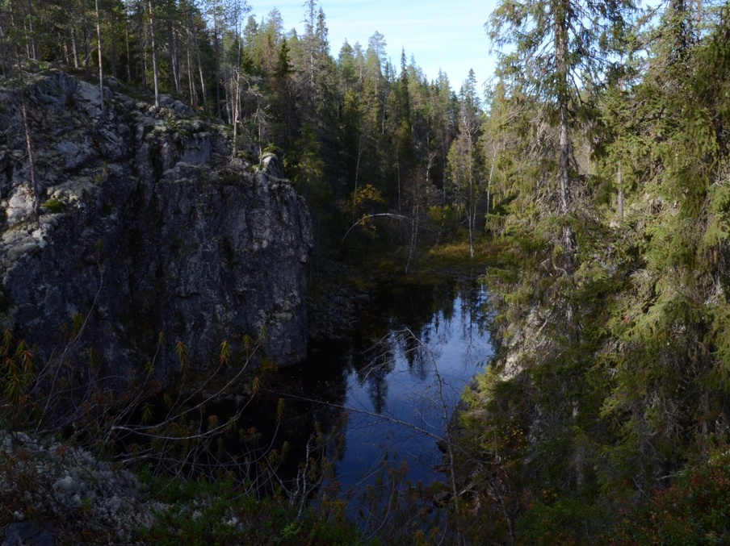
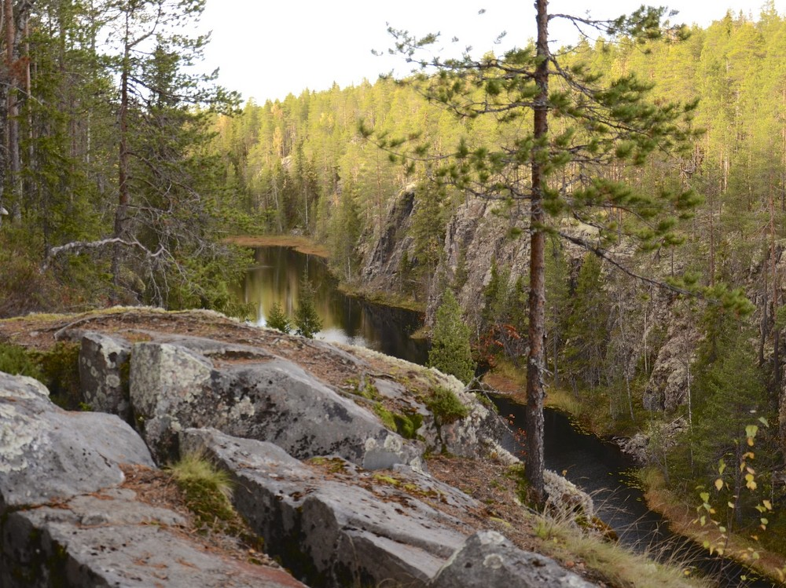
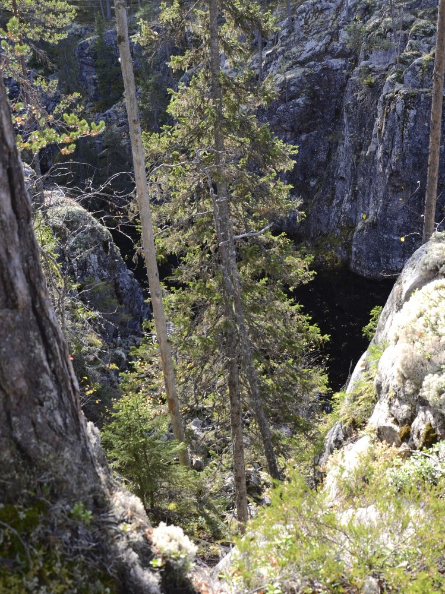
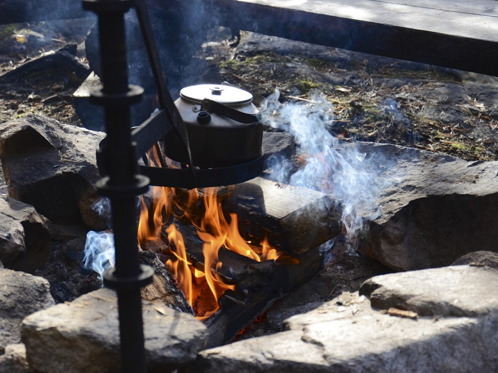
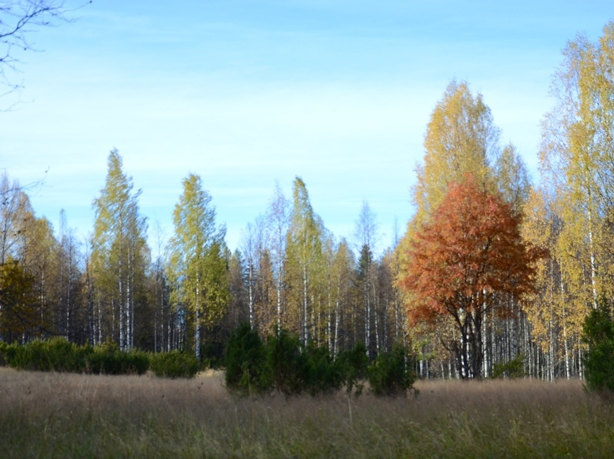

Parin viime vuoden aikana on tullut käytyä yllättävän monta kertaa Sotkamossa. Kainuun vaaramaisemat ovat vierailemisen arvoisia. Lauantaina kävimme heittämässä vajaan seitsemän kilometrin lenkin Vuokatin laelta Ketunmäen kodalle ja takaisin latu-uraapitkin. Sää oli märkä ja aika kolea eikä tehnyt oikein mieli edes kameralle etsiä kohteita. Totta puhuen reitit menivät niin vitikossa, ettei sieltä paljon maisemia näkynyt.

Sunnuntaina oli tarkoitus käydä kävelemässä joku toinen reitti Vuokatin rinteillä, mutta päätimme lähteä vajaan viidenkymmenen kilometrin päähän Hiidenportin kansallispuistoon. Jälleen kerran täytyi vaan todeta, että Metsähallituksen kansallispuistojen reitit tarjoaa ylivoimaisesti parempilaatuiset reitit verrattuna kuntien omiin reitteihin.

Hiidenportin kansallispuiston suurimmat nähtävyydet ovat Hiidenportin rotko sekä Kovasinvaaran taloaukea. Hiidenportin rotkon reunat tarjoaa pienestä korkeanpaikan kammosta kärsivälle kokemuksia jo sellaisenaan. Parhaimmillaan rotkon pohjalle on varmasti yli kaksikymmentä metriä korkea kallioseinämä.

Viisikilometriä pitkän Hiidenkierroksen puolessa välissä on Porttilammen laavu, mikä osoittautui varsin mukavaksi paikaksi pitää ruokatauko. Laavu on suojaisessa paikassa, mihin iltapäivästä paistaa lämpimästi aurinko. Paikalle sattui useampikin lähialueen asukas, joka oli päättänyt tulla patikoimaan Hiidenportille. Taukopaikan rannassa kävi melkoinen kuhina, kun paikalle saapui kalaparvi. Lajista ei nyt täyttä selvyyttä tullut, mutta kaikkea ne söi kahvinpuruja, kanervan kukkia ja makkaroita myöten.

Pois palatessa kävi mielessä oikasta tuloreittiä pitkin takaisin autolle Palolammen opastuspaikalle, mutta onneksi kuitenkin noudatettiin alkuperäissuunnitelmaa ja palattiin autolle Kovasinvaaran kautta. Kovasinvaara aiheutti totaalisen wow-efektin. Kovasinvaaralla on asuttu 1700-luvulta vuoteen 1949 asti. Rakennuksia paikalla ei enää ole vaan jälkiä laidunmaista. Silti paikanpäällä astii millaista elo aikoinaan erämaatorpalla on ollut.

Hiidenportin kansallispuisto on todella käymisen arvoinen paikka varsinkin, jos pitää kallioista. Paikalle kannattaa seurata opastetauluja pitkin, joita on Sotkamo - Kuhmo -tieltä lähtien. Navigaattori ohjaa kyllä perille, mutta metsäautoteitä pitkin eikä ne välttämättä henkilöautolle ole se paras vaihtoehto.
