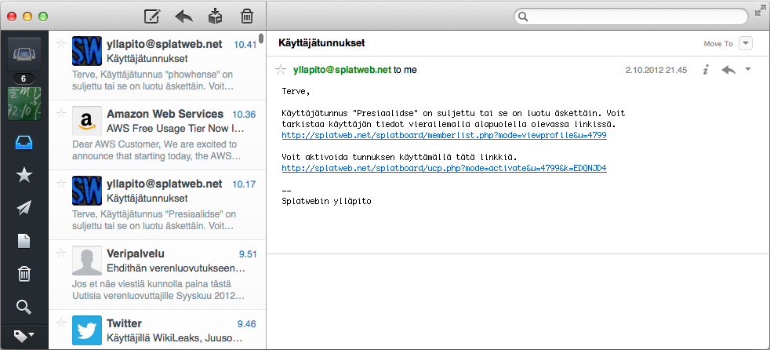

Sparrow-sähköpostiohjelma on vanha tuttu ja testattu viime talvena ilmaisella kokeiluversiolla. Ainoa puute oli se, että fontteja ohjelmasta ei voi säätää mieleisekseen. Luultavasti en pysty tottumaan koskaan muihin kuin monospace-fontteihin posteja kirjoittaessa.

Nyt olen kuunnellut työkaverin (terveisiä Samille) viikon verran ja saunaolusissa innostuin ostamaan tuon Sparrowin OS X:lle. Enpä ostaessa muistanut tuota fonttiongelmaa, joten joutui turvautumaan Googleen. Googlen avulla löytyi blogipostaus, missä kerrottiin että ulkoasua pääsee muuttamaan Sparrowin CSS-tiedostoista.

Fonttien muuttaminen on helppoa muuta vain seuraavia tiedostoja hakemistossa `/Applications/Sparrow.app/Contents/Resources/`:

tiedosto `message-editing.css`

```css
body {
  font-family: Monaco;
  font-size: 10px;
}
```

ja `conversation.css`

```css
div.-sparrow-messageBody {
  font-family: Monaco;
  font-size: 10px;
}

div.-sparrow-quickReplyTextContents {
  font-family: Monaco;
  font-size: 10px;
}
```

Tuloksena onkin huomattavasti helppolukuisemmat sähköpostit.


