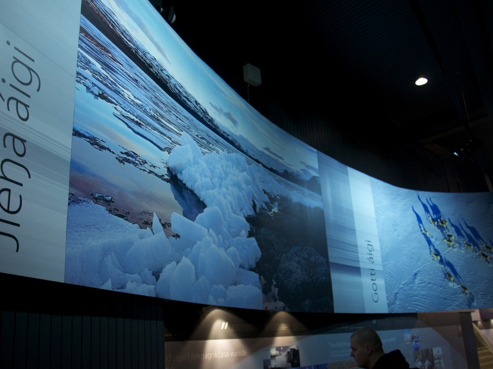
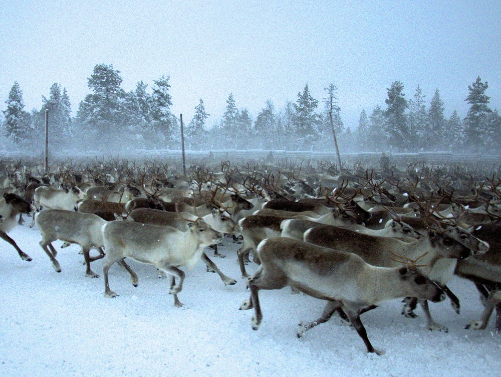
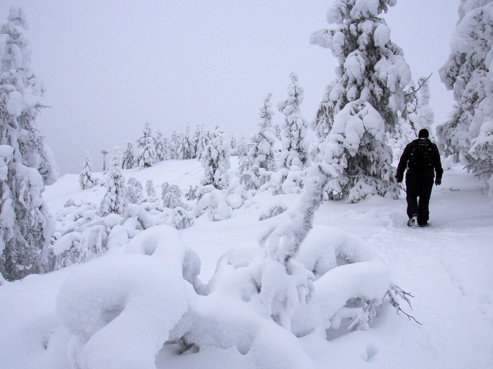
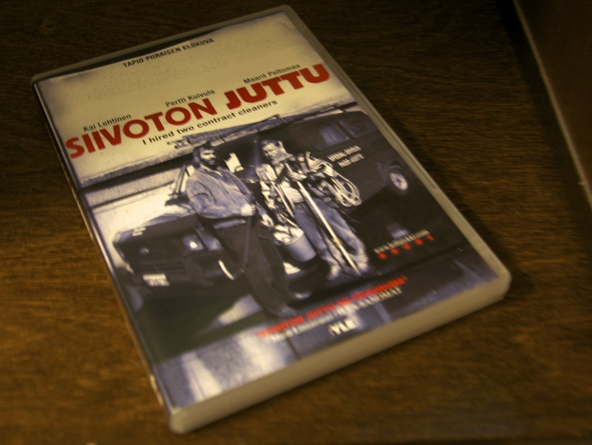
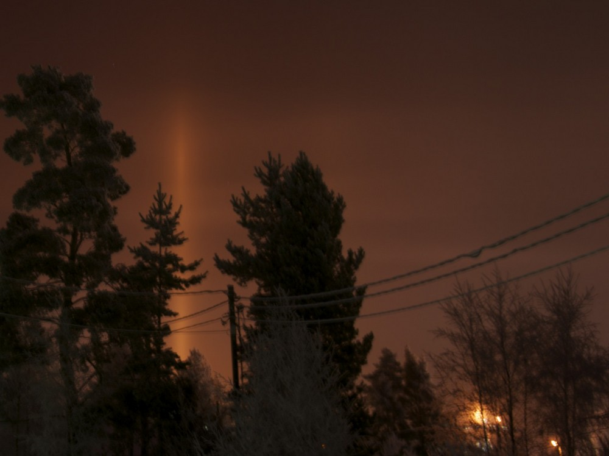

Ajattelin, että tämän vuoden ajan pyrin ottamaan yhden kuvan joka päivä tai joku apuri ottaa minusta kuvan. Samalla ajattelin, että niputan viikon kuvat sunnuntaisin tähän blogin sivuille. Tässä ensimmäisen viikon satoa.

__Maanantai:__ Kävimme [Tunturi-Lapin luontokeskuksessa](http://www.luontoon.fi/tunturi-lapinluontokeskus). Luontokeskuksesta löytyy Vuovjjuš - Kulkijat -näyttely, joka kertoo paimentolaissaamelaisten historiasta ja kulttuurista. Kuvan ottanut Elisa.

__Tiistai:__ Kävimme Vuontisjärvellä katsomassa poroerottelua. Hienoja eläimiä ja mahtava kokemus seisoa parin tuhannen poron keskellä.

__Keskiviikko:__ Pieni retkeilylenkki huipentui Jyppyrävaaran näköalakodalle. Noin 700 metriä korkean vaaran laella olevassa kodassa söimme lounaaksi hernekeittoa. Kuvan ottanut Elisa.

__Torstai:__ Torstaina piti käydä Juhls hopeapajassa Kautokeinossa, mutta päätimme vuokrata lumikengät ja lähteä Puljutunturin juurella olevalle kodalle. Umpihangessa rämpiminen kahden hengen voimin oli niin hidasta, että päätimme luovuttaa ennen puolta väliä. Kuvan ottanut Elisa.

__Perjantai:__ Perjantaina ajoimme Hetasta takaisin kotiin. Kaamos oli loppunut jo Pellon korkeudella. Kuvan otin Torniojoen varrelta.

__Lauantai:__ Pyykinpesu ja rötväpäivä. Tuli katsottua naapurilta lainattu Siivoton juttu -elokuva. Tykkään kovasti tästä leffasta. Otteita elokuvasta löytyy [Ylen Elävästä arkistosta](http://yle.fi/elavaarkisto/artikkelit/siivoton__juttu__4472.html).

__Sunnuntai:__ Illalla näkyi keinovalopilareita Kempeleen suunnalla. Otin kameran mukaan iltalenkille ja nappasin muutamia kuvia keinovalopilareista.

No niin. Ensimmäisen viikon kuvat paketissa. Helppoa kuvien ottaminen on, jos on reissussa mutta kotioloissa kuvauskohteita on vähän haastavampi etsiä. Katsotaanpa millaisia kuvia ensi viikolla tulee otettua.
