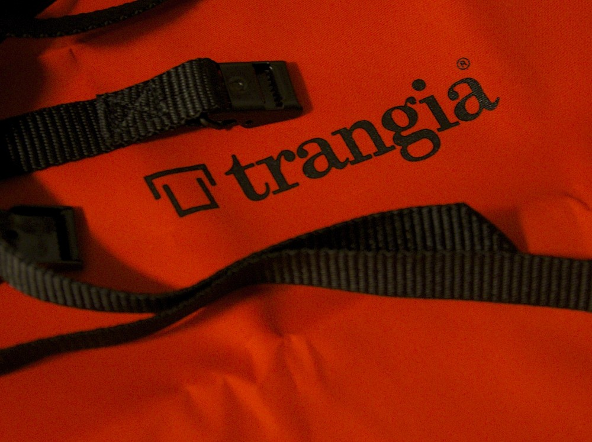
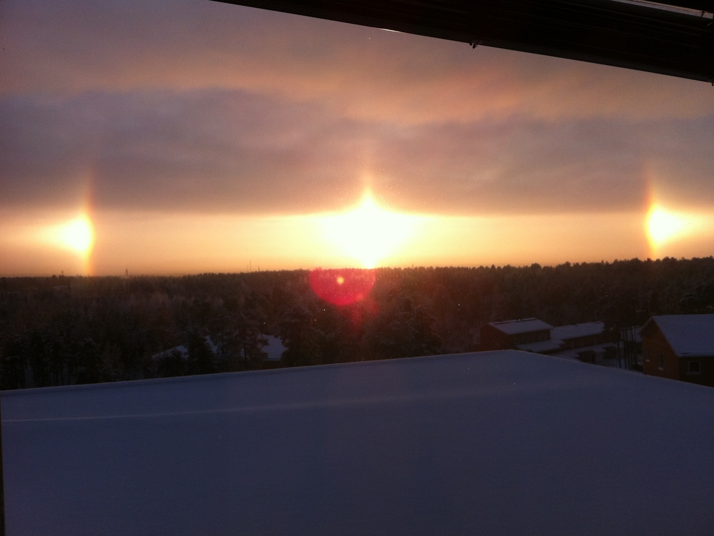
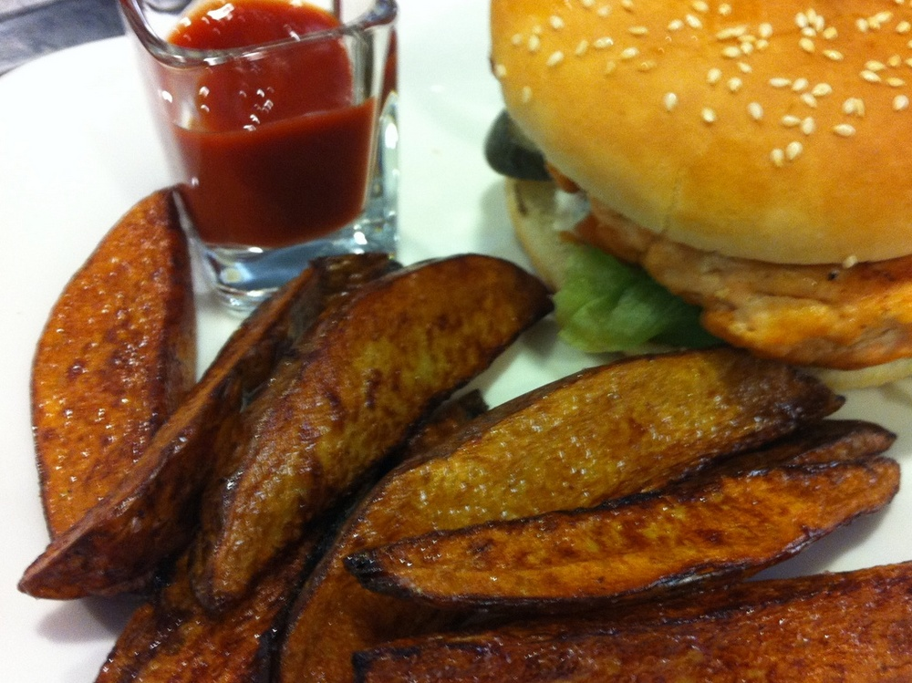

Vielä vuoden toisella viikolla muistin ottaa kuvia joka päivä. Harvinaisen vaikeaa keksiä normaaleissa oloissa kuvattavaa. Lisäksi suurin osa kuvista on otettu kännykällä vaikka melkein joka päivä oli järkkärikin mukana.

__Maanantai:__ Kaupassa käydessä tarttui valokuvaustarvikkeita parin sadan euron edestä, kunnes tulin järkiini ja ostin vajaalla kympillä retkeilyvarusteita. Näistäkin suojapussin olisi voinut tehdä itse :-)

__Tiistai:__ Ei mitään järkevää tapahtunut kamerakourassa, mutta tässä kuva kukasta, joka muutti meille. Edellinen ja siihen mennessä ainoa on kuulema seitsemän vuotta vanha.

__Keskiviikko:__ Kymmenen vuotta palvelleet AKG K 240 -kuulokkeet saa nyt väistyä. Tilalle kaapista käyttämättömäksi jääneet Sennheiser HD-550 -kuulokkeet ensihätään.

__Torstai:__ Luin Kalevaa paperilehtenä pitkästä aikaa. Pisti oikeasti ajattelemaan.

__Perjantai:__ Aamulla kävi mielessä, ottaa järkkäri mukaan vaan enpä ottanut. Sehän kostautui, kun kello 14 aikaan taivaalle ilmestyi upea haloilmiö (22-asteen rengasta, sivuauringot ja auringonpilari).

__Lauantai:__ Matkalla etelän suuntaan poikettiin [Vihiluodon kalakaupassa](http://www.vihiluodonkala.fi/) syömässä. Testasin lohiburgeria, joka oli hyvä. Perunat olivat kyllä vähän elähtäneen oloisia.

__Sunnuntai:__ Kaverin poika testaili puhelimen kameraa. Taitaa olla toinen kuva mitä etupuolen kameralla on otettu.
