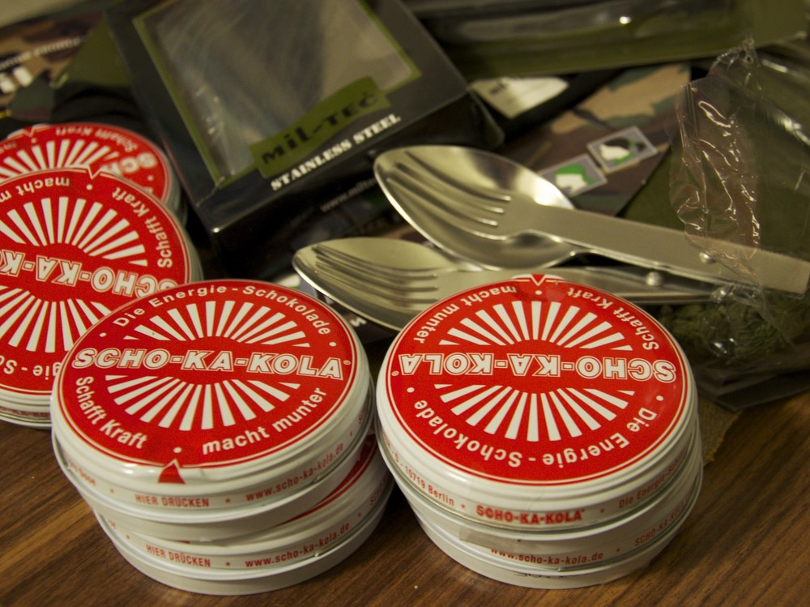
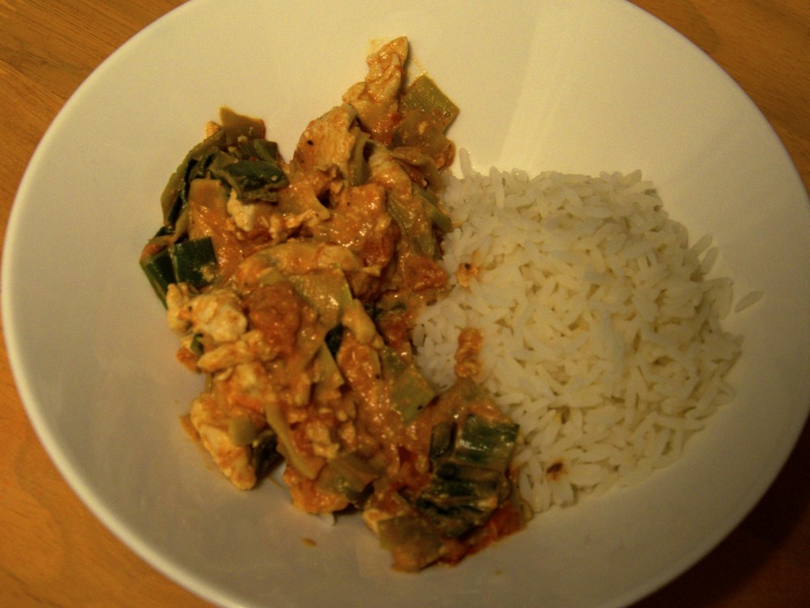
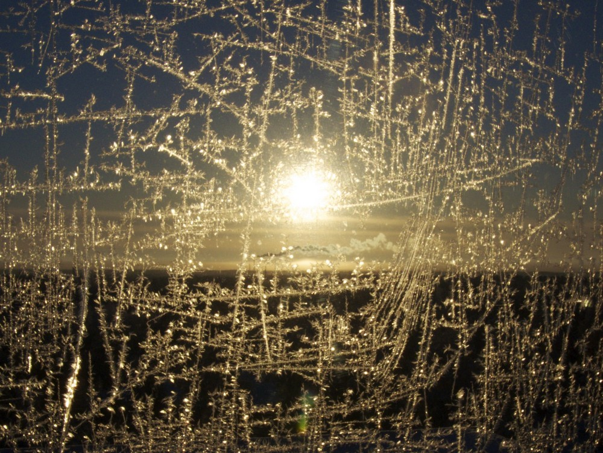
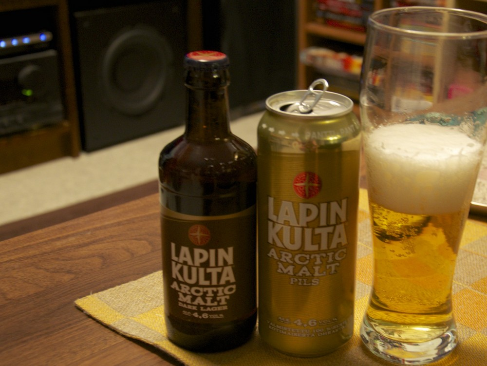
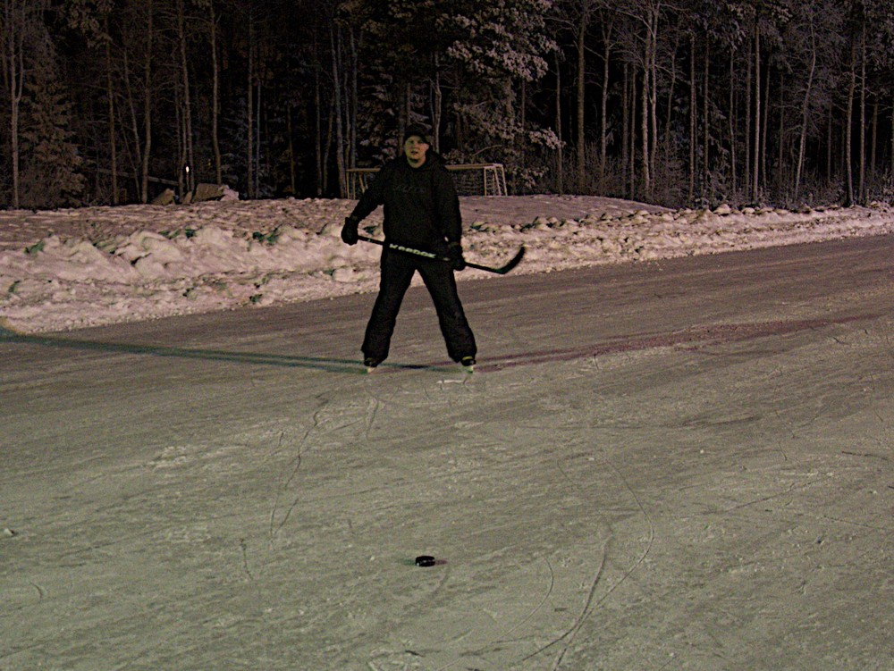
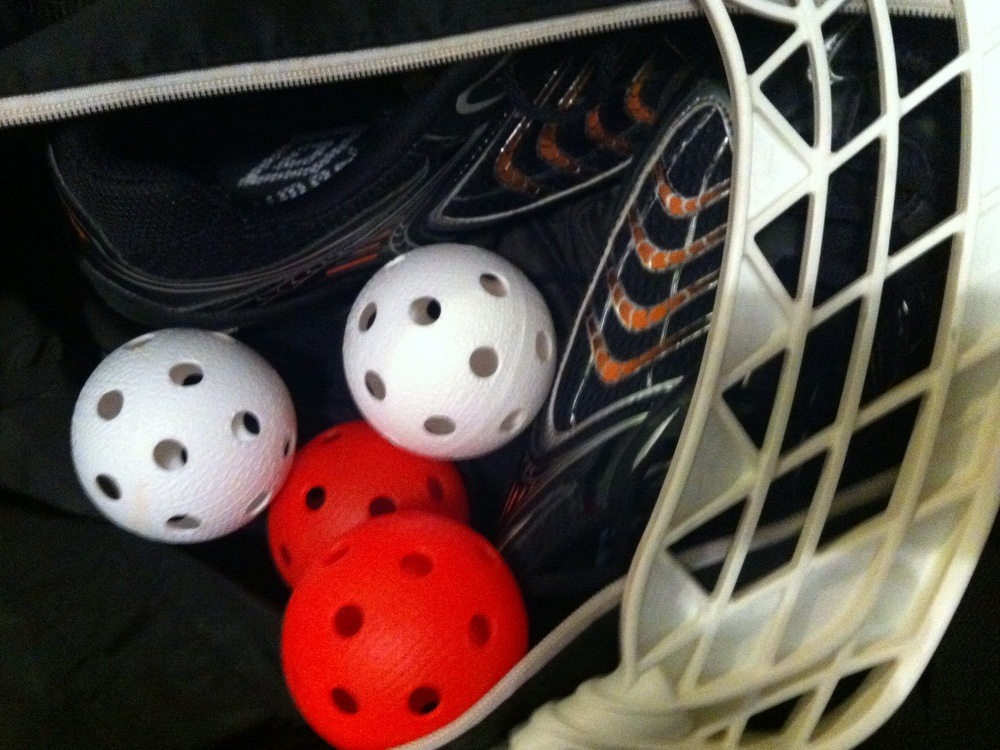
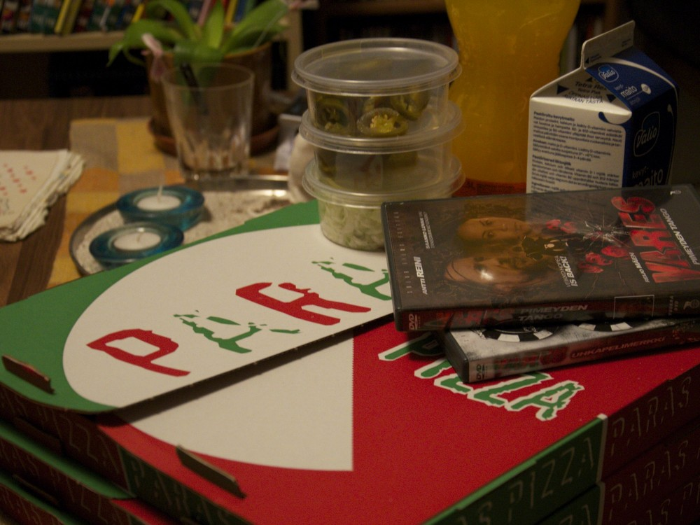

Ja taas mennään. Ruokaa ja urheilua sekä urheiluun valmistautumista löytyy näistä kuvista. Nauttikaa näistäkin kuvista.

__Maanantai:__ Varustelekasta pieni tilaus. Testiin muutama Scho-ka-kola seuraavalle retkelle.

__Tiistai:__ Päivälliseksi loihdin jääkaapin tähteistä kanariisihässäkkää. Hyvää oli.

__Keskiviikkona:__ Keskiviikkona pakkanen nousi reiluun pariin kymmeneen asteeseen. Nopeasti otettu kuva toimiston terassin ikkunasta.

__Torstai:__ Saunaolueksi Lapin Kullan Artic Maltteja. Joku outo jälkimaku näissä on, mitä ei aiemmin huomannut.

__Perjantai:__ Uutta lätkämailaa ulkoiluttamassa. Junioreitakin tuli pyöritettyä. Varpaat ihan jäässä vaikka 7 astetta pakkasta. Kuvan ottanut Elisa.

__Lauantai:__ Viisi vuotta siitä, kun viimeksi salibandyä pelasin. [BSC:n](http://bscdiscgolf.com/) porukalla  oli mukava sählätä.

__Sunnuntai:__ Elpymistä edellisen illan vietosta. Kyllähän nämä Varekset kerran katsoo.
