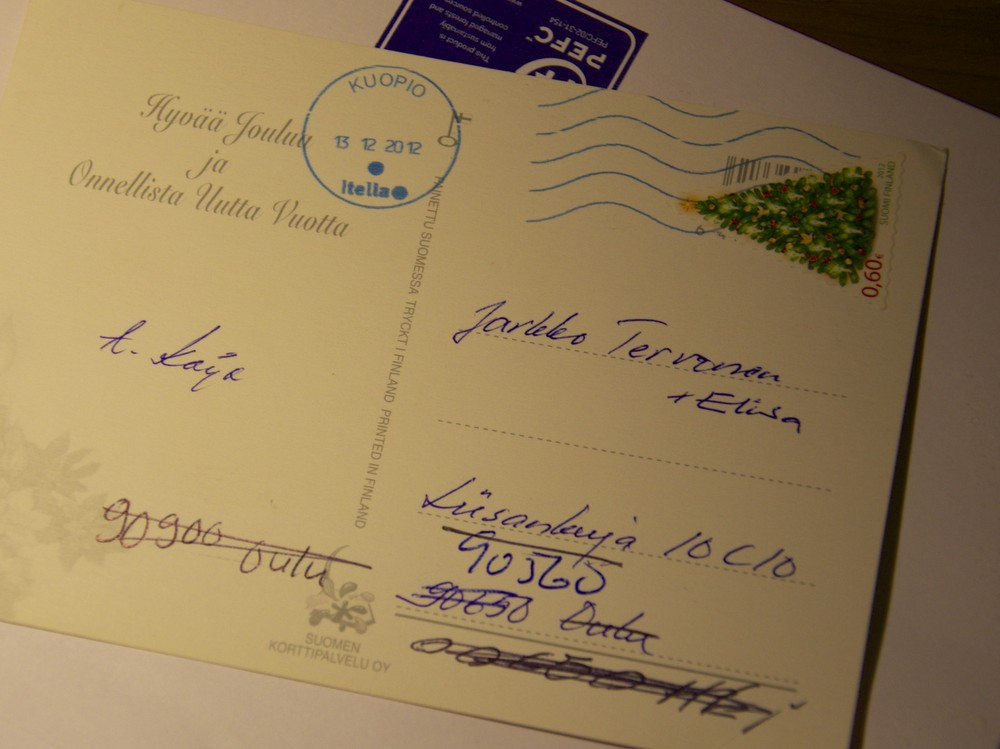
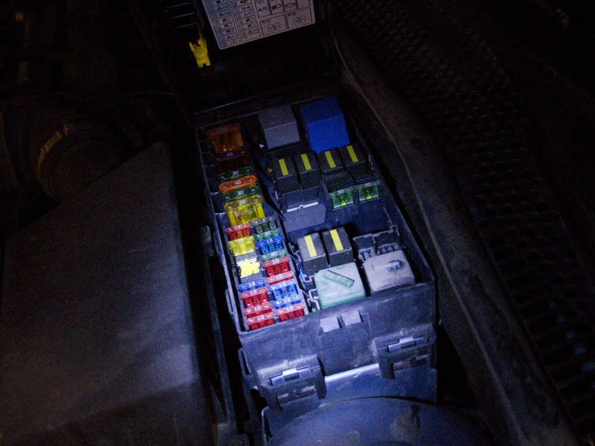
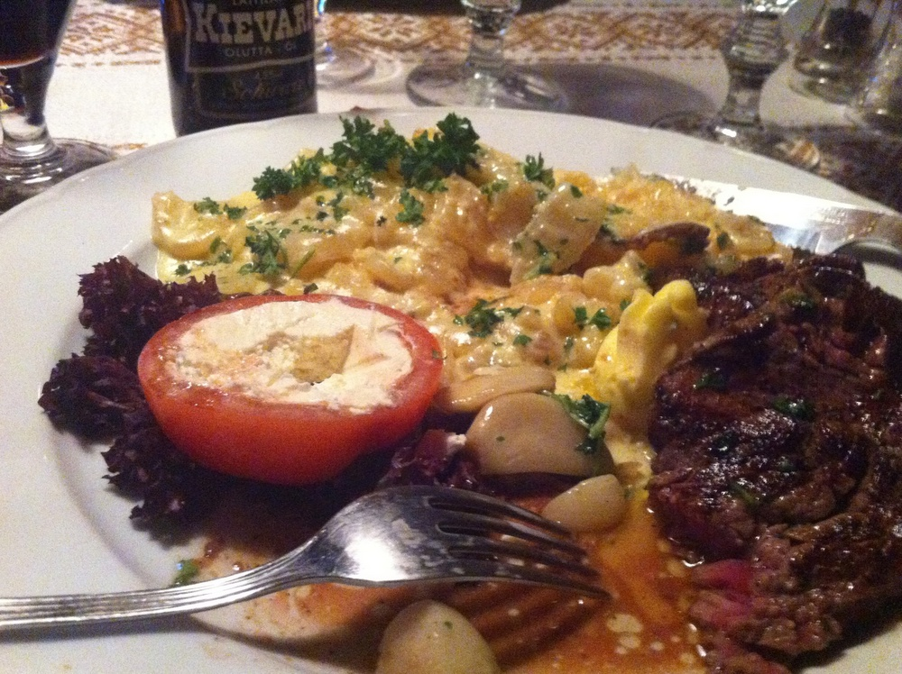
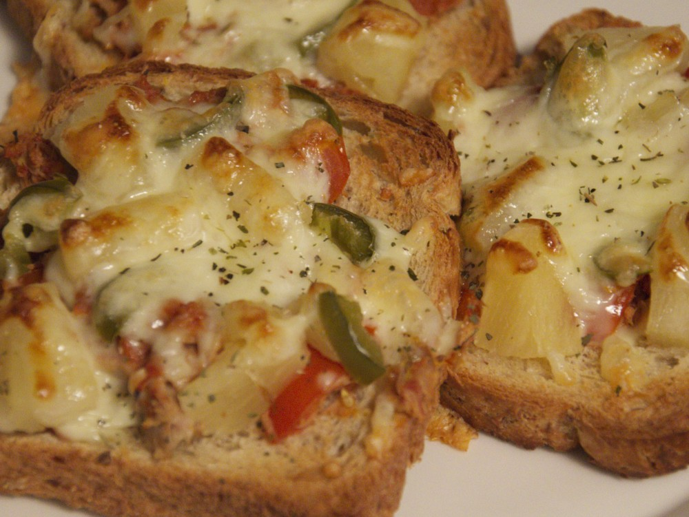

Kiirettä piti ja ei ollut monestikaan mielessä ottaa kuvia. Jotain kuitenkin joka päivälle sain kuvattua.

__Maanantai:__ Viime vuoden viimeinen joulukortti tuli tänään perille. Vai pitäisikö sanoa tämän vuoden ensimmäinen joulukortti. Kiitokset Itellalle, että ovat jaksaneet osoitetta selvitellä.

__Tiistai:__ Auton tuulilasin pyyhkijät kuolivat sunnuntaina Nilsiästä Ouluun ajaessa. Sulakkeet konepellin alla ja auton sisälläkin on ehjät. Päivän valossa vois kokeilla yleismittarin kanssa virtoja.

__Keskiviikko:__ Roskaruokapäivä. Lounaaksi kebab-höystöä, päivälliseksi kotipiirakka ja iltapalaksi hotwingsejä.

__Torstai:__ Pitkästä aikaa yövuoroo toimistolla.

__Perjantai:__ Kai nämä kaiuttimet pitäis joko heittää menemään tai korjata.

__Lauantai:__ Kävimme [Sokeri-Jussin Kievarissa](http://www.sokerijussi.fi/) lauantaina syömässä. Niin kova nälkä oli, että ei käynyt mielessäkään kuvata koskematonta ateriaa.

__Sunnuntai:__ Lämpimiä voileipiä iltapalaksi.
