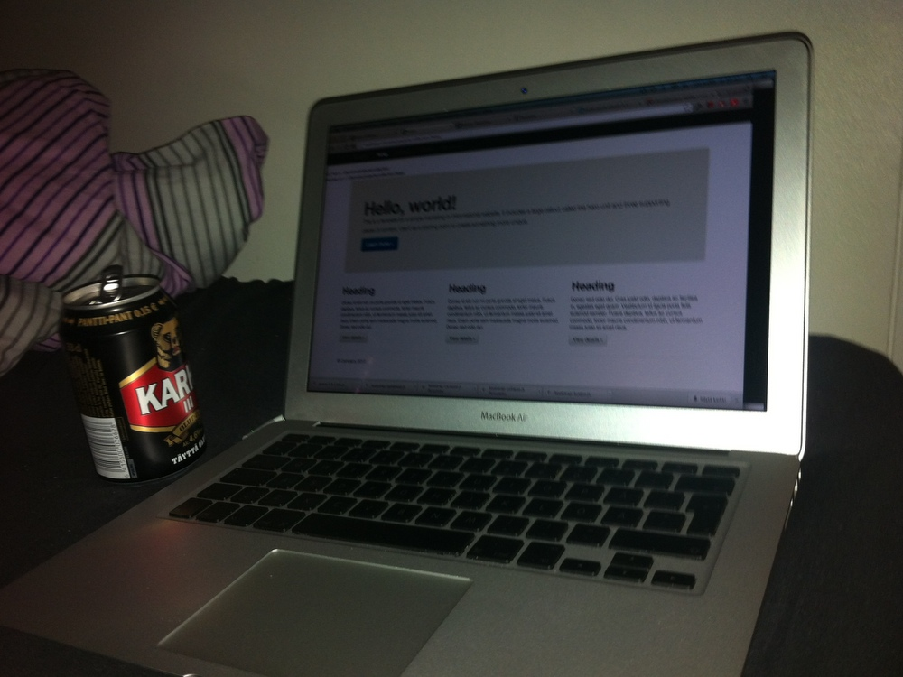
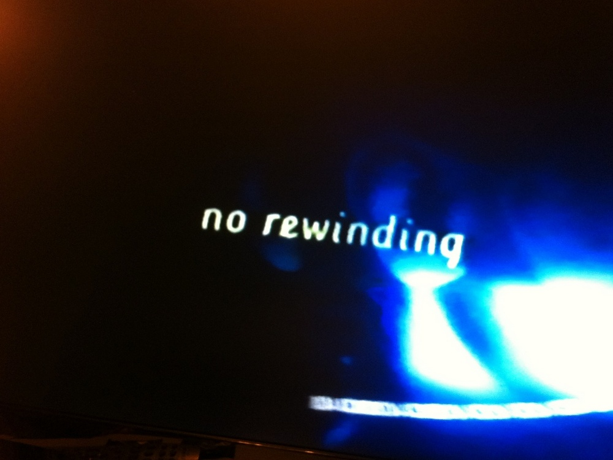

Kuudes viikko kuvina. Kaikkea tapahtuu, mutta älytön työ on löytää niistä jotain kuvattavaa tai pitää edes jonkinlaista tasoa yllä. Tässä kuitenkin tämän viikon satoa.

Niin ja tuo tiistain protoiluinnostus jäi protoiluun, kun urheiluinnostus otti niskalenkin. Palataan projektin pariin ensi viikolla.

__Maanantai:__ Kymmenen vuoden tauon jälkeen levysoitin jälleen talossa.

__Tiistai:__ Päikkärit, sauna + pari bisseä = älytön protoiluinnostus :-)

__Keskiviikko:__ Vein auton huoltoon Pateniemeen ja kävelin kotiin Kempeleeseen. 23 kilometriä mukavassa pakkassäässä. Kuvan ottanut Elisa.

__Torstai:__ Viikonloppuna olisi tarkoitus lähteä hiihtovaeltelemaan Martimoaavalle. Pientä pakkailua tässä illan kuluksi.

__Perjantai:__ Porukoiden luota löytyi vanhoilta ropeltaja-ajoiltani Mini Car Wars -lautapeli, joka ostettiin aikoinaan vain koska se oli niin halpa.

__Lauantai:__ Käytiin parin päivän hiihtovaelluksella Martimoaavalla. Pömiöstä Martimo-ojan Niittytuvan kautta Simojoen varteen Hömmönkosken laavulle. Matkaa tuli vajaa 16 kilometriä.

__Sunnuntai:__ Vanhempien luota löytyy vielä VHS-nauhuri. Hauska katsoa vanhoja VHS:iä ja niissä olevia DVD-tekniikkaa mainostavia infopläjäyksiä.
