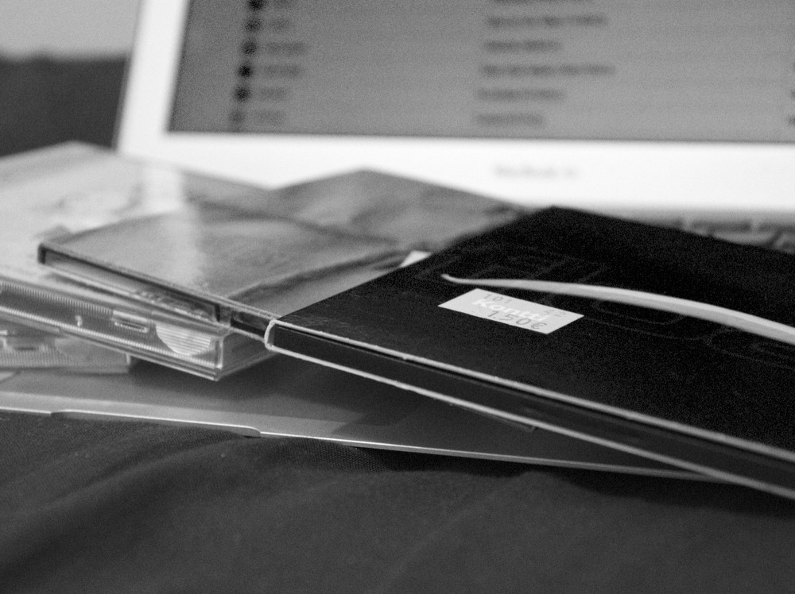
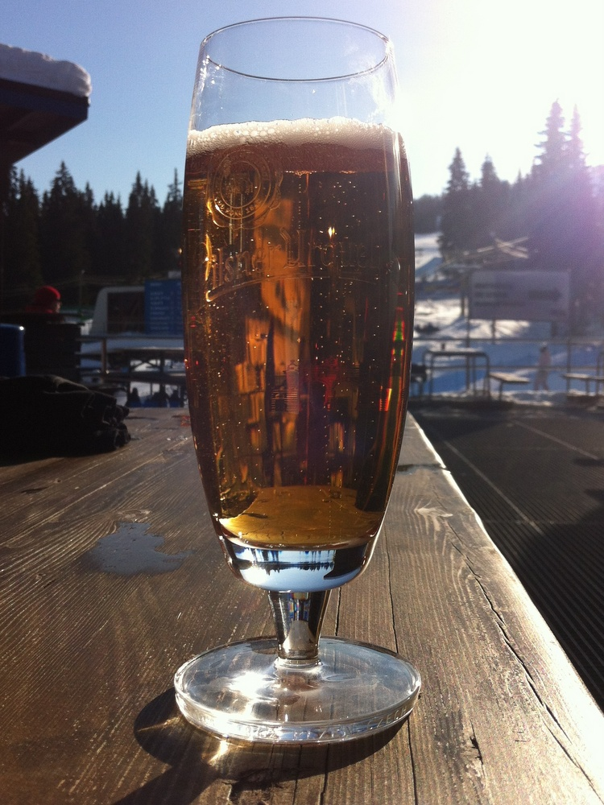

Yhdeksäs viikko alkoi unohtamalla ottaa maanantain kuva. Oli tarkoitus ottaa täysikuusta illalla vaan sehän unohtui. Huomasin tämän vasta kymmenisen minuuttia yli puolen yön. En huijaa, joten maanantain kuvaa ei ole eikä tule :-)

__Tiistai:__ Kolmen illan levyinventaario on ohi. Muutama CD-levy puuttuu ja pari koteloa. Varmaan näiden yhdistelmiäkin, mutta jatkossa pidetään parempaa kirjaa.

__Keskiviikko:__ Oulun SPR:n Kontista kävin hakemassa kahdeksan CD-levyä edukkaaseen 12 euron hintaan.

__Torstai:__ Älyttömäksi tavaran haalimiseksi mennyt tämä elämä, mutta nyt ei voinut vastustaa tämän setin ostamista. Harmi, ettei ensimmäistä kautta löytynyt.

__Perjantai:__ Matkalla Sotkamoon. Ajokeli melko liukas ainakin näillä nykyisillä talvirenkailla. Ehkä ne uudet laitan vasta ensi talveksi.

__Lauantai:__ Ravintolavuorokausissa elettiin kyllä vielä perjantaita, mutta unohdin ottaa lauantaina julkaisukelpoisen kuvan vaikka käytiin kylpylässä, syömässä ja Kajaanin suunnallakin.

__Sunnuntai:__ Piti yksi pikkumuki imaista [Pilsner Urquellia](http://en.wikipedia.org/wiki/Pilsner_Urquell) vielä sunnuntaina. Yksi parhaista oluista, joita on yleensä tarjolla.
