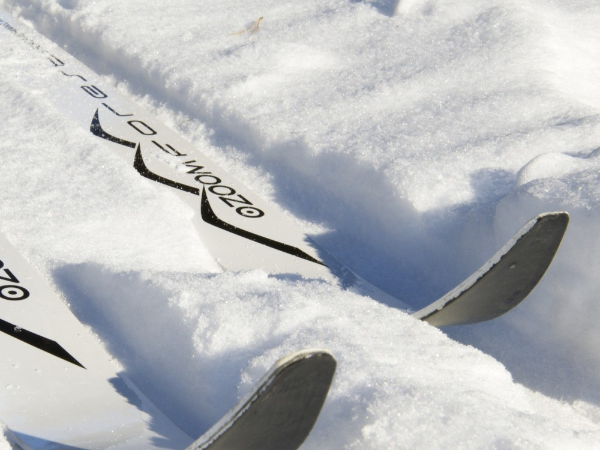
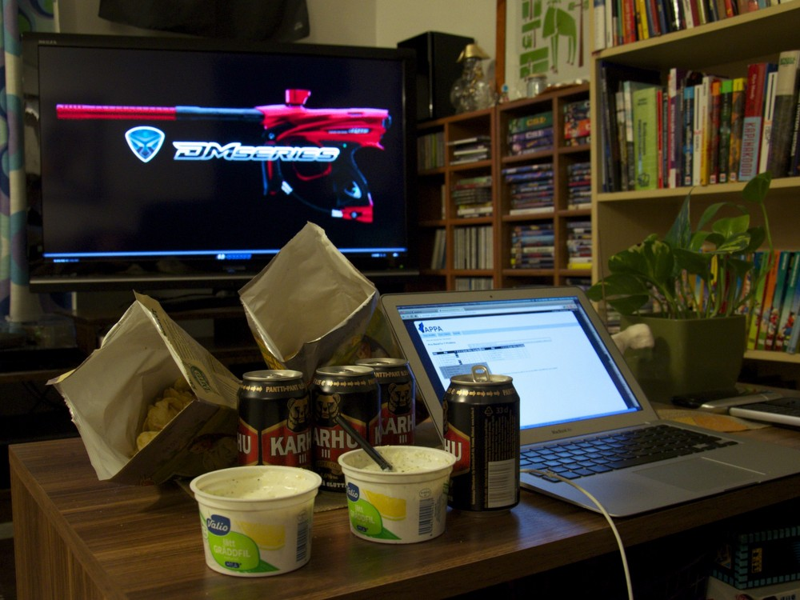

Niinhän siinä kävi, että kun kerran unohtaa ottaa kuvan jonakin päivänä, niin kynnys luistaa kuvan ottamisesta laskee. Tältä viikolta tuli vain viisi kuvaa. Onpahan kuitenkin erilaisia kuin edellisillä viikoilla. Varsinkin sunnuntain revontulia oli mukava kuvata.

__Maanantai:__ Hellittäisiköhän tällä laitteella viime aikaiset hartiakivut?

__Tiistai:__ Uudet metsäsukset irtosi kirppikseltä 55 eurolla. En ole ihan varma onko näissä nyt ne paremmat siteet.

__Keskiviikko:__ Tällä viikolla parina iltana oli nätti ohut kuun sirppi.

__Torstai:__ Penkkiurheilukausi alkoi PSP Dallas Openin myötä. Sipsiöverit tuli vedettyä.

__Sunnuntai:__ Päivällä lueskelin netistä, että revontulia olisi parhaillaan taivaalla. Odotin iltaa ja toivoin, että pääsee harjoittelemaan revontulien kuvausta. Harmikseni vasta jälkeenpäin muistin, että olisi aihetta käsittelevä kirja ollut hyllyssä, mitä olisi voinut lukea iltaa varten.
