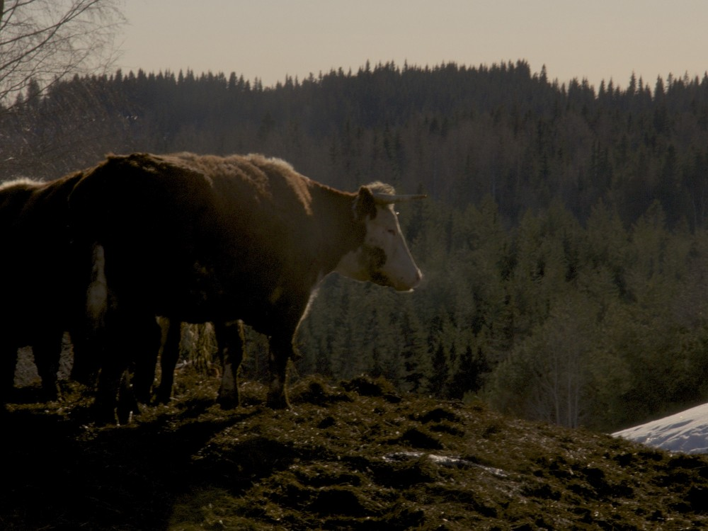
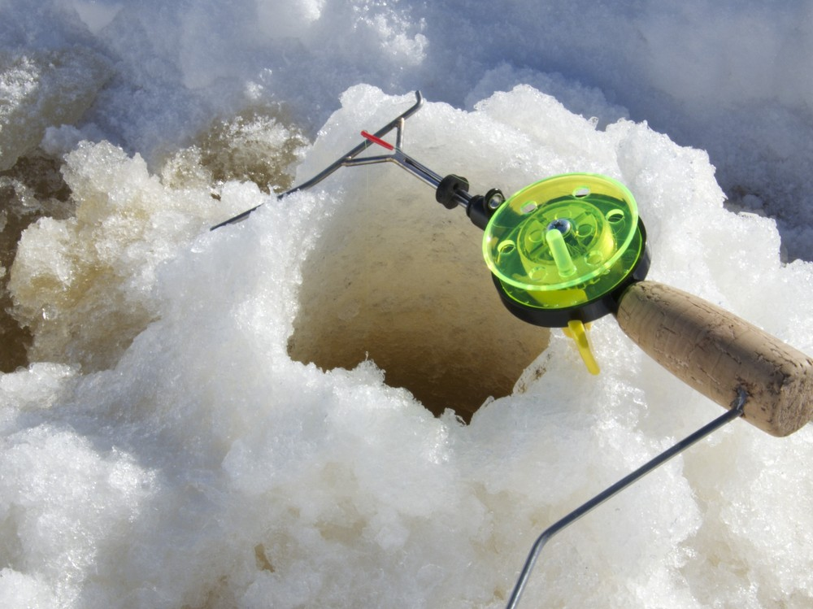

Kylläpä meni viikko nopeasti. Mitään ihmeellistä ei ole tapahtunut, mutta ei ole kuviakaan ehtinyt juuri ottamaan. Pitkä viikonloppukin meni niin nopeasti, että pitää nyt maanantaina tämä koostekin tehdä.

__Keskiviikko:__ Kirpparilta The Prodigyn ja Princen levyt. Huippukuntoisia sekä nätit kannet.

__Torstai:__ Ihmeen kauan tämä laturi pysynyt hengissä. En kyllä vieläkään ymmärrä, miksi näitä ei voi tehdä kestäviksi.

__Perjantai:__ Aamulla lähtö Nilsiää kohti. Naapuritalossa on aloitettu uunin lämmitys aikaisin ja savuverho peitti viereisen metsäkaistaleen.

__Lauantai:__ Lehmien tekemisiä on aina mukava käydä katsomassa.

__Sunnuntai:__ Pilkillä aurinkoisessa säässä. Porukalla saatiin kymmenkunta raitapaitaa saaliiksi.
