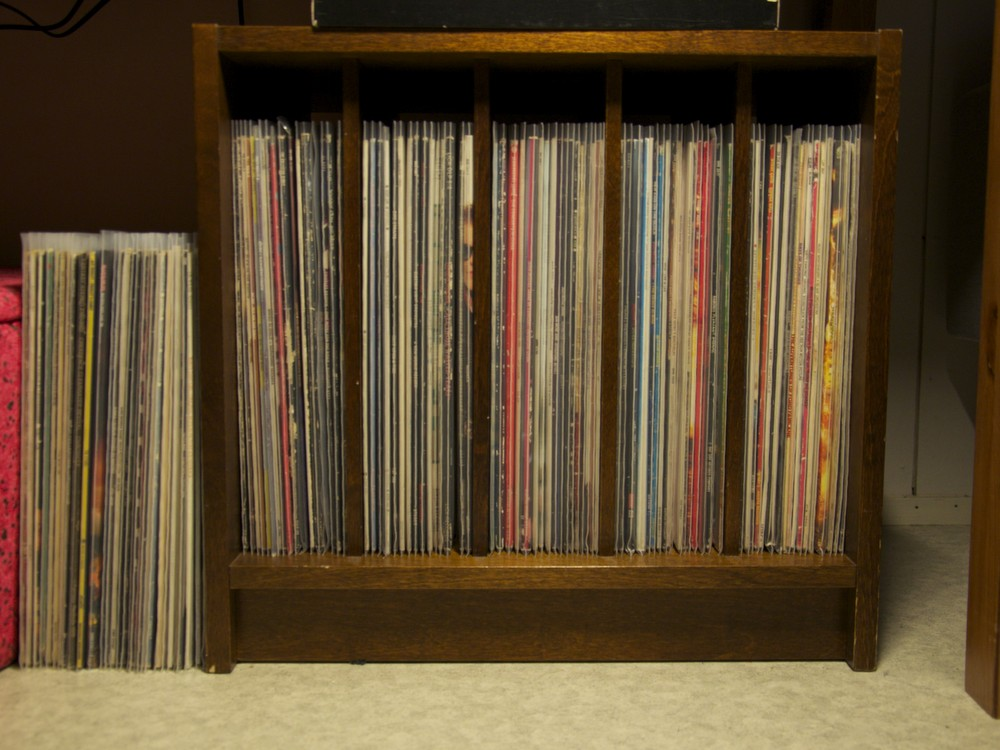
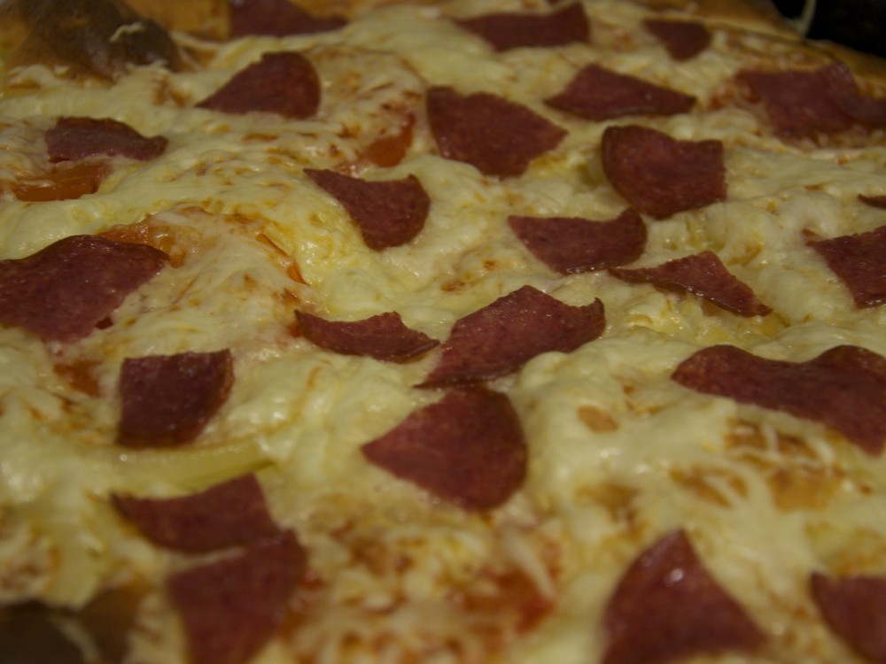
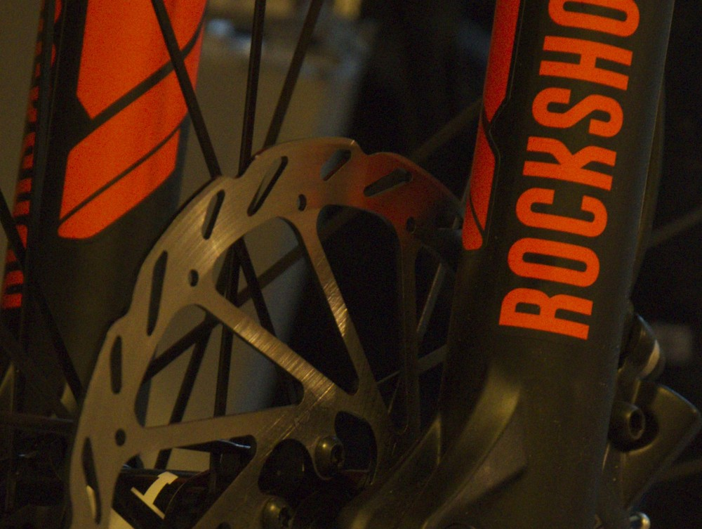
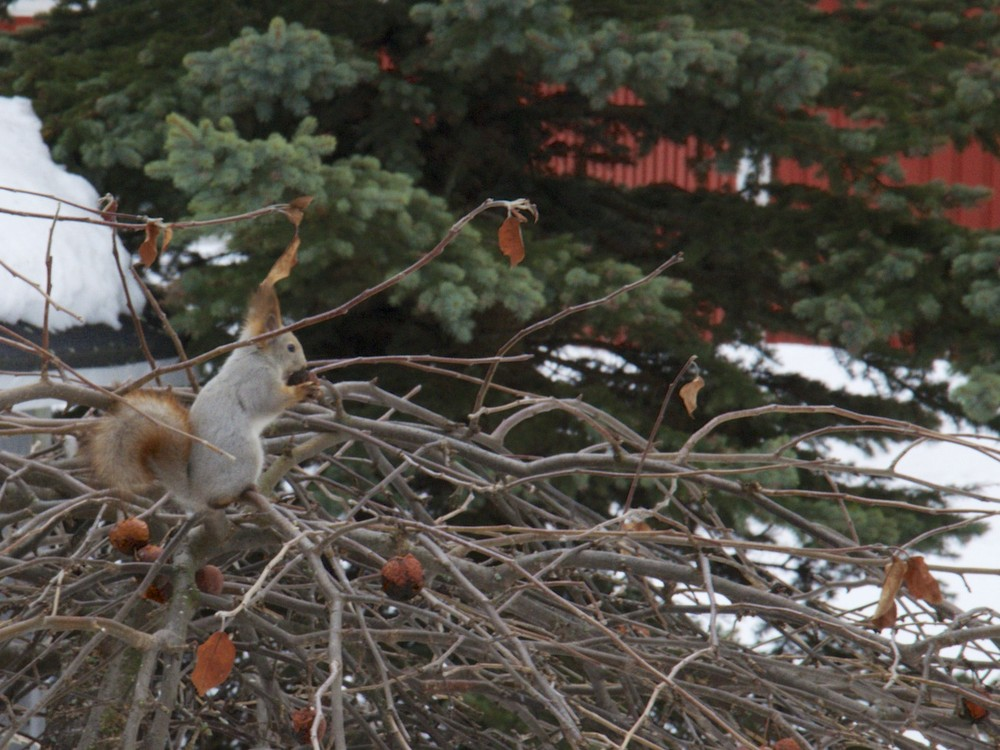
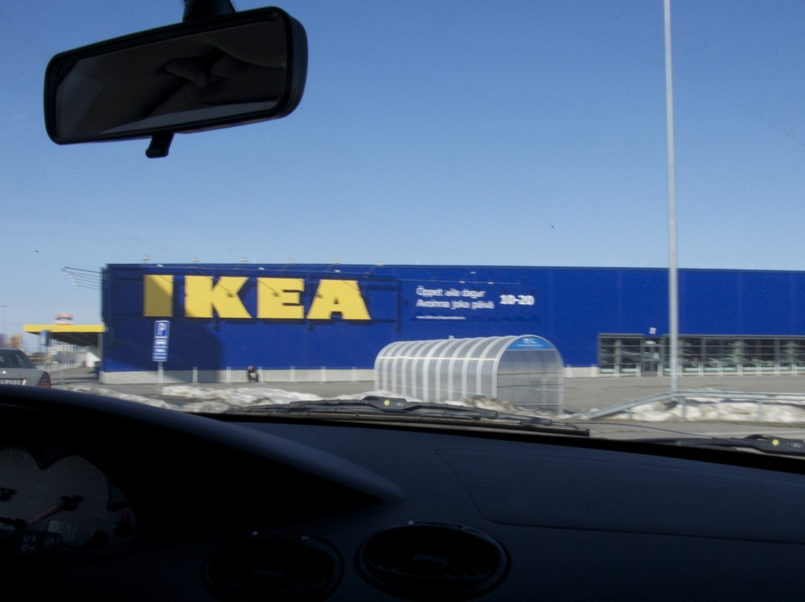

Toissa viikko jäi iloisesti kuvaamatta. Siihen olisi kyllä riittänyt kuva tietokoneesta työpaikalla tai kotona jokaiselta päivältä. Ei tämäkään viikko kovin siitä poikennut, mutta tässä nyt muutama kuva.

__Maanantai:__ Kävin [Levykauppa Äxästä](http://www.levykauppax.fi/) hakemassa suojamuoveja ja sisäpusseja. Muutama näistä kuunneltavista levyistä jäi ilman uutta sisuspussia. Pitää käydä ostamassa lisää.

__Keskiviikko:__ Tein suolaisia pannareita. Pizzaahan näistä käytännössä tuli. Seuraavalla kerralla vielä parempaa.

__Torstai:__ UPS toi paremman puoliskon pyörän, jota kasailtiin torstai-iltana. Tulisipa vielä omakin tuolta jostain saksanmaalta.

__Lauantai:__ Käytiin Kemissä porukoiden luona. Orava kävi aamupalalla meidän kanssa samaan aikaan.

__Sunnuntai:__ Sunnuntaina tehtiin reissu Haaparannalle. Ei kuitenkaan käyty tässä liikkeessä. Aiheutti kyllä ihmetystä, kun ei ollut edes aikomus käydä siellä.

Sellainen viikko tällä kertaa. Katsotaanpa mitä seuraava viikko tuo tullessaan.
