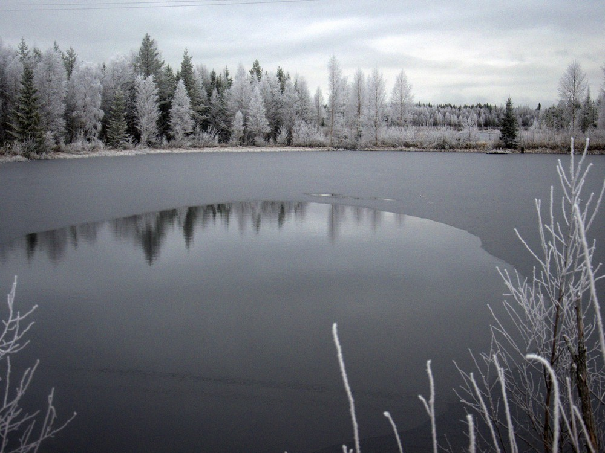
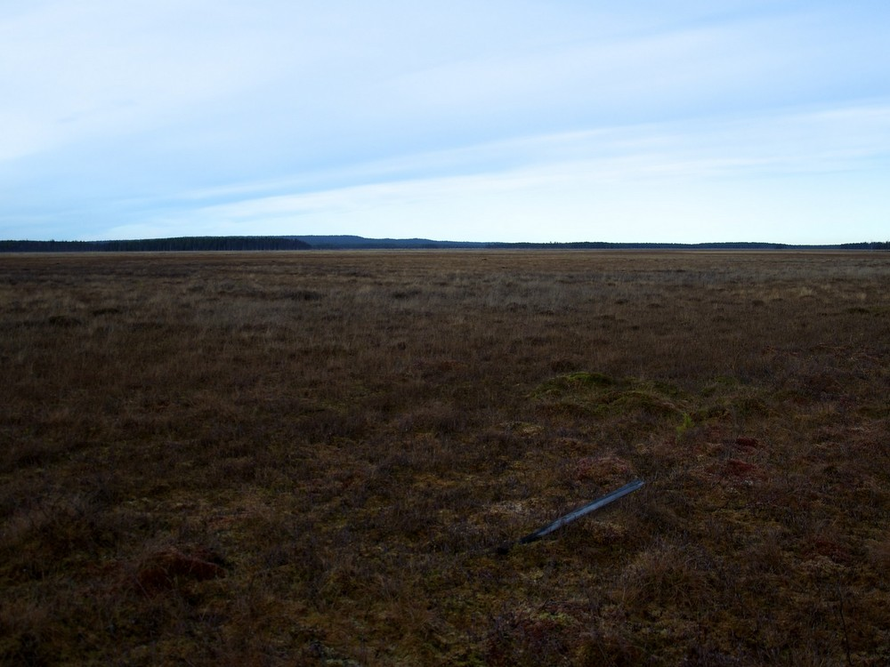

Muistelin tuossa eilen valokuva-albumin kautta ensimmäistä patikointiretkeämme Martimoaavalle ja kirjoittelin siitä [ensimmäisen osan](http://www.martimoaapa.com/blogi/patikointiretken-ensimmainen-paiva-lokakuussa-2011.html) meidän [Martimoaapa.com](http://martimoaapa.com/) -sivustolle. Täytyyhän se myöntää, että se oli TOP3-retkistä monessa mielessä. Sää oli loistava valokuvaamiseen tarjoten retken aikana erilaista valoa. Keli oli kuiva ja sopivan viileä. Tämän jälkeen olemme tehneet puolen kymmentä retkeä alueelle ja tullaan tekemään jatkossakin.

Tässä muutamia parhaita kuvia retkeltä ja lisää löytyy tuolta [Martimoaapa.comin jutusta](http://www.martimoaapa.com/blogi/patikointiretken-ensimmainen-paiva-lokakuussa-2011.html).

