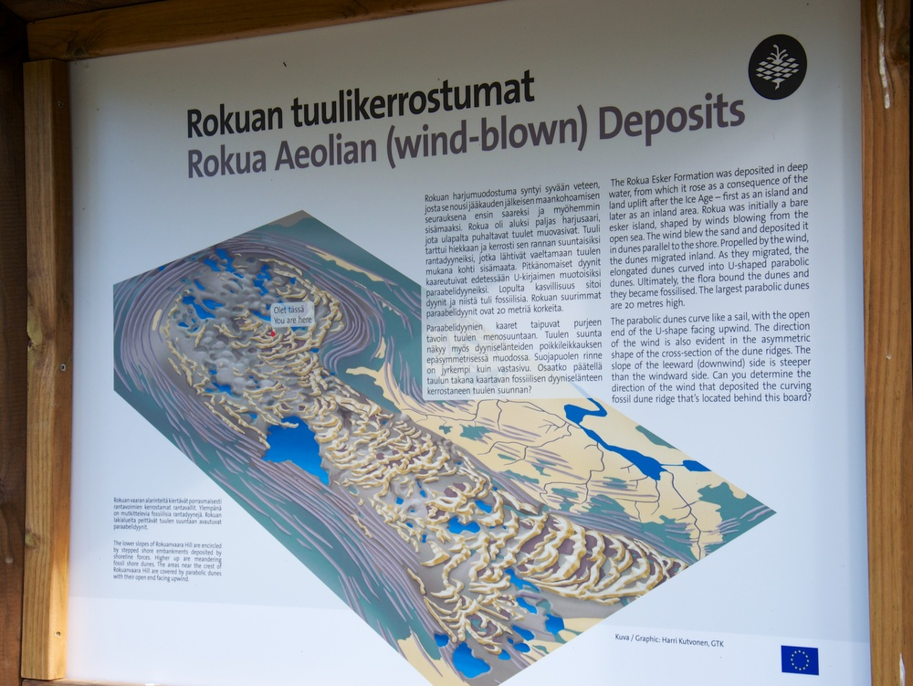
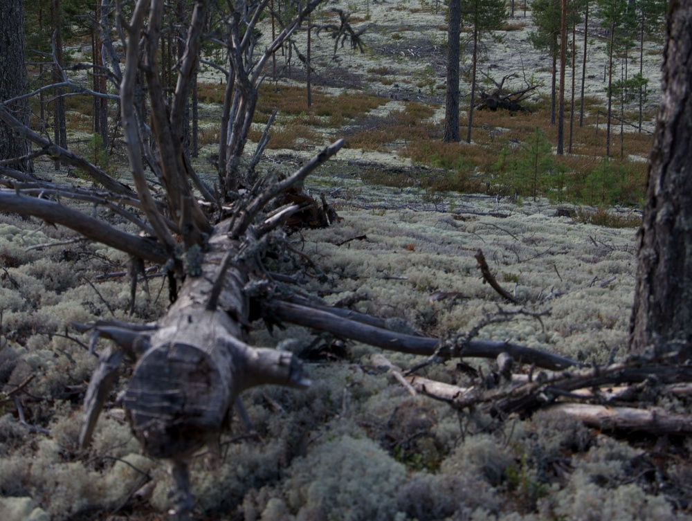
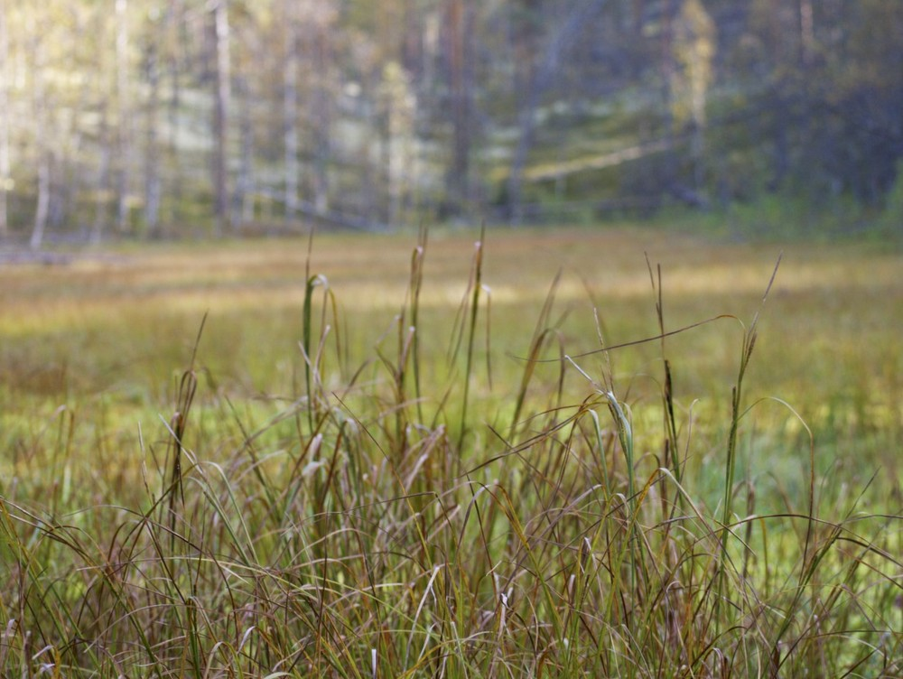
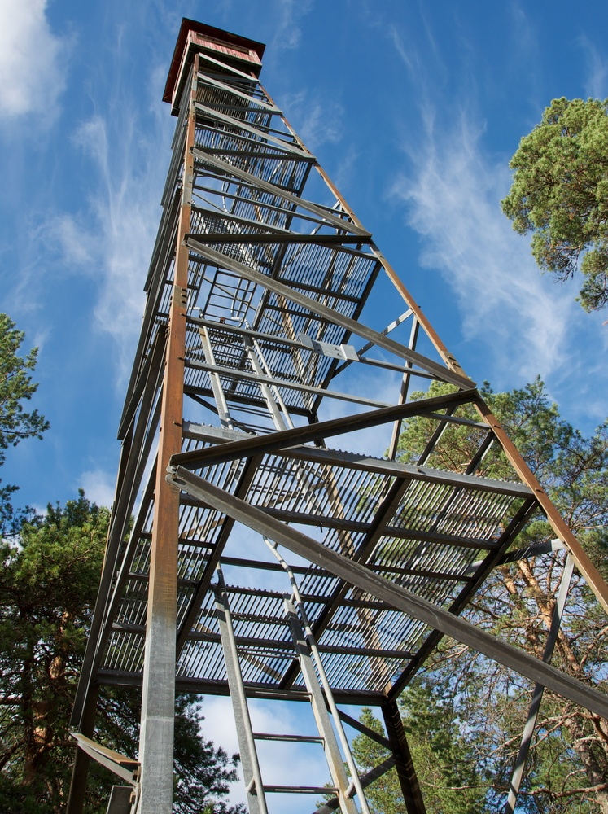
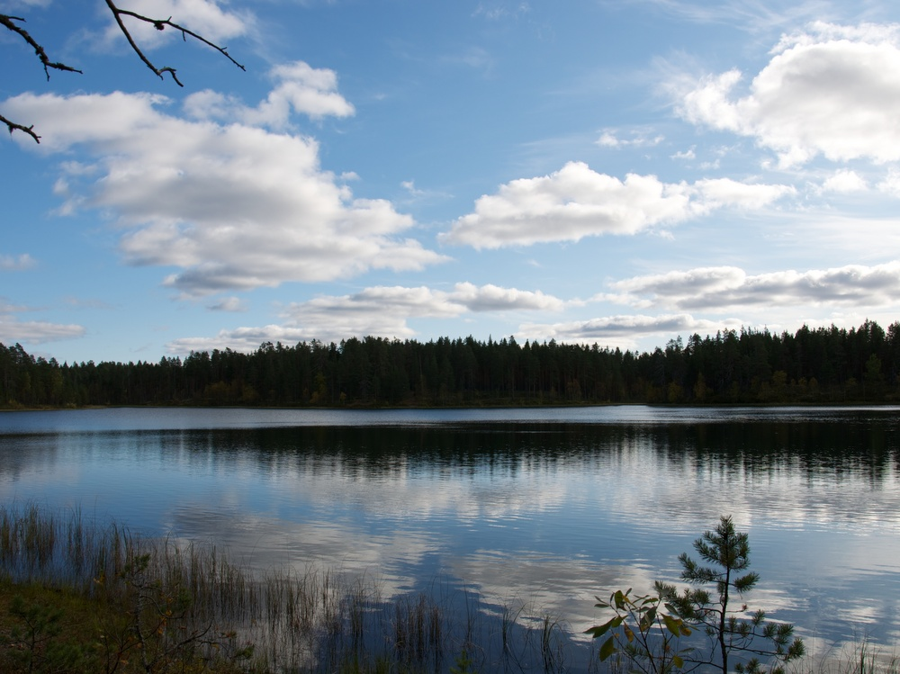
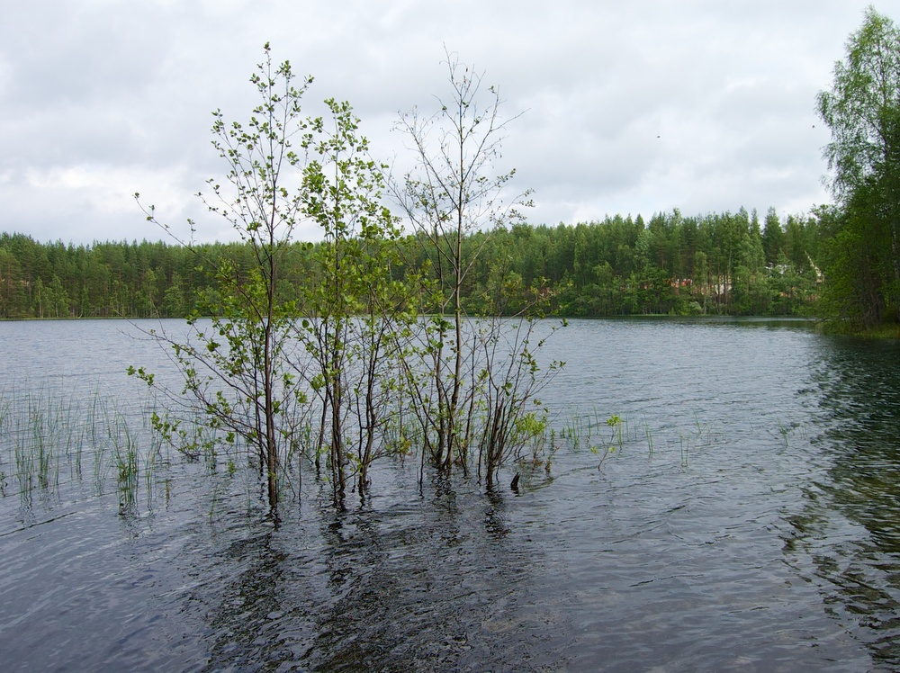
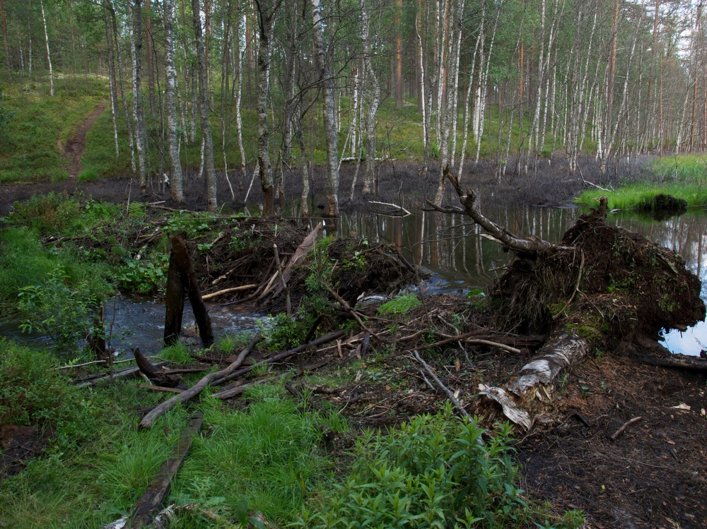

Löysin julkaisemattomista kirjoituksista lähes valmiin postauksen Rokuan Keisarin kierroksesta, jonka olen kiertänyt kahdessa osassa. Kesällä 2011 patikoimme Keisarinkierroksen eteläisen puoliskon ja kesällä 2013 pohjoisen puoliskon. Opaskartan, joka löytyy myös [Luontoon.fi:stä](http://www.luontoon.fi/retkikohteet/kansallispuistot/rokua/kartatjakulkuyhteydet/Sivut/Default.aspx), mukaan reitillä on pituutta 19 kilometriä. Olemme tainneet kiertäessä eksyä hieman reitiltä, koska GPS näytti kuljetun matkan muutaman kilometrin lyhyemmäksi.

Rokua on Vaalan ja Utajärven rajalla sijaitseva noin 20 kilometriä pitkä ja 5 kilometriä pitkä harjumuodostelma. Alueella on vajaan yhdeksän neliökilometrin laajuinen Rokuan kansallispuisto. Rokualla suurinosa maastosta on kumpuilevaa mäntykangasta jota peittää lähes yhtenäinen jäkälämatto. Oma erikoisuutensa on todella kirkasvetiset lammet. Vuonna 1956 perustettu Rokuan kansallispuisto on yksi Suomen vanhimmista kansallispuistoista.

## Eteläpuolisko vuonna 2011

Syyskuussa 2011 kiersimme Keisarinkierroksen eteläpuolen. Auton jätimme Rokuanhovin pihaan ja lähdimme kiertämään rengasreittiä myötäpäivään poiketen välillä katsomassa Syvyydenkaivo nimistä suppaa ja kiertämällä Pitkäjärven sekä Rokuanjärven kautta takaisin Rokuanhovin parkkipaikalle. Eteläinen puolisko Keisarinkierroksesta on ehkä näyttävin maastonmuodoiltaan sekä koskemattomana säilyneen kansallispuistoalueen vuoksi.

Syvyydenkaivo ei osunut reitille, mutta sen pohjalla piti poiketa. Syvyydenkaivo on yksi Suomen syvimistä supista. Suppa on syntynyt jääkaudella ison jäälohkareen jäädessä maa-ainesten ympäröimäksi. Jäälohkareen sulaessa paikalle syntynynyt kuoppa on pikkuhiljaa alkanut soistumaan pohjalta ja näin on syntynyt suppasuo.

Pookivaaran palovartijan torni on on ollut käytössä vuoteen 1975. Pookivaara kohoaa 192,4 metriä merenpinnan yläpuolelle ja torni vielä tästä noin 50 metriä ylöspäin. Palovartijat valvoivat herkästi syttyviä jäkäläkankaita tornista. Sota-aikana torni on ollut ilmavalvontakäytössä. Kuva on vuodelta 2011. Tämän jälkeen tornia on kunnostettu ja se on paremmissa maaleissa.

Pookivaaran palovartijan tupa on kunnostettu vuonna 1997 autiotuvaksi. Pienessä tuvassa on tarpeeksi tilaa parille henkilölle ja lattiallakin mahtuu pari ihmistä nukkumaan. Muistaakseni alueella oli avoin kodan tapainen rakennus. En kuitenkaan tätä kirjoittaessa löytänyt varmistusta asialle.

Pitkäjärven rannalla joimme kahvit sekä söimme pari voileipää.

Keisarinkierroksen eteläpuolen lenkistä osa kulkee kansallispuiston itärajaapitkin. Kansallispuisto rajoittuu hakkuuaukeaan. Ero on aika suuri.

Reitin jyrkin nousu piti tehdä melkein neliveto päällä. Korkeuserot metsässä ovat vaikuttavia.

## Pohjoispuoli vuonna 2013

Pari vuotta edellisen patikointireissun jälkeen palasimme patikoimaan jäljelle jääneen pohjoispuoliskon. Alunperin oli tarkoitus maastopyöräillä pohjoispuoliskon poluilla ja metsäautoteillä, mutta päätimme ottaa kamerat kaulaan ja kulkea jalan Keisarinkierroksen pohjoisen puolikkaan. Pohjoinen osa ei ole kansallispuistoa eikä luonnonsuojelualuetta muutamaa pientä palstaa lukuunottamatta.

Aloitimme retkemme Kirvesjärveltä, minkä äärellä on kota käymälöineen ja laitureineen. Autolla pääsee perille asti. Polut kirvesjärveltä on helppokulkuisia.

Saarisen kodalta jatkettiin matkaa polkua pitkin.

Rokuan järvien pinta on ollut viime vuosina matalalla ja opaskylteissäkin arveltiin syyksi Rokuan ympärillä olevien soiden ojittaminen. Tänä vuonna vesi on huomattavasti korkeammalla kuin aikaisempina vuosina vaikka kovin sateinen kesä ei ole ollut.

Soppisenvaaralla on joskus käyty hakkaamassa puut pois. Omalla tavalla hienon näköinen alue tämäkin.

Siellä allekirjoittanut tallustelee täysin retkeilyyn sopimattomissa varusteissa. Mustat farkkushortsit hiostivat ja hiersivät mukavasti :-)

Levä-Soppiselta Soppisen ojan suuhun kanadanmajava on tehnyt patonsa, joka kuitenkin oli [tuhottu 23.6.2013 "mönkijämiesten" toimesta](http://www.kaleva.fi/uutiset/pohjois-suomi/majavapato-tuhottu-luonnonsuojelualueella-rokualla/634164/).
