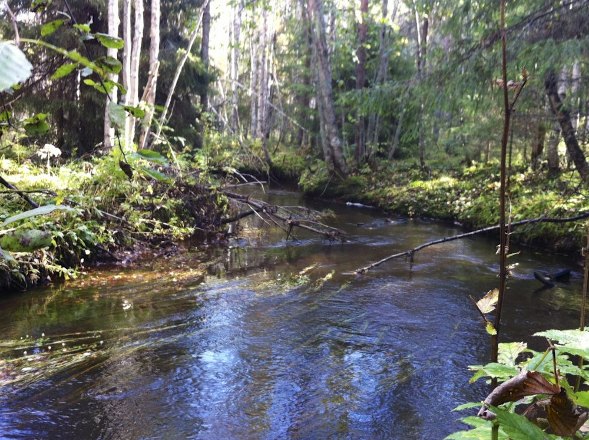
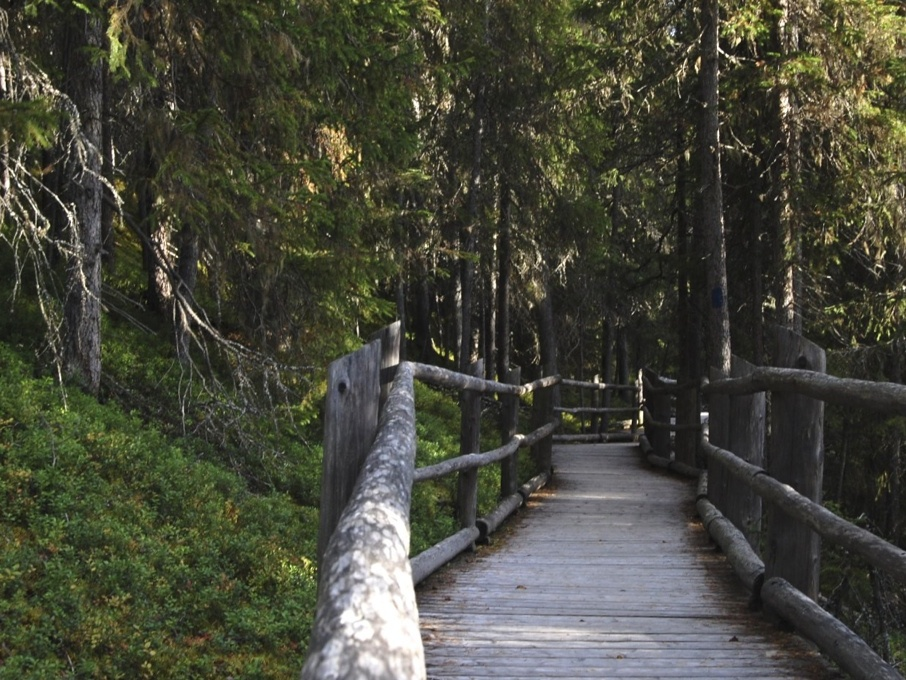

Viime viikonloppu meni vaihteeksi maalla Vaalan suunnalla. Lauantai iltana käytiin tarkastamassa vanhat kalapaikat Oulujoen rannalla, missä ei ole tullut käytyä kymmeneen vuoteen. Alkuperäinen suunnitelma oli käydä narraamassa ahvenia mato-ongella Kurenkosken rannalla, mutta koska joen pinta oli niin korkealla ja sen rannan puskat niin tiheitä, paikaksi valikoitui Multipakan uimarannan kaislikko Multilahdella.

Matoa koukussa ei tarvinnut uittaa vedessä minuuttiakaan, kun koho alkoi sukeltelemaan pinnan alle. Vajaan parin tunnin aikana vedestä nousi viisi särkeä, jotka ahvenien toivossa päästettiin menemään. Olisi pitänyt ottaa suosiolla nämä kotiin vietäväksi. Ahvenia ei näkynyt :-)

[Kansalaisen karttapaikan](http://kansalaisen.karttapaikka.fi/) muunnostyökalun avulla koordinaatit saatiin muutettua ETRS89-muotoon, joka vastaa lähestulkoon WGS84-koordinaatistoa.

Metsään lähtiessä unohtui ottaa kamera mukaan. Harmittaa vieläkin, koska pimeisiin notkoihin tuli kivasti valoa ja varjoja aurinkoisen päivän johdosta. Vieressä iPhonen kameralla otettu kuva Siirasojasta. Melkein kuin jostain viidakosta.

Edellisen kerran saman lenkin olen kiertänyt isän kanssa ~10 vuotiaana. Kiva oli käydä uudestaan. Syvällä metsässä olleen ison tervahaudan paikan vielä muistin.

Vaalasta takaisin Kempeleeseen ajettiin pienen mutkan kautta. Vesiputoukset ovat aina kiinostaneet ja päätimme käydä katsomassa Hepokönkään vesiputousta Puolangalla [Hepokönkään luonnonsuojelualueella](http://www.luontoon.fi/hepokongas). Hepoköngäs on 24 metriä korkea vesiputous Kiiminkijoen latvoilla.

Hepokönkään vesiputous oli vähän liiankin helposti saavutettava. Asfalttitieltä oli matkaa putoukselle noin 600 metriä. Tietysti on kiva, että liikkumarajoitteisetkin pääsevät katsomaan näitä luonnon nähtävyyksiä. Putouksen alle pääsee vaikka pyörätuolilla kelaamaan, joskin lankutettu kulku-ura on sateella aika liukas.

Ensi kerralla kalastukseen enemmän aikaa ja evästä matkalle. Myös [Rokuan](https://www.luontoon.fi/rokua) maastoon pitää päästä. Ainakin kiertämään pohjoisempi puolikas Keisarinkierroksesta, joka on käymättä.
