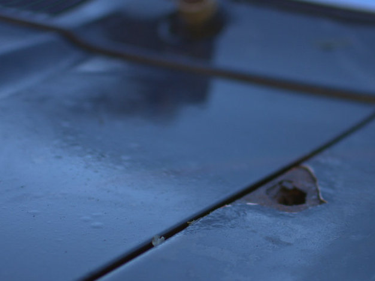
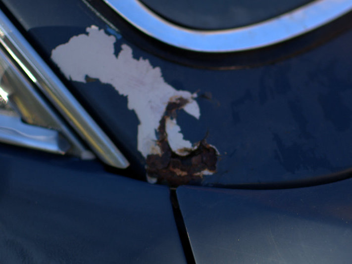
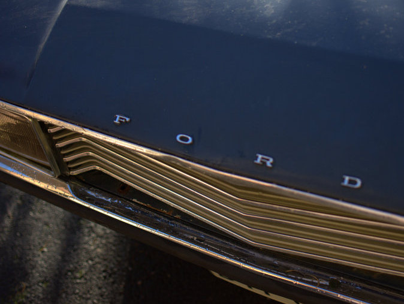
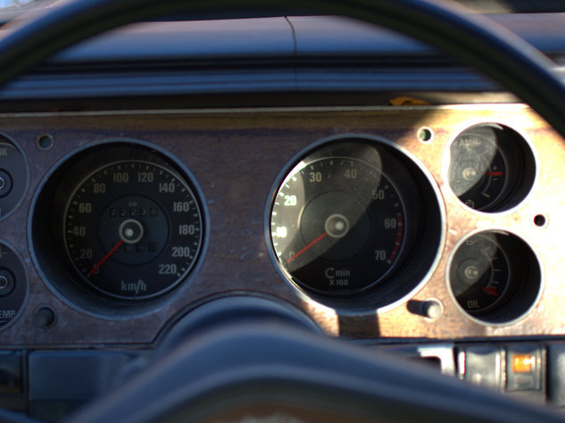
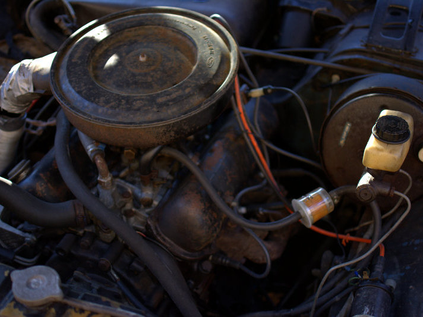

Ostos on pihassa ja aurinko paistaa. Nyt on hyvä ilma tarkistella mitä on tullut ostettua. Päällisin puolin pelleistä löytyy pari reikää, mihin ruoste on alkanut pesiytymään.

Lienee tässä ministeritason autossa olleen lippusalko näillä kohdin :)

Tästä taitaa valua vesi sisälle asti, koska apukuskin puolella kasvoi sammal matossa ja näyttipä lattiassa olevan reikäkin.

Ilahduttavaa on se, että kaikki listat on tallella ja kohtalaisen hyvässä kunnossa. Mukaan tuli umpio paikallaan olevan veden runteleman umpion tilalle. Lisäksi mukana oli jarruvaloille lasit.

Sisältä Granada oli eläneen näköinen, mutta verhoilut olivat pääosin ehjiä. Mittarit toimivat, mutta valoja näissä ei paljon näkynyt.

Konepellin alta ei löytynyt mitään yllätyksiä. Huonommassa kunnossa olevia konehuoneita on näkynyt.

Auton alle en vielä päässyt kurkkaamaan. Perästä nostaessa tankki alkoi vuotamaan, joten pitää tyhjentää tankki ja hommata muutenkin rampit, joiden avulla alle pääsee paremmin.
