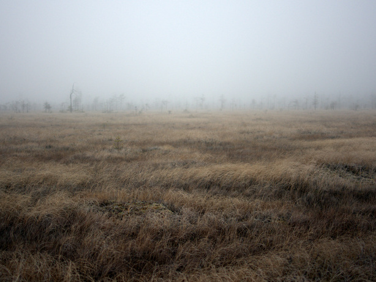
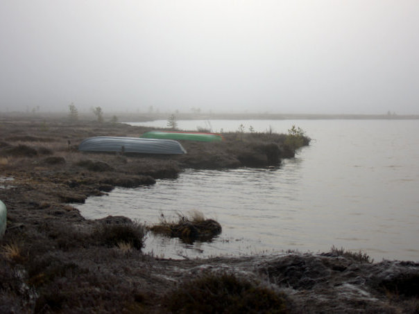

Kävimme viime viikonloppuna Kemissä ja sääennusteet lupasivat kirkasta päivää lauantaiksi, joten ei ollut mitään syytä jättää käymättä Martimoaavalla. Ajatuksena oli ehtiä Martimoaavalle auringonnousun aikaan ja käydä katsastamassa Martimojärven Valkaman laavu. Emme ole käyneet kuin kerran hiihtäen siellä.

Sää Kemissä oli selkeä, mutta usva sakeni sumuksi lähestyessämme Hangassalmenahon P-paikkaa. Tämä ei haitannut, koska usva toi aavemaisen tunnelman hiljaiselle Martimoaavalle.

Sumussa oli yllättävän vaikea hahmottaa missä päin olemme menossa vaikka olemme kävelleet nämä pitkospuut useamman kerran aiemmin. Pian kuitenkin Martimojärven Valkaman rakennukset alkoivat näkymään usvan seassa.

Martimojärven Valkama on aika karupaikka. Puita liiteristä löytyi tarpeeksi, jotta kehtasimme sytyttää nuotion ja keittää nokipannukahvit. Pari ruisleipää näissä maisemissa maistuu paljon paremmalta kuin kotona keittiöpöydän ääressä.

Pois lähtiessämme kävelimme luontopolkua pitkin takaisin. Hangassalmenahon P-paikalle oli ilmestynyt lähes kymmenkunta autoa. Moni muukin on huomannut, että tämä päivä on mitä mainioin retkeilyyn tai karpaloiden poimintaan.

Paluumatkalla pistäydyttiin katsomassa, mistä kohdasta Puukkokummun tienoilta lähtee latu-ura kohti Kivalon P-paikkaa. Samalla reissulla yritimme ulkomuistista käydä etsimässä Jatulinlehtoa, mutta emme löytäneet kuin Jatulinlehdon lähellä olevan kodan kääntöpaikan vierestä.

Eipä tässä muuta kuin seuraavia retkiä suunnittelemaan. Aina ei tarvitse useita päiviä ja pitkiä päivämatkoja tarpoa metsässä. Muutaman tunnin tepastelu luonnossa riittää mainiosti pääsemään irti arkisista rutiineista.
