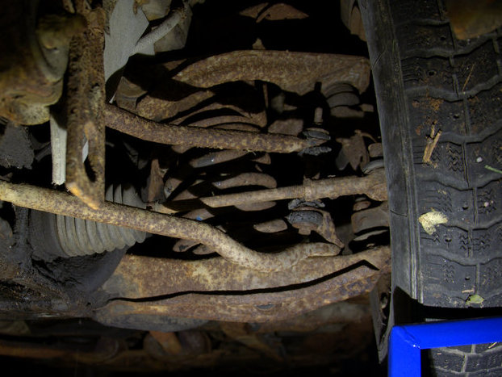

Talvi se vaan tekee tuloaan ja pitää ehtiä vaihtamaan nesteet ennen ensimmäisiä kunnon pakkasia. Autohan tulee seisomaan ainakin ensimmäisen talven mitä ilmeisemmin pihalla. Ensimmäinen kurkistus auton alle on aika karua katseltavaa, mutta näyttää siellä muutakin kuin ruostetta olevan.

Kuvassa näkyy luultavasti jälkiasennuksena lisätyt lattaraudat hinauskoukkuja varten.

Ensimmäisenä päästin jäähdytysnesteet pois suoraan irroittamalla moottorin päästä alajäähdytysletkun. Onkohan tämän jäähdyttämiseen käytetty järvivettä. Ei tämä ainakaan jäähdytysnesteeltä näytä.

Pitää käydä ostamassa jäähdytinjärjestelmän puhdistusaineet ja kierrättää niitä hetki koneessa ennen uusien nesteiden vaihtamista. Näitä odottaessa voi suorittaa öljynvaihdon. Tässä ei olekaan mitään ihmeellistä. Ruosteinen öljynsuodatin lähti nätisti irti ja öljyä näytti olevan. Laitoin sisään halvimmat öljyt. Tuskin moottoria tullaan käyttämään talven aikana.
