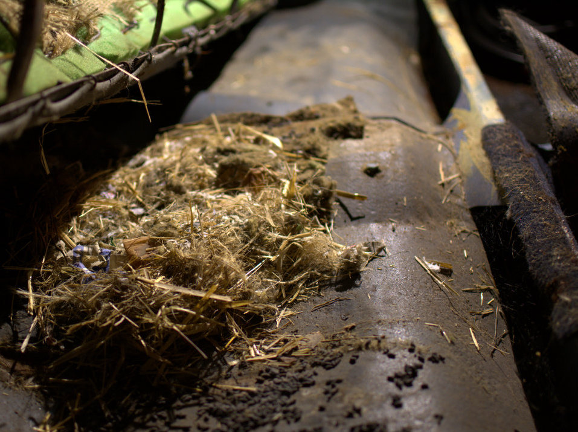
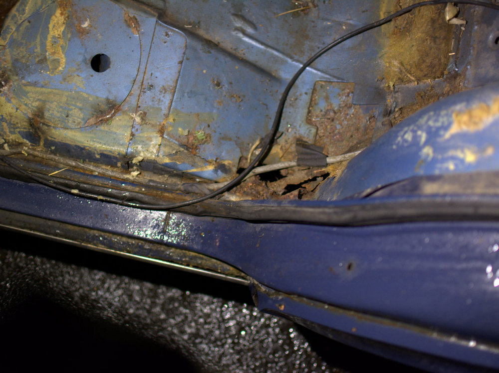
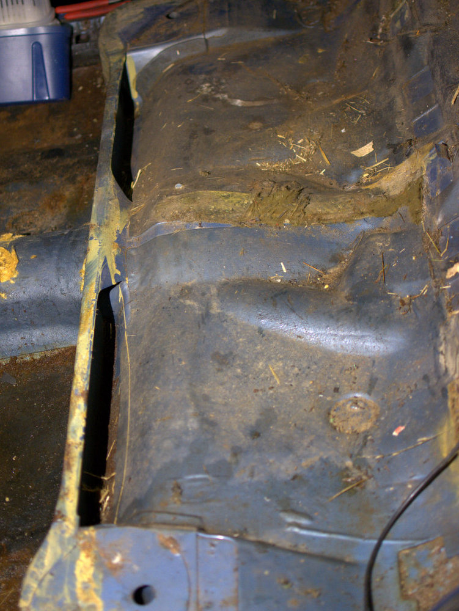

Viikonloput mennyt taas reissussa, mutta sunnuntaina ehdittiin hieman purkamaan verhoiluja. Kyllähän tätä pimeällä pystyy tekemään, kunhan valaistus on kunnossa mutta huomattavasti helpompaa päivän valolla. Tai sitten pitäisi vaan ostaa enemmän valoja.

Penkit irtosivat ongelmitta. Penkkien verhoiluhan oli yhtä reikää takapenkkien nahkaosaa vaille ehjät, mutta kankaat olivat kovin haalistuneet. Penkit tuntui painuvan pohjaan kevyemmänkin henkilön istuessa penkeille, joten uusiksi nämä menee.

Takapenkin alta löytyi hiirenpesä. Luultavasti osa takapenkin sisuksista on mennyt tämän pesän rakentamistarpeisiin.

Hiiren jätöksiä löytyi myös kuskin jalkatilan verhoilujen takaa. Radion takaa löytyi myös papanoita. Myös anteenin johtoa oli jyrsitty jonkun verran. Eiköhän nämä pikkuelukat ole syynä miksi esimerkiksi virtaa ei tule kaikille lampuille.

Reikä tuntuu löytyvän jokaisen lokasuojan kulmasta. Yllä olevassa kuvassa on apukuskin puoleinen lokasuoja.

Vastaavat reiät löytyivät myös takalokasuojista takapenkin alta.

Takapenkin alaosa näytti päälle päin hyvältä sen sijaan ruoste on tykännyt jalkatilaan jääneestä vedestä. Nämä eivät kuitenkaan olleet ihan puhki ruostuneet.
