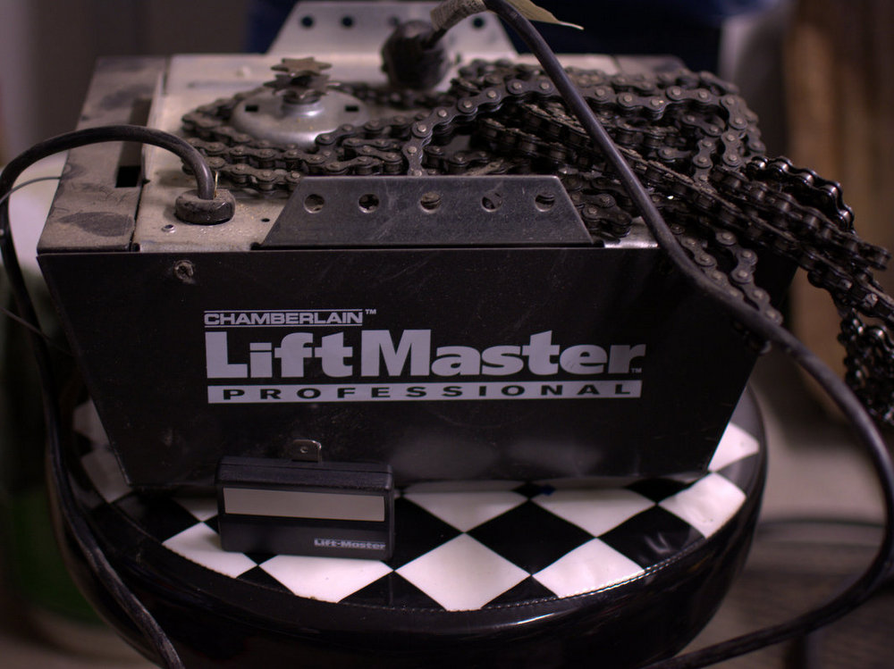
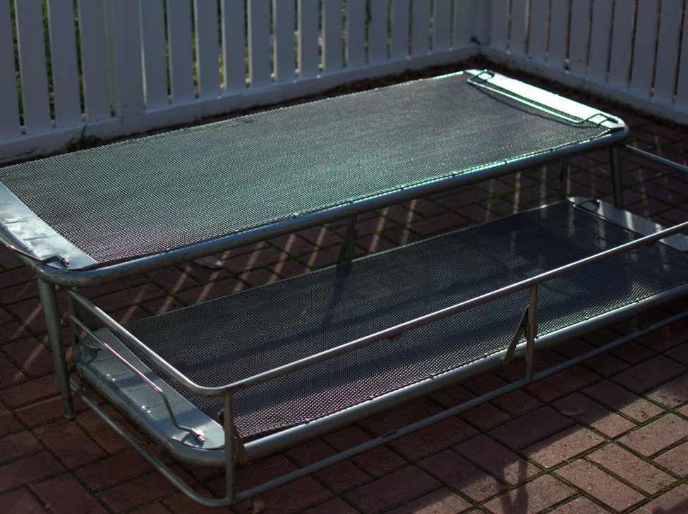
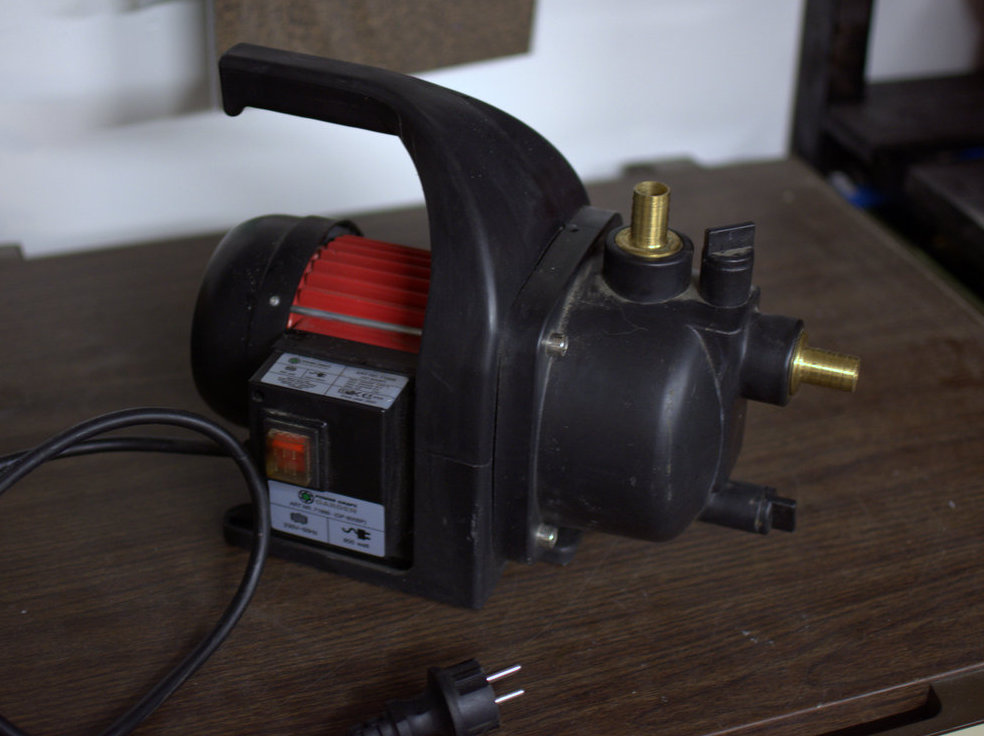
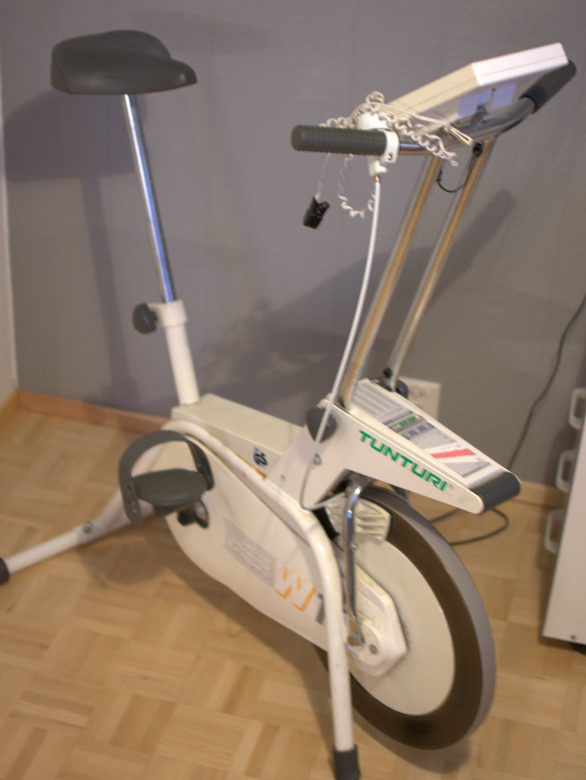
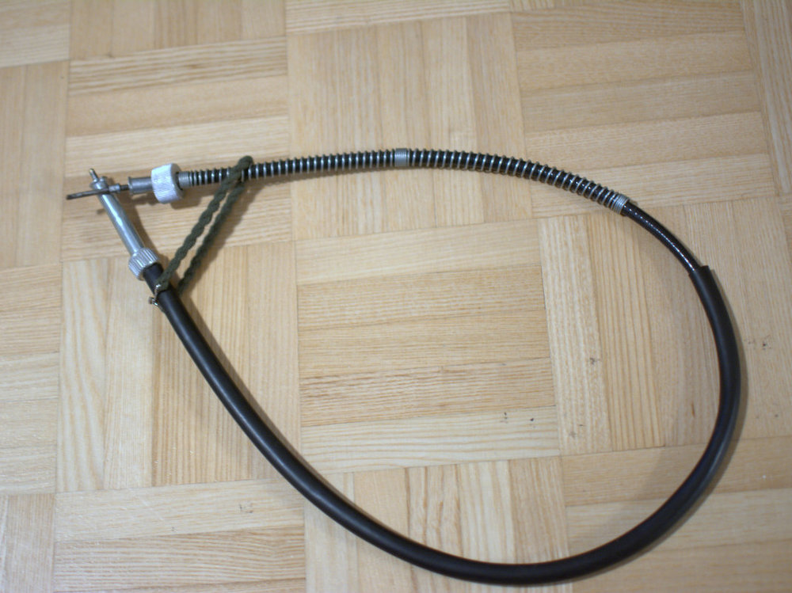
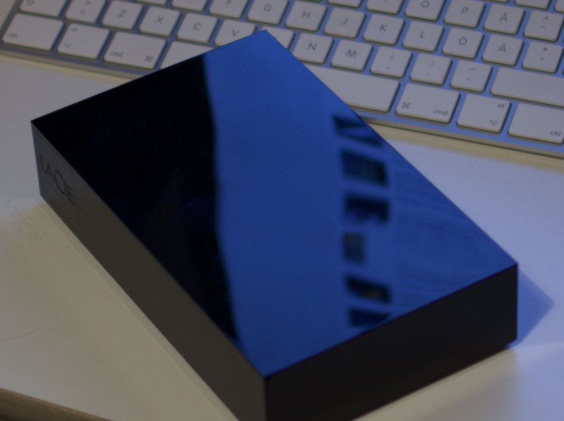
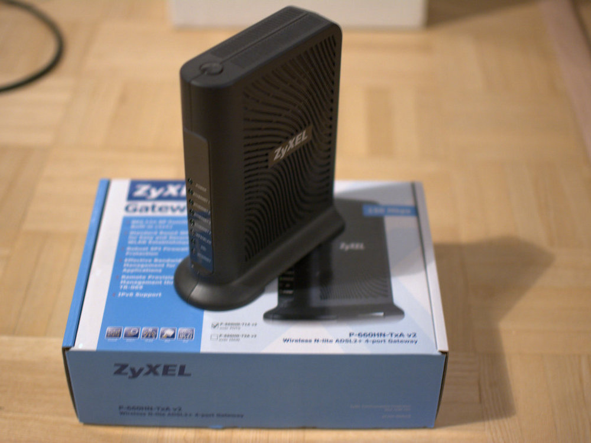
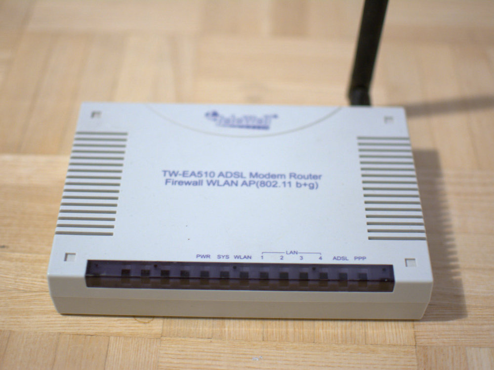
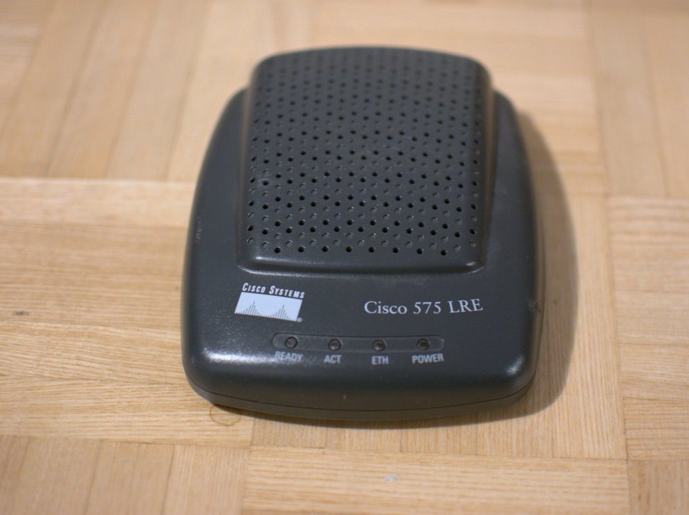

Mitä enemmän tilaa varastointitilaa käytettävissä sitä helpommin turhaa tavaraa kertyy nurkkiin. Olen jo myynyt kiitettävästi viikon aikana näitä turhia tuotteita, mutta vielä on myytävänä. Tässä lista vielä myynnissä olevista tavaroista sekä linkit <a href="http://www.tori.fi/">Tori.fi-palveluun</a>.

Yhteydenotot mieluiten osoitteeseen jarkko [at] splatweb . net tai tekstiviestillä numeroon 045 130 9209 (voin soitella takaisin).

## MYYTY - Partner GBV 325 -lehtipuhallin (hp. 80€)

Muutaman vuoden käyttämättä ollut Partnerin laadukas lehtipuhallin. Testattu ja lähti käyntiin kuin uusi.

## MYYTY - LiftMaster 4410e -sähköinen ovennostin (hp. 90€)

Muuttaessamme omakotitaloon kaupan mukana tuli asentamatta jäänyt LiftMasterin sähköinen ovennostin. Eli tämä on käyttämätön kampe. Nostovoimaa tällä ovennostimella on 800N ja tehoa moottorissa 800W.

## MYYTY - Upon valmistama heteka-sänky

Loistavassa kunnossa oleva UPOn valmistama heteka-sänky.

## Power Craft -vesipumppu (hp. 25€)

Tässä 800 watin sähkömoottorilla toimiva Power Craftin vesipumppu, mitä ei myöskään ole käytetty kuin sen verran, että todettiin meidän käyttötarkotukseen vääränlaiseksi pumpuksi. Pumppauskapasiteetti on 3200 litraa / tunti.

## Enpä myy - Ykibox-suksiboksi (hp. 40€)

Alkuperäiskuntoinen Ylikiimingin muovin valmistama suksiboksi. Kuvissa hieman valkoisempi kuin mitä luonnossa on.

## MYYTY - Tunturi W1 Original Ergometer (hp. 40€)

Toimiva kotimainen Tunturi-kuntopyörä. Ainoastaan sykemittarin anturiin en luottaisi vaan käyttäisin vyöllisiä nykyaikaisia sykemittareita.

## Yamaha DT:n nopeusmittarin vaijeri, 84,5 cm (hp. 10€)

Ainakin liitoksiltaan Yamaha DT 125 R -kevytmoottoripyörään sopiva vaijeri, mutta ainakin tähän yksilöön 5 cm liian lyhyt. Käy ehkä myös mopoihin.

## MYYTY - Sony SS-H551 -kaiuttimet (hp. 15€)

Luultavasti pienen stereopaketin mukana tulleet kaiuttimet. Hyvä valinta vaikka vaikkapa autotalliin tai saunan lauteiden alle.

## MYYTY - Logitech X-230 2.1 -tietokonekaiuttimet (hp. 25€)

Hyvin soivat kaiuttimet tietokoneeseen. Tehoja löytyy 2x6W + 20W subwoofer.

## MYYTY - LaCien ulkoinen USB-kiintolevy (hp. 40€)

Ulkoinen kiintolevy.

## MYYTY - D-Link DIR-655 -reititin (hp. 35€)

Tehokas WLAN-reititin. Lisäksi laitteessa 4 LAN-porttia sekä USB-portti.

## MYYTY - ZyXEL P-660HN T1A v2 ADSL-modeemi (hp. 15€)

Neljällä LAN-portilla sekä WLANilla varustettu ADSL-modeemi.

## TeleWell TW-EA510 ADSL-modeemi (hp. 10€)

TeleWellin ADSL-modeemi, missä neljä LAN-porttia sekä WLAN.

## TeleWell TW-EA501 v3 ADSL-modeemi (hp. 5€)

TeleWellin ADSL-modeemi neljällä LAN-portilla.

## Cisco 575 LRE VSDL-modeemi (hp. 5€)

VDSL-modeemi ilman virtalähdettä.

Päivitetty myytyjä 16.11.2015 klo 12.54.

Päivitetty myytyjä 23.11.2015 klo 8.47.

Päivitetty myytyjä 26.1.2016 klo 9.22.
