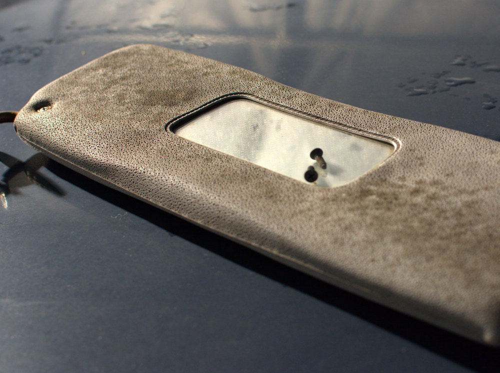

Perussunnuntai puuhailut Granadan parissa. Jatkettiin verhoilun purkamista poistamalla ovien pahvit ja purettiin koelaudan alaosa. Kaikki meni aika mallikkaasti. Ainoastaan yksi ruuvi ei suostunut aukeamaan ja jouduin näyttämään tälle dremeliä.

Ovien pahvit lähtivät nätisti hieman vääntämällä kiinnikkeiden kohdalta irti. Tämä on muuten ensimmäinen kerta, kun ovia availen lämpötilan olevan plussan puolella 🙂 Pahvit olivat vettä imeneet aikanaan mutta varsinaisesti märkiä oli vain yksi. Taitaapa mennä uusiksi nämäkin verhoilut. Vähän tuntuisi kuin maalauksessa maalia olisi vuotanut vähän sisäverhoilun päälle.

Pientä pintaruostetta ovien sisäpuolella. Kotelot eivät äkkiseltään katsottuna olleet läpipuhki mistään kohdalta.

Hiiret ovat nähtävästi jättäneet koelaudan rauhaan. Ainoastaan ihan alimmaisista osista löytyy hiiren jätöksiä sekä jonkin verran nakerrettuja johtoja.

Yllätyin kuinka vähän tässä autossa on vedetty johtoja verrattuna jopa 80-luvun autoihin, mitä olen joutunut availemaan.

Aurinkolipat olivat kohtalaisessa kunnossa, kunnes avattuna huomasi kuinka homeessa nämä ovat. Taitaa mennä katon verhoilukin uusiksi vaikka se päälle päin näyttää hyvältä.

Seuraavaan kertaan jäi vielä tuon koelaudan irroittaminen. Sitten alkaakin puhdistusoperaatiot ja tarkemman korjaussuunnitelman tekeminen. Seuraava viikonloppu pitäisi olla vapaa, jolloin ehtisi vähän enemmän puuhastelemaan tämän auton parissa.
