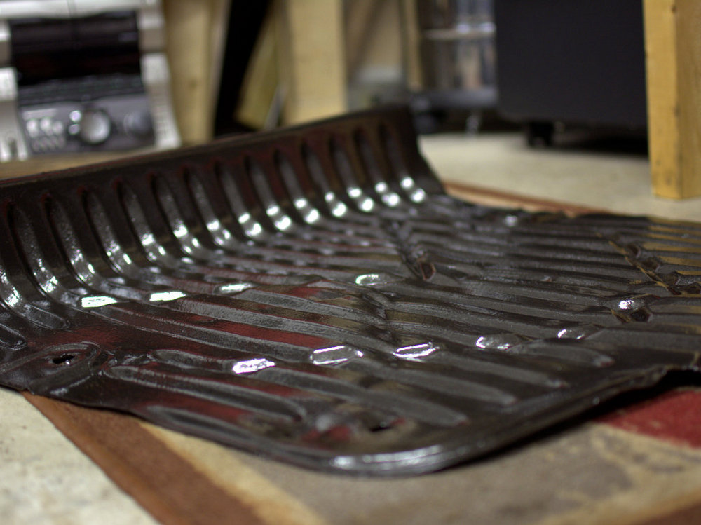

Öljynvaihdon yhteydessä irroitettua pohjapanssari, jota en ole laittanut paikoilleen vaan se on nojaillut tallin seinään pari viikkoa. Ajattelin, että sama kai se on jo tässä vaiheessa suojata maalaamalla, ettei ainakaan enempää ruostu.

Ensimmäiseksi rapsutin enimmät ruosteet kulmahiomakoneen teräsharjan avulla pois. Totta kai tämä toteutettiin sunnuntai-iltana, jottei turhaa naapureita tullut häirittyä.

Kun enimmät ruosteet oli saatu irroitettua, kävi selväksi pohjapanssarin alkuperäinen väri, joka oli musta. Löytyipä pohjapanssarista Fordin leimakin, joten ennakkoarvailusta poiketen tämä ei ole mikään itsekyhätty pohjapanssari.

Autotallin puolella ei lämmitys ole päällä, joten maalaaminen suoritettiin pannuhuoneen puolella. Sivelin pohjapanssarin pintaan 2-3 kerrosta mustaa Hammertite-maalia, jota sattui olemaan hyllyssä puoli purkkia.

Mielestäni tämä musta Hammertite on enemmän tumman harmaata kuin mustaa, mutta menköön näissä pohjan osissa. Maalia markkinoidaan ominaisuuksilla, jotka mahdollistaa maalaamisen suoraan ruosteen päälle, mutta olen aina enimmät ruosteet rapsutellut alta pois.
