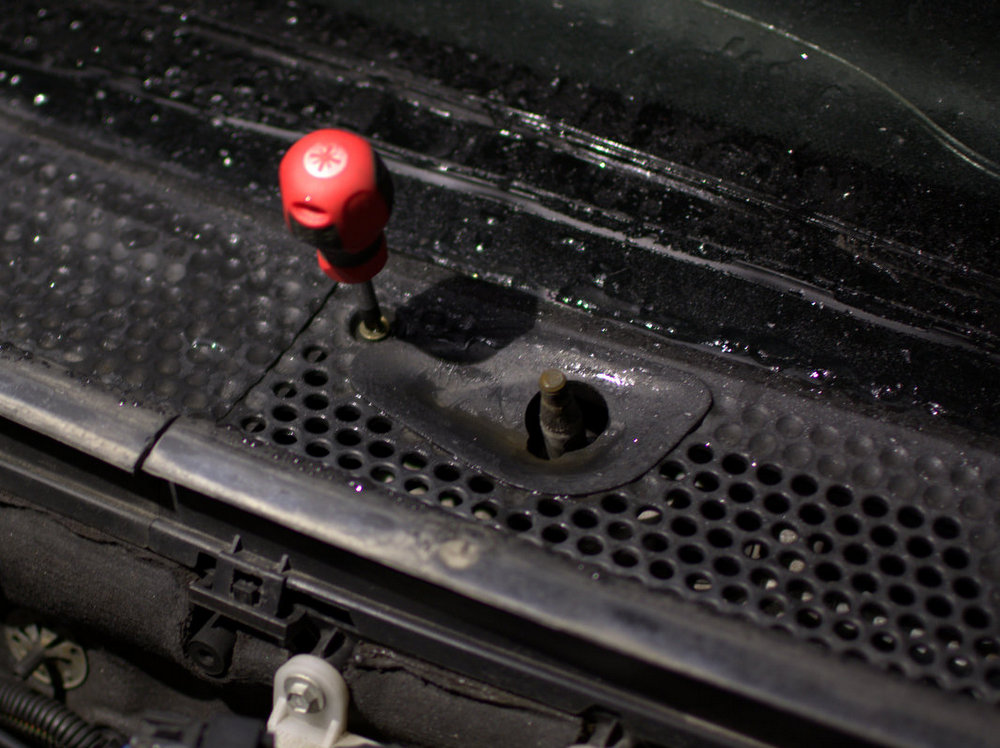

Pari tapausta tiedän, missä Ford Focus MK1 eli vuosimallit 1999-2003 tuulilasinpyyhkijät lopettavat toimimisen. Aluksi minullekin tuli mieleen tuulilasinpyyhkijöiden moottorin hajoaminen tai joku sähkövika, koska pyyhkijöiden päälle laittamisen jälkeen ei mitään ääntä kuulunut.

Tuulilasinpyyhkijän moottoriin pääsee käsiksi irroittamalla ensiksi tuulilasin pyyhkimet. Tärkeintä on kuitenkin ensiksi varmistaa, ettei virrat ole autossa päällä. Tämän jälkeen tuulilasinpyyhkijän varren saa irti irroittamalla yllä olevassa kuvassakin näkyvä suojamuovi. Suojamuovi lähtee nostamalla irti ilman työkaluja. Suojamuovin alla on mutteri, jonka avaamisen jälkeen pyyhkijä pitäisi lähteä irti nostamalla. Omat pyyhkijänsulkien varret olivat hapettuneet siinä määrin, että jouduin käyttämään [Biltemasta ostamaani ulosvetäjää apuna](http://www.biltema.fi/fi/Autoilu---MP/Tyokalut-ja-korjaamon-varustus/Ulosvedin/Pallonivelen-ulosvedin-2000019461/).

Kun pyyhkijänsulkien varret on irroitettu, irroitetaan seuraavaksi vivustoa suojaava suojamuovi. Apukuskin puoleisen varren vieressä on muovitulpan alla ruuvi, joka tulee irroittaa. Seuraavaksi irroitetaan muoviklipsut ja suojamuovi lähtee irti.

Pyyhkijöiden toimimattomuuden syy ei ollutkaan moottorissa tai sähköissä. Ongelma on tuulilasinpyyhkijöiden vivustossa, missä moottorilta tulevan tangon päässä oleva pallonivel on löystynyt. Moottorilta tuleva tanko näkyy yllä olevassa kuvassa taustalla. Youtubesta löytyi monta vinkkiä, missä tämä pallonivel on kiinnitetty mitä erilaisimmilla nippusidevirityksillä. Nämä eivät ole pysyviä ratkaisuja. Toivoa antoi tämä alla oleva video, missä yksinkertaisella metallilevyn palasella voidaan korjata pallonivelen kiinnitys.

<iframe src="https://www.youtube.com/embed/iirmgj92nfg" width="560" height="315"></iframe>

Ebaystä löytyy "Windscreen wiper motor linkage repair kit" -hakusanalla videolla esitellyn kaltaisia korjauspaloja, mutta kun metallilevyä löytyy hyllystä niin miksi ei tekisi itse sellaista. Valitettavasti minulla ei ole edes peltisaksia, joten jouduin dremelöimään levystä tämän osan.

Piirsin ohjausvivuston pään ääriviivat pahvin palalle, jonka leikkasin ja käytin sabluunana, kun hahmottelin haarukan muotoja pellin palaselle.

Mikään kaunis palahan tästä ei tullut, mutta tämä ei olekaan kauneuskilpailu. Kiinnitin haarukan M5-ruuvilla ja mutterilla vipuun. Vivussa oli jo valmiina sopiva reikä, joten siihen sitä ei tarvinnut porata. Valitettavasti en saanut kuvaa korjatusta pallonivelestä, koska se jäi niin pahasti piiloon, enkä jaksanut koko vivustoa irroittaa kuvan ottamista varten.

Jos jotain jäi epäselväksi niin kannattaa katsoa tuo ylempänä oleva Youtube-video, missä on hyvin selitetty kuinka haarukka kiinnitetään vivuston varteen.
