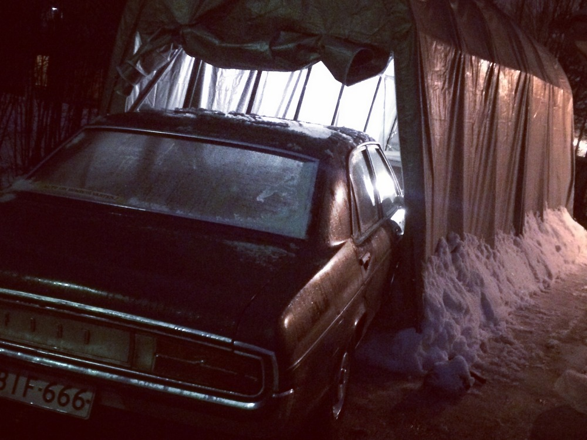
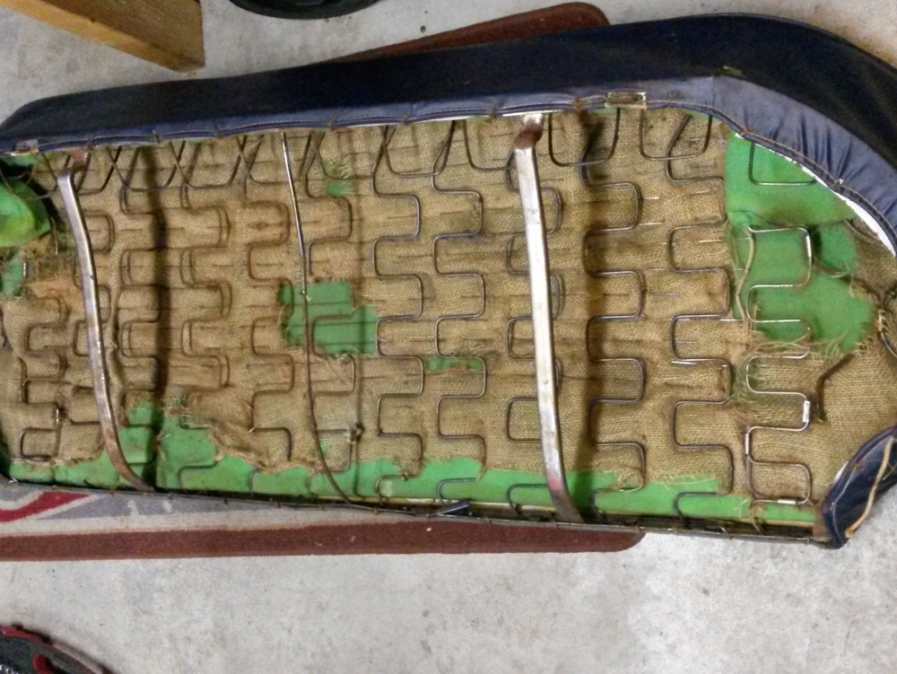
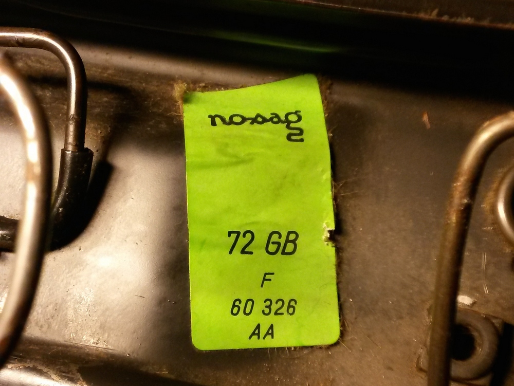

Granada on saanut olla melko rauhassa pari viimeistä kuukautta, mutta alku vuodesta on tätä projektia saatu hieman eteenpäin. Loppu syksystä luonto päätti puuttua peliin ja vaikeuttaa Granadan kunnostusprojektia. Myrskytuuli yritti tehdä selvää pressutallista ja lennätti sen auton päältä pois. Onneksi pahemmilta vaurioilta vältyttiin. Autoon tuli pieni naarmu ja pressutalliinkin vain yksi reikä ja muutama murtunut liitospala, jotka saatiin hitsattua kuntoon. Tämän jälkeen talli pystytettiin nurmikolle, jotta talli saatiin ankkuroitua joka kulmasta kunnolla maahan kiinni.

Kun talli saatiin pystyyn niin ehti pakkanen iskemään eikä kehdannut Granadaa tulille laittaa, jotta sen olisi saanut ajettua suojaan. Kun seuraavan kerran nollakelit tulivat joulukuussa, alettiin kampeamaan autoa talliin. Nastamursketta sai kylvää koko pihan täyteen, jotta auton sai ajettua talliin. Iltahan siinäkin sitten lopulta meni. Tämän jälkeen pääsikin käyttöauton kimppuun, jonka jarrut olivat katsastusmiehen mielestä liian epätasapainossa. Samalla vaihtui yksi tarviketukivarsi alkuperäiseen ja tulipa yksi helakin vaihdettua jarrujen lisäksi.

Tammikuun puolessa välissä päästiin vihdoin Granadan kimppuun. Verhoilun purkaminen jatkui. Nyt purettiin penkit rungoille.

Etupenkit olivat kohtalaisen hyvässä kunnossa, mutta kaikki menee uusiksi. Säätömekanismit toimivat molemmissa penkeissä moitteettomasti.

Takapenkin alla oli iso hiirenpesä. Pesän rakennusmateriaaleja oli otettu mm. takapenkin verhoilusta.

Verhoilujen kätköistä löytyi erilaisia lippuja ja lappuja. Pitäisi selvittää mistä nämä ovat peräisin.

Verhoilukankaiden ja keinonahkojen metsästys on jo alkanut. Kovin helppo ei ole löytää vastaavan tapaisia materiaaleja. Varsin ohkainen tarjonta on sinisten kankaiden ja nahkojen kohdalla kaupoissa.

Verhoilumateriaalien etsimisen lisäksi seuraavaksi vuorossa on penkkien osien maalaaminen näkyviltä osiltaan.
