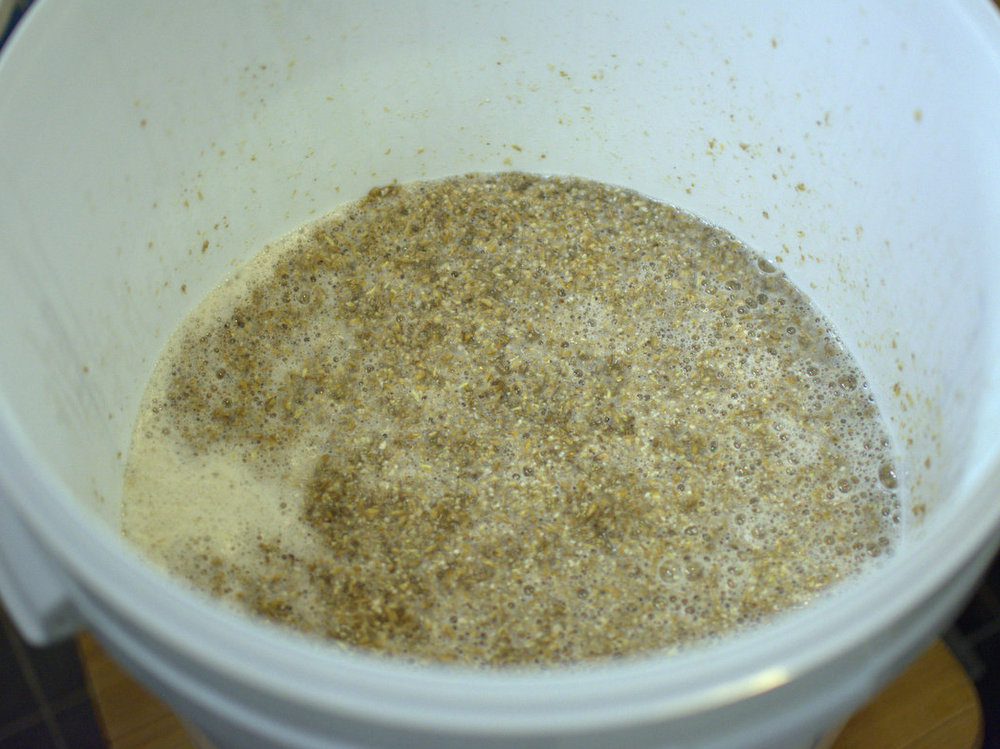
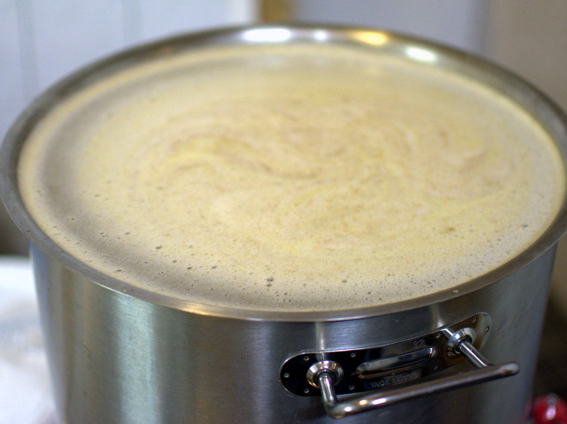
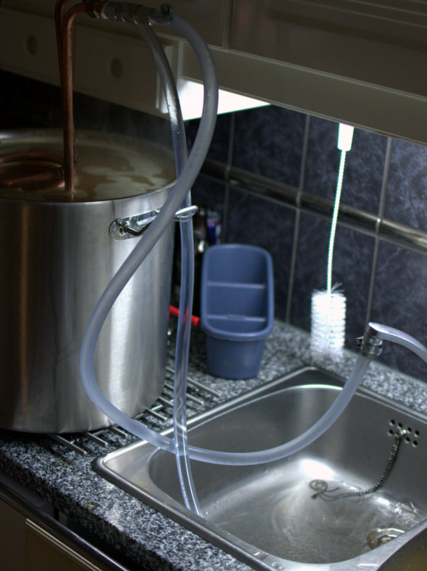
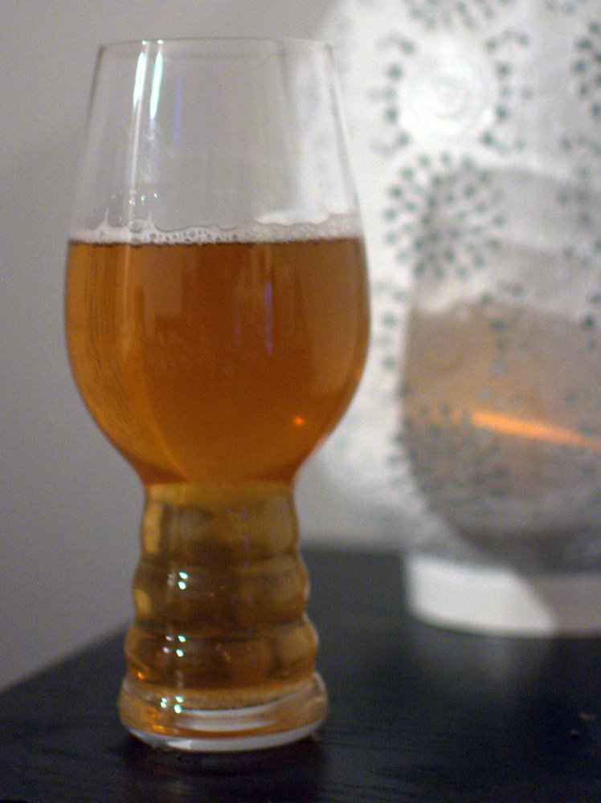

Olutta on tullut nautittua toki useamman vuoden ajan, mutta oluen valmistus oli minulle uusi. Varsinainen olutharrastus alkoi noin viisi vuotta sitten, kun ostimme erilaisia oluita ja vahingossa pidimme tasting-session. Kirjasimme ylös muistiinpanoja mausta, väristä ja koostumuksesta. Nämä kaikki puhtaasti suomeksi ilman termistöä. Siinä alkoi huomaamaan mikä ero eri tyyppisillä oluilla on ja lopulta olen oppinut tunnistamaan pienemmätkin erot saman tyyppisten oluiden väliltä.

Oman oluen valmistus on ollut mielessä tämän jälkeen monesti. Kokeilua on jarruttanut muistot opiskeluajoilta. Luokkakaverini harrasti oman oluen valmistamista, mutta maku ei silloin miellyttänyt. Kun sain syntymäpäivälahjaksi Henok Fentie &amp; Karl Grandin Pane olutta -kirjan, rohkenin investoimaan laitteistoon. Kirjassa oluen paneminen neuvotaan tekemään varsin yksinkertaisella laitteistolla. Laitteisto koostuu käytännössä kattilasta, kylmälaatikosta sekä kolmesta käymisastiasta. Kahdesta käymisastiasta rakennetaan mäskin huuhteluastia. Lisäksi rakentelin kupariputkesta vierteenjäähdyttimen.

Käymisastiat maksoivat noin 13 euroa kappaleelta. Biltemasta löytyi 25 litran vetoine kattila 59 euroon. Kylmälaatikon ostoa olen vältellyt pitkään, mutta nyt sillekin tuli oikea tarve ja sattui vielä olemaan punaleimatuotteena eli hinta jotain 15 euron luokkaa. Vierteenjäähdyttimeen ostin 10 metriä kupariputkea, joka maksoi 7,90 euroa metriltä. Lisäksi tuli erilaisia pikkuosia muutaman kympin edestä (ominaispainomittari, lämpömittari, desinfiointiaine). Eli aloituskustannukset välineistön osalta oli jotain 250 euroa.

Reseptiksi valitsin Kotiolut.com-keskustelualueelta yksinkertaisen [Pale Ale -reseptin](http://www.kotiolut.com/viewtopic.php?p=1731#p1731), joka koostuu Pale Ale -maltaista sekä Cascade-humalasta. Hiivana käytin Safale US-05 -oluthiivaa. Raaka-aineiden hinnaksi tuli noin 65 euroa.

Kieltämättä aika hinnakas setti, mutta luotin siihen, että sijoitus maksaa itsensä takaisin.

Maltaat tilasin valmiiksi rouhittuna [Lappo.fi-nettikaupasta](http://www.lappo.fi/), josta tuotteet toimitetaan nopeasti.

Ensimmäiseksi lämmitetään vettä mäskäystä varten. Itse käytin 4,6 kilogrammaa maltaita, jota haudutetaan tunti 12 litrassa vettä.

Tämän jälkeen mäski huuhdellaan käyttämällä kahdesta käymisastiasta tehtyä huuhtelusiivilää. Sisimmäisen astian pohjaan porataan reikiä. Mäski kaadetaan tämän siivilän päälle ja päälle kaadetaan 78 asteista vettä. Vettä valutetaan ulompaan käymisastiaan tehdyn reiän kautta hitaasti kattilaan.

Maltaiden huuhteluvesi eli vierre keitetään. Keiton eri vaiheissa lisätään humalaa, joka antaa oluelle katkeron ja aromin.

Humalat tilasin pellettimuodossa.

Kun vierrettä on keitetty tunti, se jäähdytetään 20 asteeseen. Käytin rakentamaani jäähdytintä, jonka läpi ajoin kylmää vettä keittiön hanasta.

Kun vierre on jäähdytetty kahteenkymmeneen asteeseen, kaadetaan vierre siivilän läpi käymisastiaan. Kun vierre on käymisastiassa, sekaan lisätään hiiva ja suljetaan käymisastia.

Annoin oluen käydä pari viikkoa. Tämän jälkeen lapoin oluen toiseen käymisastiaan. Viikon päästä tästä pullotin oluet. Pullotuksen yhteydessä lisäsin kolmisen grammaa panimosokeria per litra. Pullossa käydessään vapautuvahiilidioksidi liukenee hiilihapoksi oluen sekaan.

Käytin pulloina 0,33 litran pulloja ja niitä tuli noin 50 kappaletta. Hävikkiä syntyi jo panovaiheessa sekä eri välivaiheissa. Seuraavaa satsia tehdessä tiedän olla tarkempi.

Jo muutaman päivän jälkeen pullo alkoivat sihahtelemaan avatessa. Yllättäen makukin oli paljon parempi kuin uskalsin toivoakaan. Pidän hieman vahvemman makuisesta oluesta, mutta tämä on aivan loistava ensimmäiseksi olueksi.

Jatkossa voikin alkaa keskittymään erilaisiin resepteihin sekä optimoimaan valmistuprosessia ja laitteistoa. Oluen valmistaminen on huomattavasti helpompaa kuin miltä se aluksi kuullostaa. Varsinkin tuosta Pane Olutta -kirjasta oli paljon apua tämän harrastuksen aloittamisessa.
