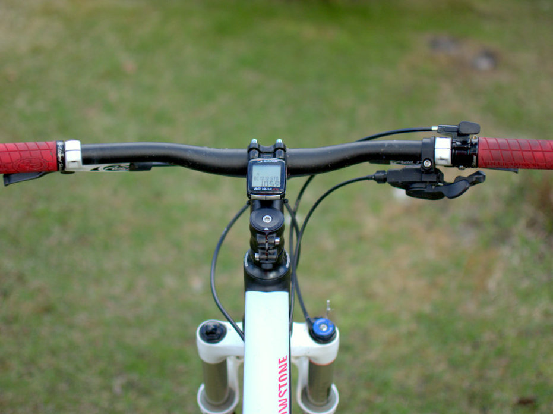

Kevät tuli ja oma vuoden 2012 Canyon Yellowstone 6.9 alkoi kaipaamaan isompaa huoltoa. Hieman rahiseva takanapa oli jo vaivannut pidemmän aikaa. Tätä remonttia tehdessä huomasin, että takapakan kilometrit ovat myös tulleet täyteen. Päätin tilata Shimanon XT-pakan ja uudet ketjut. Uudet ketjut eivät pysyneet eturattaiden päällä, joten sekin piti uusia. Kaveri oli jo siirtynyt 1&#215;10 aikakauteen, joka alkoi kiinnostamaan myös minua. Nyt olisi oikea aika päivittää pyörä näiden osalta nykyaikaan.

Päätin tilata 32 hampaisen [Race Facen Narrow Wide -rattaan](http://www.raceface.com/products/details/narrow-wide-single-ring). Kaverilla on sama 11-36 pakka, mikä minullakin, joka tuntui mukavalta ajaa. 1&#215;10 suosiosta kertoo se, että rattaat tuntuivat olevan loppu vähän jokaiselta kauppiaalta. Tai ainakaan 32 hampaisia versioita ei hyllyistä liiaksi löytynyt. [HI5 Bikesin](http://www.hi5bikes.fi/) valikoimasta tämä ratas lopulta löytyi.

Eturattaiden ostamisessahan ei tarvitse käytännössä ottaa huomioon muuta kuin itselleen sopiva hampaiden lukumäärä. Lisäksi kampien pulttijako ja käytössä olevan takalehtien määrä (ketjun koko).

Race Face Narrow Wide -rattaan asentamisessa ei suurempia haasteita ollut. Aluksi etuvaihtaja vipuineen sekä vanhat rattaat irti ja uusi ratas tilalle. Pikkuisen takavaihteen vaihtajaa piti säätää, koska ketju ei suostunut nousemaan isoimmalle rattaalle.

Etuvaihtajan sekä vaihdevivun poistaminen teki ohjaustangosta hieman epätasapainoisen näköisen. Pitäisi testata keulan lukitsemisvivun siirtämistä vasemmalle puolelle. Tein asentamisen jälkeen noin 25 kilometrin testilenkin ajaen niin asfaltilla kuin maastossa. Siirtymäajossa käytössä on käytännössä pienimmät takarattaat jolloin vauhti pyörii siinä 25 km / h paikkeilla. Aiemmin käytössä oli isoin ratas ja keskimmäiset takarattaat.

Ensimmäisen lenkin jälkeen olen tyytyväinen tähän päivitykseen. Liikkuvia osia saatiin pyörästä pois ja pyöräkin keveni kivasti. Entiset eturattaat ja vaihtajat painoivat reilu 400 grammaa ja uusi ratas painaa karvan alle 40 grammaa. Eli pyörästä tuli noin 360 grammaa kevyempi.
