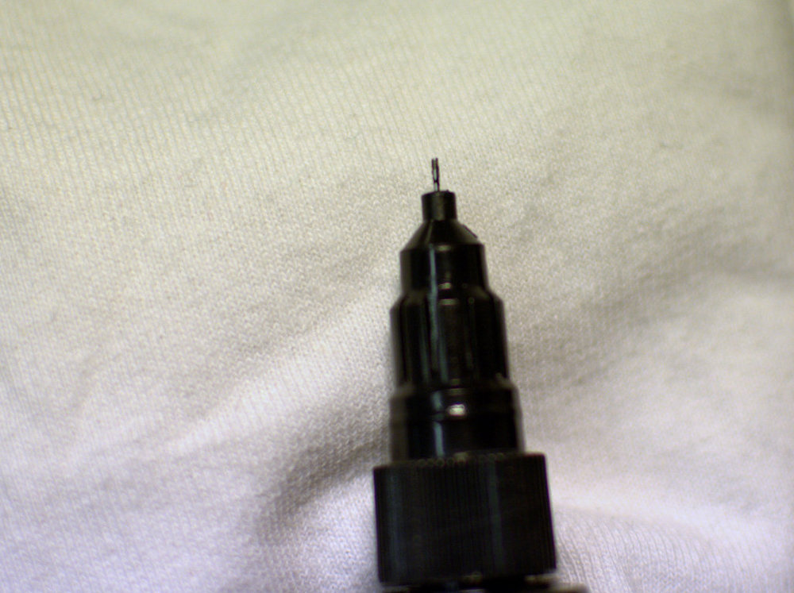
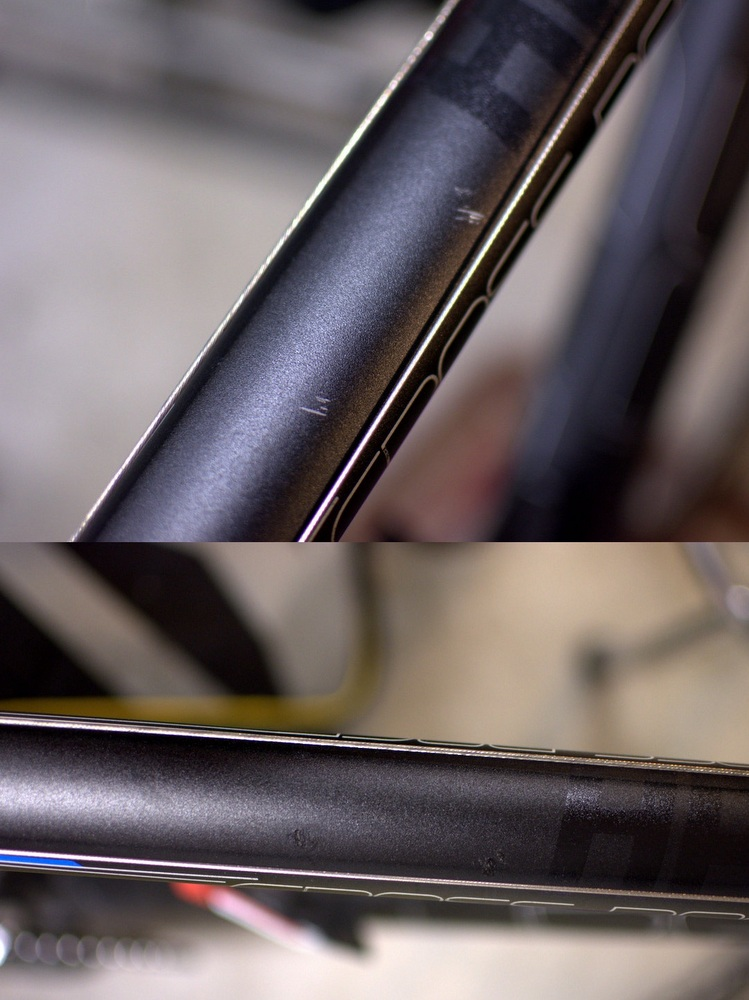

Käytön jälkiä naarmujen muodossa tahtoo tulla pyöriin vaikka kuinka niitä yrittäisi vältellä. Nykyään yleisissä alumiinisissa rungoissa naarmut eivät niin vakavia ole kuin teräsrungoissa, mutta onhan nuo isoimmat hyvä peitellä. Ei ainakaan pistä silmään niin kovasti.

Ostin kokeeksi [Bilteman mattamustan värikynän](http://www.biltema.fi/fi/Autonhoito/Maalit-ja-lakat/Varikyna/) sekä lakkaa. Nämä on tarkoitettu juuri pienien naarmujen paikkailuihin. Kynässä on kynän lisäksi pensseli, jolla voi isompia naarmuja paikkailla. Hintaa kynällä oli 6,99 euroa.

Testasin kynää ensiksi Canyonin maastopyörän runkoon, joka on kiiltävämpi kuin Cuben runko. Puhdistin aluksi maalattavat alueet jarrujen puhdistusaineella, jonka jälkeen maalasin naarmun pensselillä.

Maali oli mattamustaa ja tarkoitus oli vetää vielä päälle lakka, mutta aika lähellä alkuperäistä väriä päästiin tuolla mattamustalla.

Cubessa vuorostaan oli hieman erilainen maalipinta. Tämä ei ole kiiltävää eikä mattaa, joten en ollut aivan varma mitä tästä tulee. Luultavasti tämä ei ainakaan huonommaksi muutu.

Yllättävän hyvähän tästäkin tuli. Naarmut eivät tietysti olleet isoja, mutta kun olivat tuossa yläputkessa ja näkösällä aina ajaessa niin päätin nekin häivyttää pois.

Bilteman värikynät toimivat mielestäni tarpeeksi hyvin tässä tarkoituksessa. Käytännössä yhdessä paketissa tulee kaikki eikä muita työkaluja tarvita. Mielestäni olen samanlaisia kyniä nähnyt myös muissa kaupoissa muiden tuotemerkkien nimen alla. Eli tämä vinkiksi niille, joilla ei ole Biltemaa lähettyvillä.

*Päivitys 23.8.2016 klo 10.00:* Maali hävinnyt komeasti pyörän rungoista sekä auton kyljestä. Pesuaineina käytetty autossa Autoglymin punaista vahaa ja pyörässä Muc-Offia. Eipä ole näin helposti mitkään maalit hävinneet. En suosittele tätä tuotetta enää vai vaatisiko tämä lakan vielä päälle?
