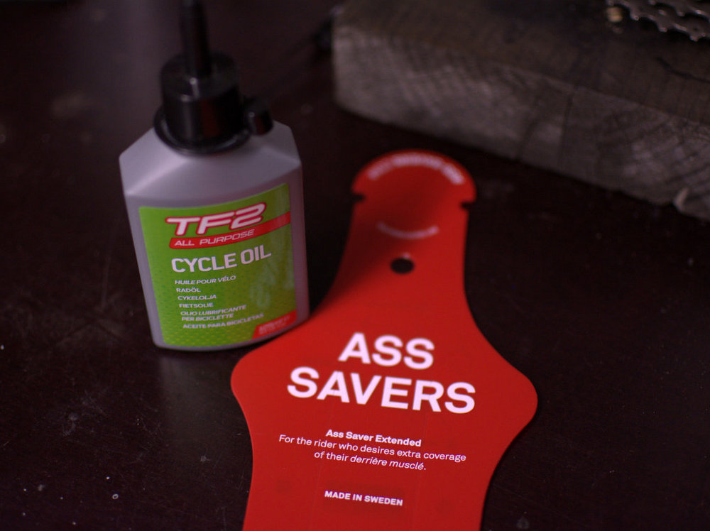

Eilen oli Oulun XXL-liikkeen avajaiset. Ovet avattiin jo kuudelta aamulla ja uuteen liikkeeseen tutustuminen oli mahdollista aina ilta kymmeneen asti. Tarkoitus oli piipahtaa katsomassa liikkeen avajaistarjoukset töistä tullessa vaan en huomannut, että iltapäiväksi oli luvattu vesisadetta. Eli aamulla ei tarttunut mukaan lokasuojaa eikä sadetakkiakaan. Ei sitä rapaisena kehdannut mennä sotkemaan kanssa kuluttajia uuteen liikkeeseen, joten kävin kotona vaihtamassa vaatteet ja suuntasin autolla takaisin Ouluun.

Olin XXL:n nettikaupasta huomioinut muutaman tuotteen, jotka ajattelin käydä hakemassa pois. Näistä kiinnosti edellisvuoden mm. Shimanon XT -lukkopolkimet sekä pukki polkupyörälle. Vaan eihän niitä ollut tarjolla, joten tilasin ne myöhemmin illalla nettikaupasta.

XXL:n avajaisia varten hyllyt oli täytetty enemmän ihmisiä kiinnostavilla tuotteilla ja lopullinen valikoima laajenee myöhemmin. Tuotevalikoima on tietysti silti laaja. Kyllä tässä muut oululaiset urheiluliikkeet saavat alkaa miettimään miten vastaavat uuteen tulokkaaseen.

Matkaan avajaisista tarttui maltillisesti alle kymmenen euron ostokset. Pikkupurkki ketjuöljyä sekä Ass Saver -lokasuoja reppuun mukaan hätävaralokasuojaksi. Pitää tutustua tähän lokasuojaan myöhemmin tarkemmin.
