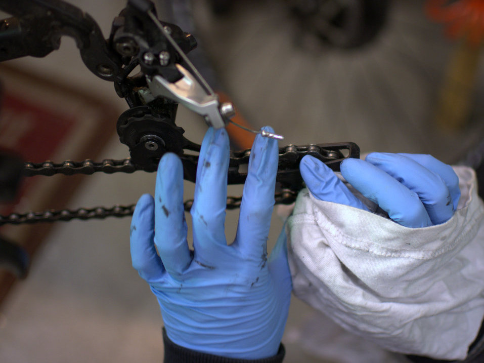

Oikealla rengasvalinnalla pystyy vaikuttamaan pyörällä ajomukavuuteen huomattavasti. Vielä tälläkin viikolla ihmettelin töihin polkiessa, kun yksi kanssapyöräilijä tuli nastat rapisten vastaan vaikka lunta ei ole näkynyt viikkoihin. Vierintävastus on tavallisen ja nastarenkaan välillä huomattavat.

Parempi puolisko huomasi myös, että Canyonin mukana vakiona tulleet Schwalben [Racing Ralph](http://www.schwalbe.com/en/offroad-reader/racing-ralph.html) ja [Rocket Ron](http://www.schwalbe.com/en/offroad-reader/rocket-ron.html) -renkaiden nappulat ovat turhan järeät hänen käyttöön. Pyörällä tulee ajettua pääasiassa tiellä työmatkaa. Ostettiin sitten näiden tilalle Schwalben [Thunder Burt -renkaat](http://www.schwalbe.com/en/offroad-reader/thunder-burt.html), joissa keskellä olevat nappulat ovat huomattavasti kevyemmät. Renkaat ovat myös hieman kapeammat kuin alkuperäiset.

Kun takarengas irroitetaan niin on hyvä putsata takavaihteen vaihtaja siihen kertyneestä liasta. Vielä kun olisi muistanut, että työkaluvalikoimissa on pikalinkin irroitus- ja kiinnitystyökalut niin olisi kannattanut irroittaa ketju työn helpottamiseksi ja puhdistaa sekin kunnolla.

Schwalbe Thunder Burt -renkaan nappulaprofiilin tunnistaa Schwalben tuotteeksi helposti. Renkaat rullasivat kevyesti ja hiljaisesti asfalttitiellä eikä pito-ongelmia ollut 35 kilometrin pyöräretkellä. Ajoimme pääasiassa metsäpoluilla. Rengaspäivitys kannatti ja näköjään rengasvalintakin. Suosittelemme.
