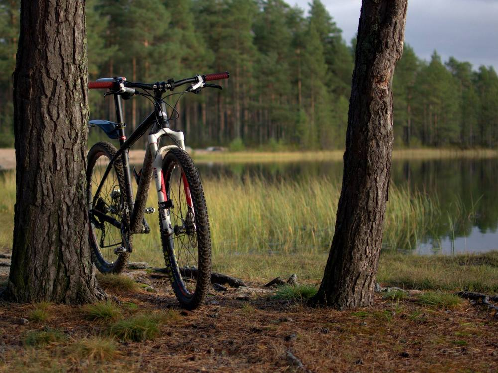

Retkeily on jäänyt harmittavan vähälle viime aikoina. Pari pientä hiihtoreissua repun kanssa tuli talvella tehtyä. Talviloman pilasi sairastelu ja nyt keväällä on ollut oman pihan ja kasvimaan kunnostustöitä tarjolla enemmän kuin tarpeeksi.

Viime lauantaina kuitenkin tehtiin muutaman tunnin pyöräilyretki Kempeleen maastoissa. Lähinnä Köykkyri - Mourunkijärvi välisen maaston polkuja ja metsäautoteitä kiertäessä. Siellä niitä polkuja riittääkin ja on hyvää vaihtelua arkipyöräilylle taajama-alueilla.

Näytti olevan myös kyykäärmeet liikkeellä. 35 kilometrin matkalla nähtiin näitä pikkuveijareita jopa kolme kappaletta. Aiemmin metsässä liikkuessani näitä on tullut vastaan alle kymmenen koko elämäni aikana, joten ainakin itselle tämä oli erikoista.

Mourunkijärvi näytti samalta kuin vuosi sitten keväällä siellä ajellessa. Vielä ketään ei ollut uimassa, mutta eiköhän ensimmäiset uimarit tänne lähipäivinä saavu.

Pitäisi vain jaksaa useammin käydä lähialueilla metsässä keittämässä vaikka kahvit, jos ei pidempiä reissuja jaksa tehdä.
