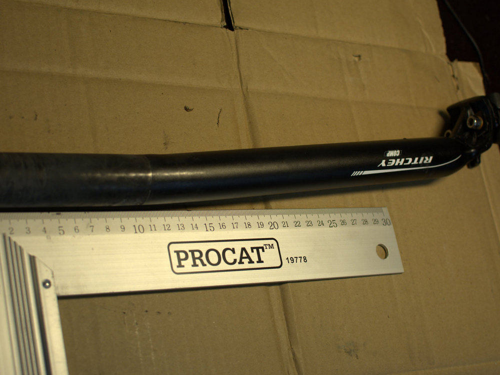

Moni sanoo, että meille vähän tukevammille ihmisille pyöräily on mitä parasta liikuntaa, koska siinä ei nivelet kulut tai rasitu samalla tavalla kuin esimerkiksi juostessa. Juu, ei nivelet kulu, mutta rahaa sitäkin enemmän. Nyt ohjelmassa oli maastopyörän korjaaminen.

Edellisessä postauksessa jo kerroin saapuneesta Bike Discountin -tilauksesta. Muc-Off -pullo oli pettänyt ja kastellut koko lähetyksen. Vahinkoja ei tullut ja ystävällinen reklamointikirje tuotti tulokseksi 10 euron lahjakortin Bike Discountiin. Tilauksessa tuli uusi mm. satulatolppa sekä takavaihtaja.

Olin jo aikaisemmin Canyoniin satulatolpan vaihtanut, kun alkuperäinen vääntyi. Tilalle ostamani Ritcheyn tolppa vääntyi vielä enemmän, kun päätinkin etten kaadu vaan tulen ilman jalkoja hyppyristä alas. Eihän tuo vielä paljoa taipunut, mutta haittasi ajoa, kun aina pelkäsi tolpan lopullista pettämistä. Selailin Bike Discountin tarjontaa ja siellä Thompsonin tolppaa markkinoitiin 40% vahvempana kuin muut tolpat on. Nyt mentiin ihan markkinointipuheiden perusteella tolpan valinnassa. Uusitun tolpan ainoa huono puoli on se, että uuden tolpan rinnalla satula näyttää kovin kuluneelta.

Toinen päivityskohde oli takavaihtaja. Entinen normaali Deoren XT -vaihtaja vaihtui Shadow+ -malliin. Olihan tuo entinen aika rupelille vääntynyt. Pitää kokeilla taivutella tuo takaisin entisiin kuosiin, jotta siitä saisi varavaihtajan hyllyyn.

Uuden vaihtajan säätäminen ei onnistunut väsyneenä ja nälkäisenä loppuillasta. Odottelin perjantai-iltaan ja ajattelin pari asennusolutta ottaa asennusta auttamaan. Eihän tuota ehtinyt ensimmäistäkään hörppyä ottaa, kun vaihtaja vaihtoi nätisti pakan jokaiselle rissalle.

Eikä tässä vielä kaikki. Vaan työmatkalla paukkui taas pinna Cuben Eastonin kiekoista. Mitkähän naulat tuohon pitäisi pistää tilalle, että kestäisi? Uudet vahvemmat kiekot on mietinnässä. Ainakaan nuo Easton EA?? -kiekot on tälläiselle 120 kiloiselle kuskille aivan liian heppoiset.

No. Tehdäänpä niin, että seuraava postaus on vähän positiivisempi. Alkaa itseäkin ärsyttämään nämä vastoinkäymiset kaluston kanssa.
