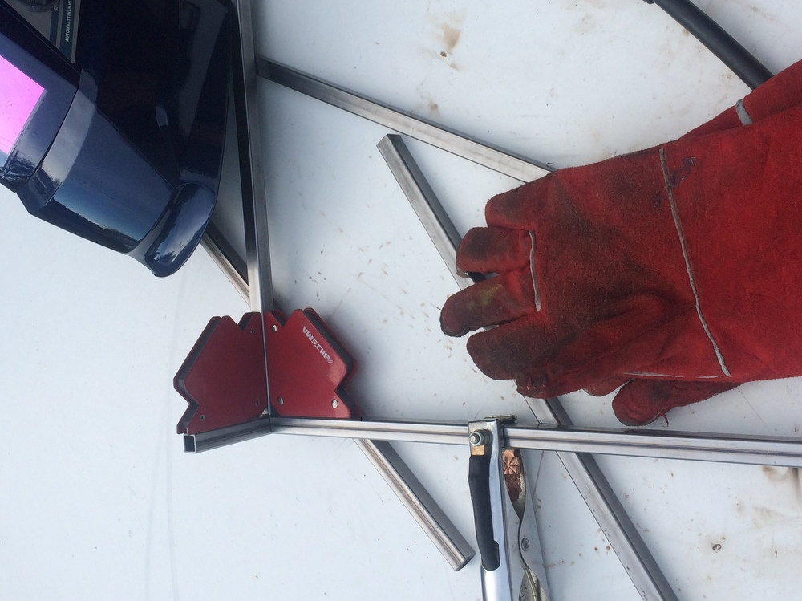
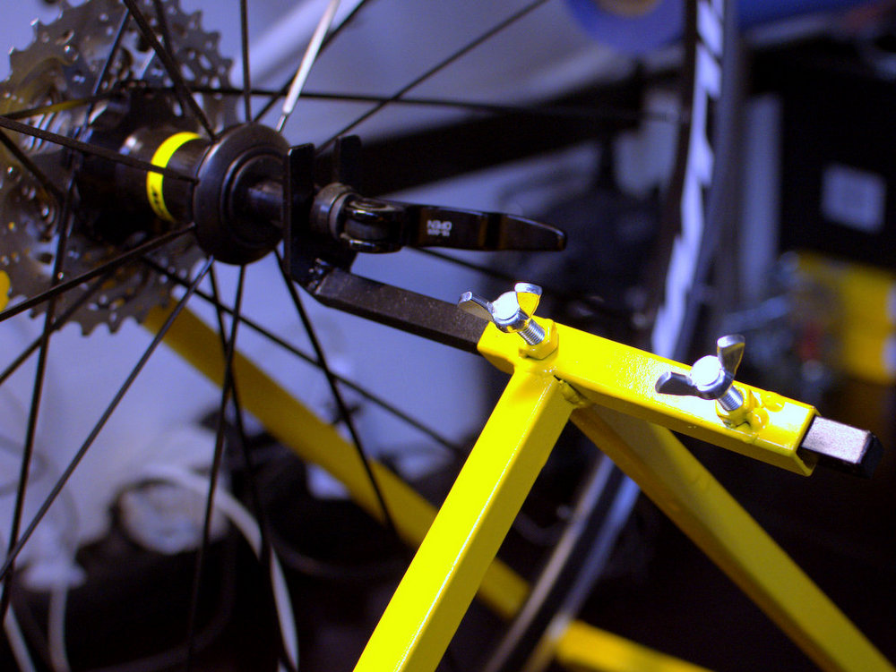
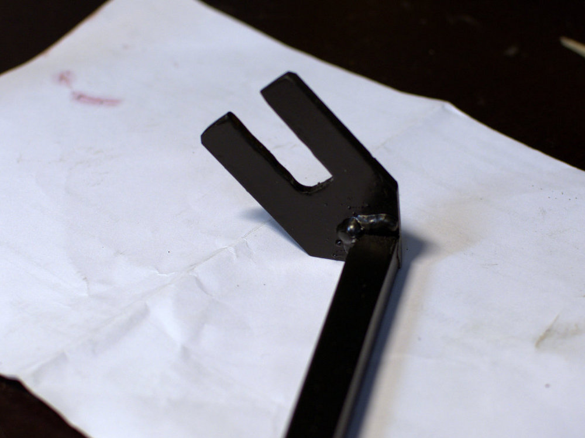

Tässä on viimeinen kuukausi tehty kaikkea muuta kuin pyöräilty. Yhden huoneen remontointi sekä patikointiretki Tuntsalle veivät aikaa pyöräilyltä. Tallin puolella ehdin kuitenkin sen verran puuhastelemaan, että sain tehtyä rihtauspukin. Tarve tälle tuli, kun hiljain hankkimani Mavicin Aksiumit löystyivät sisään ajossa ja kiristin takakiekon mutkalle.

Jos olisin huomannut, että näitä rihtaustelineitä saa muutamalla kympillä, niin olisin vielä kerran miettinyt alanko tekemään tätä itse. Oli vain jäänyt mieleen kuva monta sataa euroa maksavista pukeista. Katsoin vähän mallia Googlen kuvahausta [hakusanalla rihtauspukki](https://www.google.fi/search?q=rihtauspukki&amp;tbm=isch) ja sieltä löytyikin monta hyvää esimerkkiä, joista ottaa mallia.

Päätin pysyä 90- ja 45-asteen kulmissa, koska näiden kanssa selviytyy helpommin. Mittalin 1,5mm paksusta neliön mallisesta (15mmx15mm) huonekaluputkesta neljä 50 senttimetrin pätkää sekä kaksi 23 senttimetrin pätkää, josta tulee rihtauspukin runko. Lisäksi sahasin haarukkaa varten yhden senttimetrin pituisen pätkän sekä 10 senttimetrint pituisen pätkän. Hitsailin nämä yhteen käyttäen apuna magneetteja ja onnistuin aika hyvin pitämään paketin suorana.

Tämän jälkeen kyhäsin säädettävän haarukan lattaraudasta sekä neliön muotoisesta rautatangosta. Tästä tuli yllättävän hyvä vaikka hieman epäilin tukevuutta. Muistin jopa porata reiät eri säätöjen lukitusruuveja varten ennen hitsausta. Yleensä unohdan tämän enkä sitten pysty käyttämään pylväsporakonetta hyväksi porauksissa.

Kun osat oli liimailtu yhteen suoritin maalauksen käyttämällä kilikolimaaleja niin pohja- kuin varsinaisen maalipinnan tekemiseen. Ennen maalausta pukkiin hitsattujen mutterien kierteet kannattaa suojata pulteilla.

Rihtaukseen käytettävät aputikut tein hitsaamalla umpitankoihin kiinni mutterit, joiden läpi ruuvataan kierretangot. Kierretankojen toiseen päähän hitsasin siipimutterit ja toisen pään suojasin kutistesukalla ettei ne raavi kiekkoihin naarmuja rihdatessa.

Tässä vielä muutama kuva eri ratkaisuista, joita tein kasatessa rihtauspukkia.

Haarukan leveyttä voidaan niin ikään säätää. Lukitsemiseen tein kierretangosta ja siipimuttereista ruuvit.

Suuntaustikut pysyvät urallaan kahden pultin avulla. Kiristys tapahtuu kiristämällä kierretankoa, johon on hitsattu siipimutteri.

Haarukka tuli tehtyä lattaraudasta. Tässä ei tahdo oikein maali pysyä. Ainakaan käyttämäni keltainen maali, joka syystä tai toisesta pysyi pehmeänä vielä useamman päivän jälkeen maalauksesta.

Entä sitten itse rihtaus. Moni rihtaa kiekot käyttämällä apuna pyykkipoikia sekä pyörän omia haarukoita. Tämä ei minun kohdalla oikein tuottanut tarpeeksi hyvää lopputulosta. Siksi tein rihtauspukin ja toivoin, että se helpottaa kiekon suoristamista. Ja niin se todellakin teki. Rihtaus onnistui hyvin niin sivuttais- kuin pystysuunnassakin.
