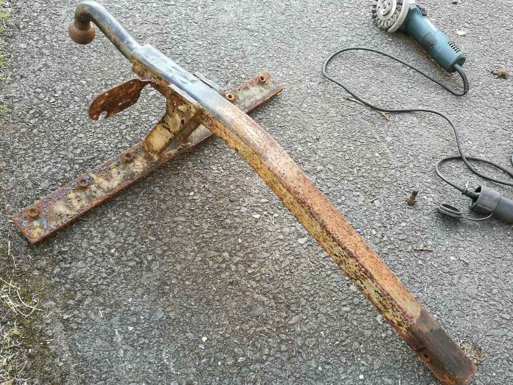
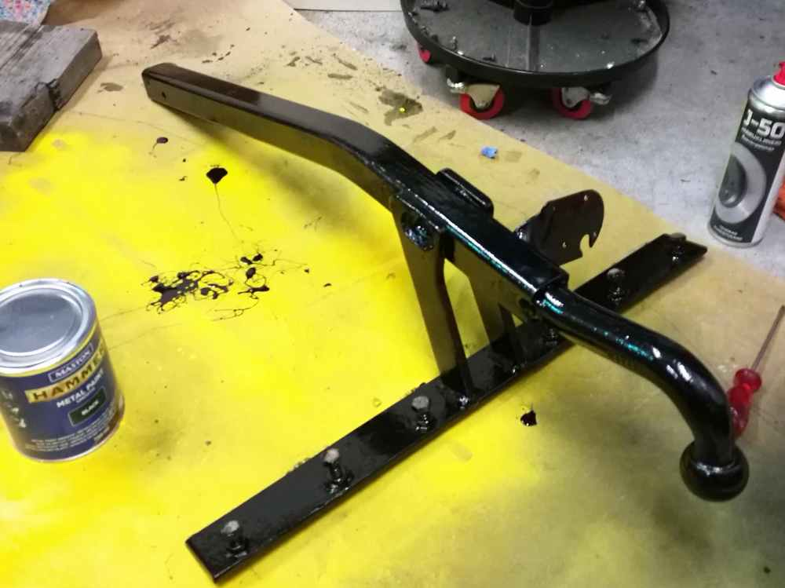
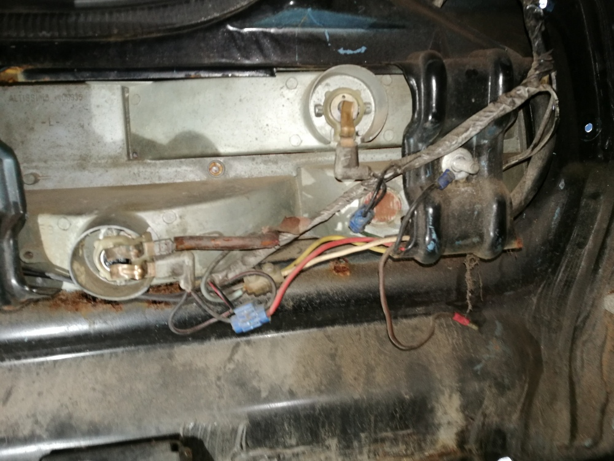
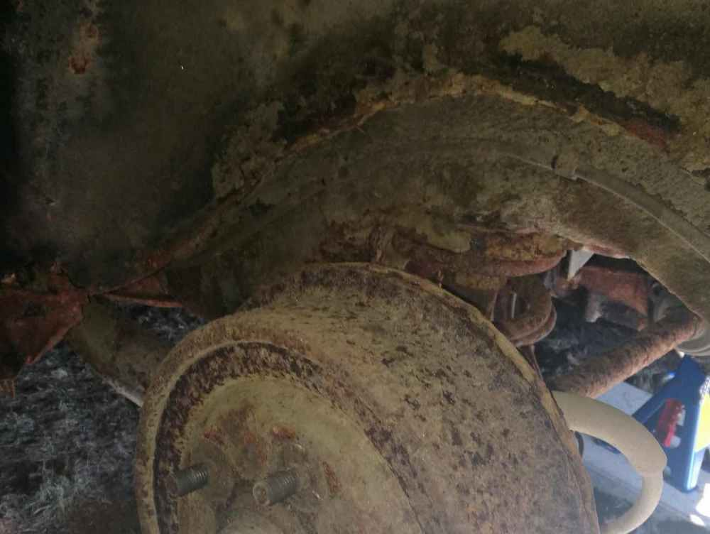

Vajaa pari vuotta sitten ostamani Ford Granada -projektille on alkanut taas löytymään aikaa. Käyttöautona olevan Ford Focuksen isoimmat remontit alakvat olla ohi. Näistä viimeisin oli hieman venähtänyt jakohihnaremontti, joka tosin seuraavalla kerralla sujuu huomattavasti nopeammin. Isoja vahinkoja ei tullut, mutta aikaa kului. Kesän aikana vielä pitäisi pieniä maalaustöitä tehdä Focukseen, mutta muuten keskitytään Granadaan.

Granadan korjaamisen aloitin peräkontista. Tieltä on purettu puskurit, listat ja bensatankki. Vielä, kun toisen takalampun saisi jotenkin irti ja voiman siirron niin pääsisi korjaamaan rauhassa. Tarkoitushan on vain kunnostaa tämä auto eli siis pelastaa museoinnilta vanhaa kuitenkin kunnioittaen.

Irroitettuja osia olen maalaillut silloin tällöin, jotteivät enempää ruostu. Tässä hiljattain irroitin peräkoukun. Joka oli parilla pultilla kiinni edestä ja kuudella peräkontin läpi tulevalla pultilla takaa.

Seuraavaksi hioin ruosteet pois niin hyvin kuin kulmahiomakoneen teräsharjalla sain.

Ruostesuojaksi sipaisin Mastonin Hammer -vasaralakkaa. Tuskin tätä enää auton perään kiinnitän, ellei tule ostettua jotain autoon sopivaa asuntovaunua.

Takavalojen johdot olivat ainakin vielä vuosi sitten toimivat. Kuskin puoleinen takavalo lähti nätisti irti, mutta toisen puolen valot on liimattu tai massattu jollain kiinni eivätkä ne tahdo irrota nätisti. Odotellaan hieman lämpimämpiä kelejä niiden irroittamiseen.

Vararenkaan kotelo on tietysti puhki. Tuntuu, että korin pahimmat ruosteet ovat paikoissa, joita on jo aiemmin paikattu hitsaamalla.

Takarenkaan takaa löytyy paksusti massattu lokasuoja ja vähän jumittavat rumpujarrut. Olen yrittänyt näitä availla WD40:n ja CRC:n tuotteiden avulla sekä vähän lämpöä antamalla. Ei vain tahdo mutterit irrota.

Tässä lyhyen ajan suunnitelmana on järjestää ilta- tai pari viikossa aikaa tuon tavaratilan kunnostamiseen seuraavan kuukauden aikana. Saattaa vaatia enemmän, koska peltiä en ole mahdottoman paljon hitsannut.
