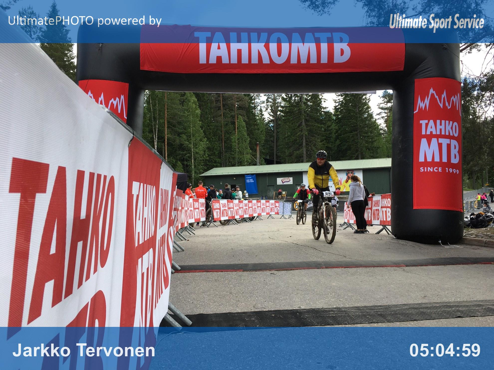

Viikonloppuna järjestettiin kahdeskymmenes [Tahko MTB -maastopyöräkilpailu](http://www.tahkomtb.fi/), joka tosin minulle oli ensimmäinen kerta, kun ajoin Tahkolla maastopyörällä. Tämän lisäksi ensimmäistä kertaa ajoin ns. täyden matkan kisan eli 60 kilometriä. Pitkään näytti siltä, että kilpailu tultaisiin ajamaan rankassa vesisateessa, mutta onneksi sateiden saapuminen Tahkolle aikaistui ja käytännössä perjantai-illan jälkeen Tahkolla ei satanut vettä.

Tahkoa kohti lähdettiin perjantaina työpäivän jälkeen Kempeleestä ja numerolappuja olimme noutamassa yhdeksän aikaan. Olin ilmoittautunut kello 10 starttiin, joka oli tarkoitettu kilpailijoille, joiden tavoiteaika oli yli viisi tuntia. Kuitenkin sen verran hyvin maastopyöräilyt tänä kesänä on kulkenut, että oma tavoite oli päästä ajamaan tämä kisa neljään ja puoleen tuntiin vaikka reitin vaativuudesta ei ollut juuri tietoa.

Ensimmäinen kolmetoista kilometriä oli laskettelua Nilsiän keskustaan, jossa yritin arpoa itselle sopivaa paikkaa metsäosuuksia ajatellen. Huippunopeudet laskuissa nousivat huomaamatta yli 50 kilometrin tunnissa. Ensimmäisen huollon ohitin suosiolla mutta otin varalta ensimmäisen geelin tällä kohdalla. Kinahmille nouseminen tuntui yllättävän helpolta vaikkakin polkuosan jouduin jalkautumaan. Ei ole oikein hallinnassa hitaasti muiden perässä ajaminen ylä- eikä oikein alamäkeenkään.

Varsinkin liukkaassa mudassa ajaminen oli itselle haastavaa ja ennen toista huoltoa pannutinkin alamäessä kohtalaisen kovasta vauhdista. Onneksi vain oikean käden peukalo otti osumaa. Tämä tietysti vaikeutti vaihteiden vaihtamista kevyemmälle, mutta se ei juuri menoa hidastanut. Toisenkin huollon laskettelin läpi ja nautin omista geelivarannoista.

Matka seuraavalle huollolle alkoikin jo tuntumaan. En tiedä vaikuttiko siihen tuo pannutus vai muuten vain käsistä alkoi voimat ehtymään. Muutenkin aika outo tilanne, kun yleensä jalat ovat alkaneet ensin piiputtamaan. Kalkkiruukin huoltopiste tuli kuitenkin yllättävän nopeasti vastaan ja sinne oli saapunut kannustusjoukotkin, joilta sain nestetäydennystä sekä muutenkin virtaa.

Tästä eteenpäin jatkettiin jokseenkin tuttua seutua vaikkakin polut olivat uusia. Siirtymäpätkien johdosta matka taittui jouten eikä Tuulivaaralle nouseminenkaan ollut mikään paha, mutta tässä vaiheessa alkoi vähän vatsassa velloa. Ilmeisesti vesi ei ottanut imeytyäkseen. Tuulivaaralla yritin syödä ja juoda huoltopisteen tarjoilusta varovasti, ettei vatsa aivan sekaisin mene.

Seuraava pätkä viimeiselle tankkauspisteelle Rahasmäkeen olikin melkoista tunkkaamista mudassa. Kädet alkoivat loppumaan ja laskuissa keskittymiskyvyn vei housujen puhtaana pitäminen sisäpuolelta vaikka vaippahousut olivatkin käytössä. Muutenkin muistikuvat loppumatkasta ovat kovin hatarat vaikkei energiat loppuneetkaan.

En tiedä uskaltaako tätä ääneen sanoa, mutta viimeinen nousu eli El Grande oli pienoinen pettymys. Tietysti en sitä pystynyt kokonaan ajamaan, mutta ei se niin vaativalta näyttänyt. Mäen päällä alkoi taas vatsaa vääntämään. Päätin kuitenkin, että maaliin asti mennään ennnenkä päästetään varpuspari valloilleen. Viimeiset laskut menivätkin kädet krampissa jarrut sauhuten. Itse asiassa toiseksi viimeisen laskun aikana piti pysähtyä irroittamaan krampannut vasemman käden nyrkki ohjaustangosta. Maaliin kuitenkin pääsin ajassa 5:04:59. Pari urheilujuomaa hätäisesti nautin maalissa ja sitten etsimään vapaata bajamajaa.

Kisa meni oikeastaan paremmin kuin ajattelin. Ainoastaan nuo vatsaongelmat haittasivat menoa ja siitä luulen johtuvan osan käsien ongelmista. Jalat toimivat loppuun asti mallikkaasti eikä oikein missään vaiheessa tapahtunut energian loppumisesta johtuvaa nuupahdusta. Energiaa kyllä voisi seuraavalla kerralla nauttia huomattavasti enemmän niin ennen matkaa kuin matkan aikana.

Seuraavaksi odotellaan ensi kuuta, joka alkaa Syöte MTB:llä ja sielläkin on tarkoitus ajaa 60 kilometrin matka. Nähdäänpä sitten siellä.
