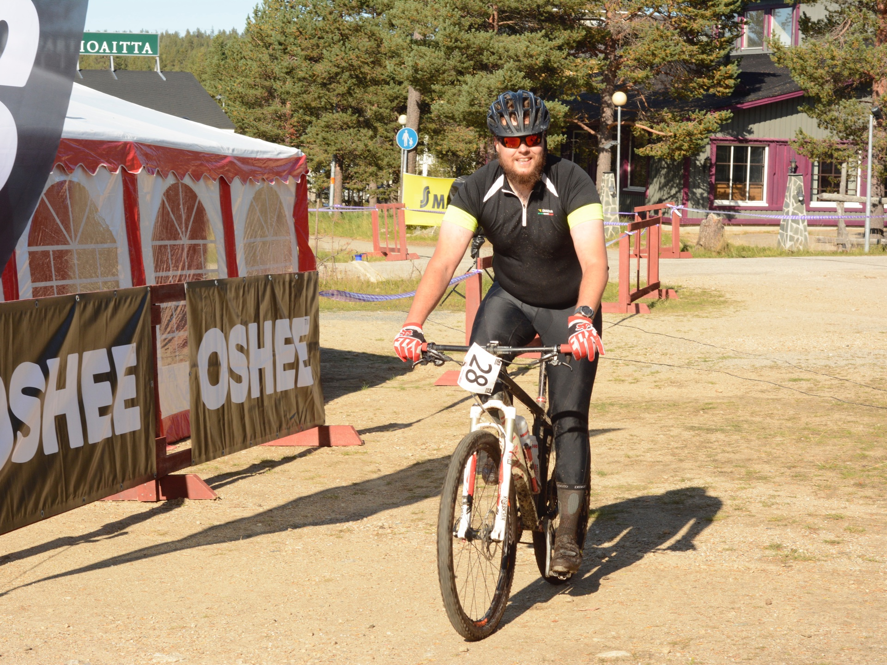

Vuosi sitten ajoin toisen maastopyöräilykisani Rokualla. Tämä kisa meni ilman teknisiä murheita ja meno oli muutenkin mukavaa. Kisan jälkeen katselin vähän maastopyöräilytapahtuma tarjontaa ja bookkasin Tahko MTB:n lisäksi elokuulle Syöte MTB:n, Rokua MTB:n ja kauden huipennukseksi Saariselkä MTB:n. Lisäksi mielessä oli Jämi84, mutta onneksi maltoin jättää elokuulle yhden vapaan viikonlopun.

Saariselkä MTB on kolmen etapin kisa, jossa kolmena päivänä ajetaan noin 50, 80 ja 50 kilometrin matkat. Jos etapilla joutuu keskeyttämään, voi kuitenkin osallistua seuraaviin etappeihin. Kolmipäiväinen kisa tuo omat haasteensa sekä se, että kilpailun reitti kulkee niin syrjässä, että kalustorikon sattuessa saattaa taluttamista riittää kilometritolkulla lähimmälle autotielle.

## Saapuminen Saariselälle

Kempeleestä Saariselälle mutkineen matka kesti noin kuusi tuntia. Olimme perillä noin kuudelta ja katukuvassa oli maastopyöräilijät edustettuna. Kisakeskus oli Saariselän keskusvaraamon vieressä, joten avaimet majapaikkaan ja numerolipun hakeminen onnistui näppärästi samalla kertaa. Illalla kävin vielä kuuntelemassa ajajien kokouksessa viimeisimmät neuvot ennen nukkumaan menoa.

## Stage 1

Ensimmäisen päivän lähtö oli vasta puolilta päivin. Tämä on ihan mukavaa, että muutaman sadan kilometrin päässä asuvien ei tarvitse välttämättä hotellihuonetta ottaa, jos vain jaksavat nousta aikaisin aamulla auton rattiin.

Nousu Kaunispäälle näytti loivalta ja lyhyeltä. Tuli otettua tämä ehkä turhan rivakasti, koska laskussa joutui hieman himmailemaan. Osaltaan tämä johtui siitä, että kivikko oli kovin erilaista kuin ennen ajamani eikä aivan kylmiltään uskaltanut vauhtia pitää. Matka jatkui vauhdikkaasti kohti Tolosjoen rantaa, missä heti huoltopisteen jälkeen tökkäsin eturenkaan mättääseen ja lensin sarvien yli. Peukalo mustui, mutta ei ilmeisesti vääntynyt kuten pääsi Tahkolla käymään. Se olisi tietänyt sitä, että seuraavien päivien ajot jäisivät ajamatta.

Pääsiäiskuru ja Iisakkipäälle nousu tuskaista samoin kuin lasku ala-asemalle. Renkaat eivät pitäneet ja käsistä oli voimat ehtyneet. Maaliin kuitenkin pääsin hyvissä voimissa.

## Stage 2

Tämä oli ensimmäinen 80 kilometrin lenkki maastossa. Tämän lisäksi keli oli aika haastava. Alkumatkalle oli luvattu välillä voimakastakin sadetta. Onneksi lämpötila oli jo heti aamusta reippaasti yli kymmenen astetta.

Alku varovaisesti Kaunispäälle tunnustellen päivän kuntoa. Urupäältä alkoi vauhdikas lasku, joka ehdottomasti pitää päästä ajamaan joskus kuivalla kelillä. Vellinsärpimälenkki tasaista puurtamista välillä puromaisemia ihaillen. Kiilopäälle noususta ei juuri muistikuvia mutta Ruijanpolun "helposta" "neulaspolusta" sitäkin enemmän. Loppuosa reitistä sama kuin edellisenä päivänä. Ihme ja kumma, kun virtaa riitti ja ajoin loppuosan nopeammin kuin ensimmäisenä päivänä.

## Stage 3

Kolmannen päivän aamuun heräsin kuten muutoikin. Edellisien päivien polkemiset eivät juurikaan tuntuneet jäsenissä vaikkakin unissa Saariselän polkuja oli ajettu monet kerrat. Siitä vain normaalisti aamupalalle ja kohti lähtöviivaa.

Alkumatka ajettiin latupohjaa pitkin Kiilopäätä kohti. Päätin tässä vaiheessa pitää vauhtia rohkeasti päällä, koska tasaiset ja nousut ovat sujuneet täällä parhaiten. Ehkä polut ja laskut ovat liian kivikkoisia minun jäykkäperälle. Tälläkin kertaa alkoi Rautulammelta lähtenyt single track puuduttamaan, joskin niin se puudutti myös täpärikuskien käsiä.

Rautulammen single trackin jälkeen tuli vielä puuduttavampi kivikko, jonka onneksi pelasti pian alkava Kiilopään takanousu. Tunkkaamiseksihan se välillä meni, mutta helpompaa se oli kuin kivikossa ajo. Kiilopäälle ei kivuttu aivan huipulle, mutta mukava lasku sieltä kuitenkin tuli Suomen ladun majalle. Onneksi laskun lopussa oli mies varoittamassa teräväreunaisesta ojasta. Tuosta olisi voinut varoittaa myös merkein.

Lopussa ei voimat loppuneet vaan väsymys alkoi iskemään. Pahin virhe tapahtui Iisakkipäälle noustessa Pääsiäiskurun kohdalla, kun yritin laittaa lähes tasaisella juomapulloa takaisin telineeseen. En huomannut keskelle polkua noussutta kiveä johon eturenkaan ajoin. Tästä eturengas meni poikittain ja en oikein itsekään huomannut miten kiekon sain aivan mutkalle.

Sekunnin mietin, että pitääkö tässä luovuttaa, mutta päätin että tulos pitää saada vaikka kantamalla pyörä maaliin. Onneksi muistin, että vaimo lupasi odotella maalissa, joten soitin hänelle, että voisiko ottaa oman pyöränsä etukiekon ja tulla vastaan. Uusi kiekko vaihdettiin alle laskettelurinteen puolessa välissä, mistä ajelin sitten varovaisesti maaliin.

## Yhteenveto

Kyllähän tämä kisa kannatti käydä polkemassa. Huoltoja ehkä olisi voinut olla yksi enemmän per päivä, mutta menihän se näinkin. Etappien jälkeen tarjolla oli illallinen Pirkon Pirtissä, joka oli aivan edellisessä kirjoituksessa mainitun Rokua MTB:n ruokatarjoilun tasoa. Tosin hieman suppeampi.

Reitit vaikeudeltaan olivat Rokuan ja Syötteen välimaastoon osuvia. Terävät kivikot aluksi arveluttivat, mutta niitäkin oppi ajamaan nopeasti. Laskut ja nousut olivat pitkiä. Tylsiä ja tarpeettomia pätkiä ei juurikaan reitillä ollut. Mukavia lisiä oli Tolosjoen ylitykset. Maisemat tietysti olivat mahtavat, mutta niitä ei juurikaan ehinyt ihastelemaan. Taidan tulla tänne ajamaan toistekin.
