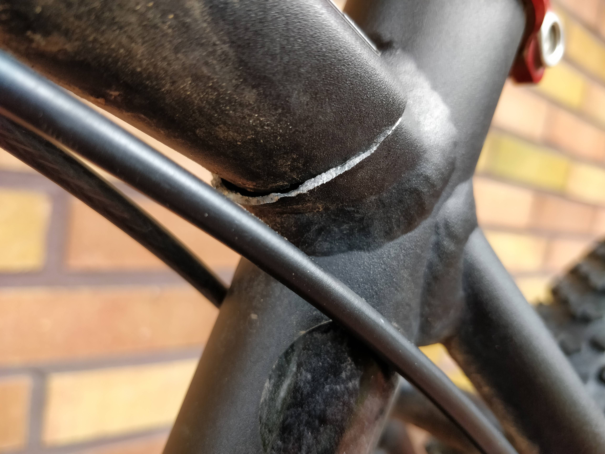
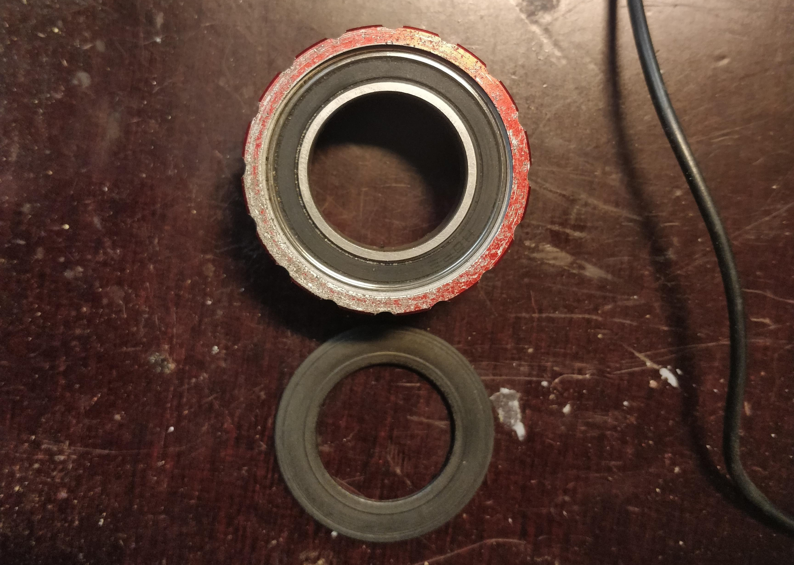

Hiljaista on pidellyt kirjoitusrintamalla. Oikeastaan siitä syytä, että Saariselkä MTB:n pyörään jättämät jäljet oli vähän isommat kuin alkutarkastelu osoitti. Canyon Yellowstonen runko oli katkennut pysty- ja vaakaputken liitoksen vierestä. Onneksi Canyonilla on kuuden vuoden runkotakuu, joten sain uuden Grand Canyon -rungon tilalle. Vaihtoprosessi hoitui nopeasti. Canyonin Suomen edustajalle kuvat rungosta mailiin. Pyörän purku ja runko kohti Turkua. Pian postissa olikin odottolemassa ehjä runko.

Samalla tilasin uuden ohjainlaakerin sekä kiekkoihin kehät. Grand Canyonin ohjainlaakereiden koko on ylhäällä 44 milliä ja alhaalla 52 milliä. Näiden laakereiden saaminen samassa paketissa on hieman haastavaa, mutta FSA:lta löytyi paketti, jossa laakerit ovat paremmat kuin alkuperäiset suojaamattomat pallolaakerit. Kehiksi valitsin DT Swiss XR 331 -kehät. Toivottavasti näistä kiekot saadaan kasattua.

Ohan tuo pyörä ottanut osumaa kesän aikana muutenkin. Ketjut voi laittaa roskikseen. Takavaihtaja on aika kärsineen näköinen ja Hopen keskiölaakerikin on ottanut aika paljon itseensä, kun kurassa on möyritty menemään. Ihme ja kumma, että laakereissa ei muuten ole yhtään vikaa vaikka uloin pölysuoja ei ole mikään tiivein.

Pitäisi nyt vaan jaksaa laittaa tuo pyörä nippuun vaan kun ei ole vaan saanut. Olen tässä odottanut kolme kuukautta lunta tulevaksi, jotta pääsisi hiihtämään. Vaan eihän sitä ole näkynyt. En ole kuitenkaan jäänyt sohvalle makaamaan vaan olen sitten käynyt juoksemassa melkein kolmatta sataa kilometriä. Olihan tuokin mukavaa niin kauan, kun lunta tai kuuraa ei maassa ole ollut.

Vaan tässäpä oli nopea päivitys mitä on tullut tehtyä. Pitää alkaa katsomaan mitä kivoja tapahtumia sitä kiertäisi ensi vuonna. Mutta taidanpa kirjoitella niistä myöhemmin.
