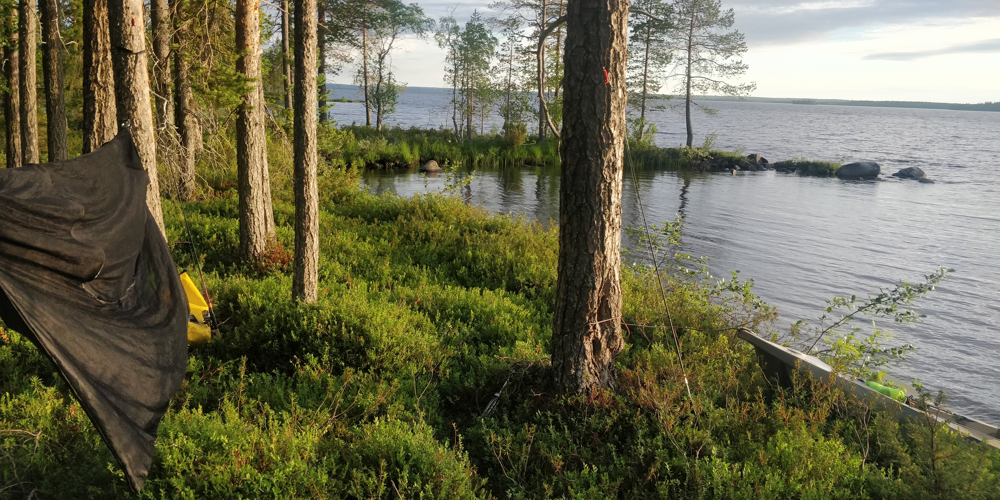

Vietimme viime juhannuksen Ranuan Simojärvellä. Tukikohdaksi valitsimme Korvajokisuun tulentekopaikan, joka on varustelultaan kuin leirintäalue. Paikalta löytyy keittokatos, tulentekopaikka ja ulkohuussi. Riittävästi paikkoja teltoille ja riippumatoille sekä hiekkaranta. Ainoa huono puoli on se, että tämän paikan ylläpito on lopetettu ilmeisesti ihan lähiaikoina.

Paikka on rauhallinen. Edes juhannuksena alueella ei meidän lisäksi leiryitynyt kuin yksi pariskunta ja viime viikonloppunakaan paikalla ei juuri ihmisiä näkynyt. Myös järvi on rauhallinen eikä moottoriveneliikennettä liiaksi ole.

Juhannuksena pidimme majapaikkaa Korvaniemen kärjessä, mistä irtosi muutama hauki. Muutoin aika kului meloen. Juhannuspäivä oli sen verran tyyni, että meloimme syömään Selkäsaareen laavulle ja sieltä Porosaaren päivätuvalle ja takaisin Korvajokisuuhun. Matkaa tuli noin kahdeksan kilometriä mikä ei tuntunut juuri missään.

## Kalastus Simojärvellä

Toisen reissun Simojärvelle tein viime viikonloppuna. Tarkoitus oli keskittyä tällä kertaa enemmän kalastamiseen. Lämpömittari tälläkin kertaa kohosi reippaasti yli 20 asteeseen vaan kalastelua hankaloitti navakka 5-7 metriä sekunnissa puhaltava tuuli. Eteneminen vastatuuleen kanootilla oli hankalaa ja nopeus oli noin kaksi kilometriä tunnissa. Enkä ole varma oliko nopeus aina siihen suuntaan mihin meloin :)

Meloin kuitenkin Korvajokisuulta Suolahden hiekkarannalle, missä oli hillojen poimijat lastailemassa ämpäreitään veneisiin. Nautin hetken aikaa lauantaipäivästä hiekkarannalla syöden, uiden ja juoden kahvia. Iltaa kohden tuuli hieman tyyntyi ja lähdin kokeilemaan kalaonnea syvyyskäyrien kohdilta. Ahvenet tuntuivat täryyttelevän vapaa mutta tuuli vei sen verran kanoottia, ettei kalastaminen ollut oikein mielekästä. Ankkuria en kehdannut käyttää tälläisessä tuulessa. Pitäisi kehitellä kanoottiin parempi kiinnitys ankkurille.

Illasta ajattelin, että palaisin takaisin meloen Korvajokisuulle. Paluu matkalla tuuli yltyi ja vastatuuleen meloessa aallot nostivat niin paljon kanootin keulaa, että perä alkoi hörppimään vettä. Tälläistä ongelmaa ei ole tullut vastaan kaksin meloessa. Päätinkin, että tämä yö vietetään Suolahdenniemen kärjessä.

Viritin riippumaton rannalle ja tuulen tyynnyttyä kokeilin kalaonnea rannalta muutaman kerran, mutta uni alkoi painamaan. Paikalle saapui pari venettä uistellen samoja paikkoja, missä itsekin kalaonnea aiemmin illalla kokeilin. Ilmeisesti ainakin yksi isompi kala sieltä nousi.

Aamulla päätin, että syön vain aamupalan ja lähden melomaan autolle. Tuuli oli taas yltynyt ja melominen oli hieman hankalaa. Meloin melkein rantoja pitkin ja kokeilin vähän kalaonnea Korvajoen edustalta. Kaikuluotain näytti, että möykkyjä veden alla on mutta ainakaan tähän syöttiin ne eivät ottaneet. Pian jatkoin kohti Korvajokisuun tulentekopaikkaa, missä auto oli parkissa. Illaksi piti ehtiä kotiin ja sitä ennen pakata kanootti auton kyytiin.

## Yhteenveto Simojärvestä

Näiden kahden reissun perusteella annan vahvan suosituksen Simojärven seudulla retkeilylle. Järven rannat ovat rakentamattomat ja vesiliikenne on maltillista. Silloin tällöin kuulee moottoriveneen kiitävän jossain kauempana mutta muutoin saa olla rauhassa. Kalaa vesistä löytää ja koska Simojärvestä laskee Simojoki vapaana Perämereen, voi syöttiin tarttua jalokalojakin. Vesillä liikkuessa pitää kuitenkin huomioida se, että olosuhteet voivat vaihtua nopeasti.
