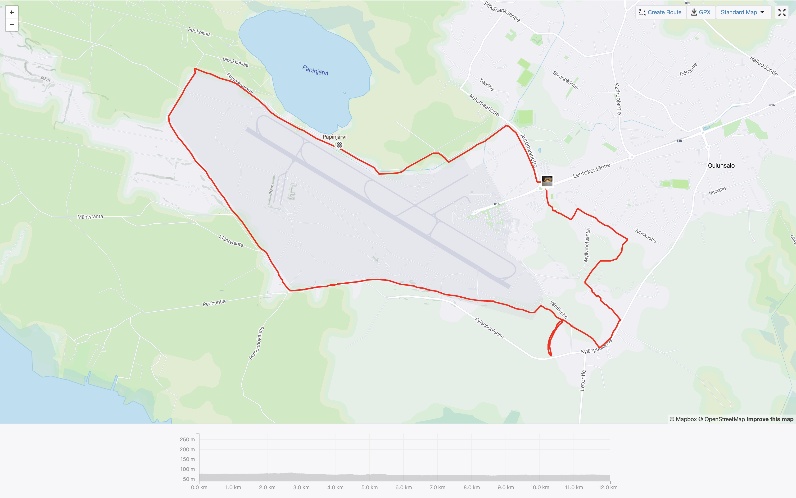

Oulunsalon lentokentän ympäri kulkee hiihtolatu, jolla pituutta on noin 10,5 kilometriä. Profiililtaan latu on kohtalaisen tasainen. Lentokentän takasuoralla on muutamia loivia ylä- ja alamäkiä. Kaarteita laskuissa ei juuri ole.

En virallista aloituspaikkaa löytänyt, mutta tilava parkkipaikka löytyy esimerkiksi Papinjärven uimarannan parkkipaikalta, josta pääsee helposti ladulle. Lisäksi parkkipaikkoja löytyy Lentokentäntien varrella olevien toimistorakennusten parkkipaikoilta.

Oulunsalon lentokentän ympärysladulta pääsee helposti Kisakankaan laduille ja hyvälumisina talvina ajetaan yhdyslatu meren jäälle, josta pääsee Kempeleen Leton ladulle sekä Tupoksen ja Limingan laduille. Eli hyvä lumisena talvena hiihtämistä riittää.

Lentokentän eteläpäädyssä latu katoaa vähälumisina aikoina helposti enkä itse asiassa ole koskaan latua pitkin osannut hiihtää tuota kohtaa vaan olen kiltisti hiihtänyt Kylänpuolentielle ja sieltä suunnistanut Myllypirtintielle ja etsinyt ladun.

Vähälumisena aikana varsinkin lentokentän takasuoran latupätkälle nousee hiekkaa ladulle, jota kannattaa varoa ainakin hämärällä hiihtäessä.

Ajantasaisimmat tiedot löytyvät [Oulun alueen kunnossapitojärjestelmästä](https://oulu.fluentprogress.fi/outdoors).
