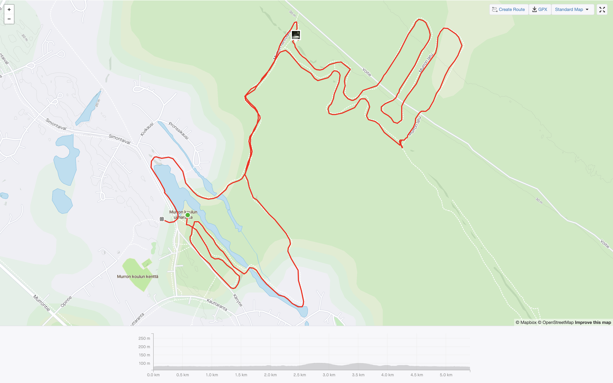

Tyrnävän Murrosta löytyy osittain valaistu hiihtolatu. Murto sijaitsee suurin piirtein Kempeleen ja Tyrnävän keskuksen puolessa välissä. Aloituspaikka löytyy Murron koulun (Simontaival 6-8) kohdilta. Iltana, jolloin kävin Murrossa hiihtämässä, oli hämärää ja satoi lunta, joten en oikein keksinyt muuta paikkaa kuin koulun parkkipaikan auton pysäköimiseen.

En heti löytänyt opastetaulua ja lähdinkin hiihtämään latua väärään suurtaan. Perinteisen ura oli ajettu baanan vasempaan laitaan mikä hieman ihmetytty. Ei muuta kuin käännös paluu suuntaan ja oltiinkin jo lykkimässä latua oikeaan suuntaan.

Tasaisempi osuus ladusta on valaistu. Matkalla on pieniä keinotekoisia kumpareita ja hiihtäminen on helppoa aloittelijallekin. Syvemmällä metsässä on hieman mäkisempää maastoa joka tarkoaa haastetta niin nousuissa kuin laskuissa. Illalla hiihtäessä otsalampulla varustautuminen on suositeltavaa, koska ympäristössä ei ole paljon valaistusta, joka kajastaisi metsän sisään.

Tutustumishetkellä latua oi tehty reilun viiden kilometrin matkalle. Näytti, että Yli-Murtoon päin lähtevää lisälenkkiä ei oltu ajettu tai en ainakaan ilman valoa nähnyt, että siinä latu menisi. Jos tämä lenkki olisi käytössä, hiihdettävää reittiä olisi yhdeksän kilometrin verran.

Ajantasaisimmat tiedot löytyvät [Oulun alueen kunnossapitojärjestelmästä](https://oulu.fluentprogress.fi/outdoors).
