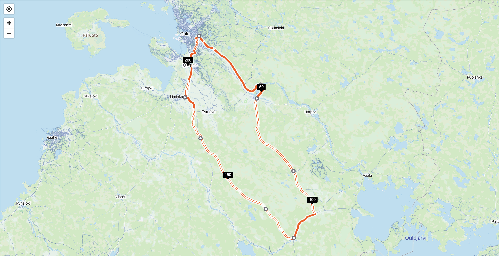

Kesäloma alkoi vapulta ja sen myötä on vähän enemmän vapaata tehdä vähän mitä mieleen juolahtaa. Alkuperäinen suunnitelma olisi ollut tehdä muutaman yön pyöräretki Oulujärven ympäri vaan kevät on ollut sen verran kylmä täällä rannikolla ja ilmeisesti vielä kylmempi tuolla idässä, joten se jäi ainakin näin toukokuun alkuun tekemättä. Itse asiassa sääennusteet lupailevat huomiseksi 10-20 senttimetrin lumisateita Kainuuseen.

Toukokuun kolmannen päivän iltana tuli mieleen, että pitäisikö se ajella korvaavana harjoitteena ensimmäinen 200 kilometrin maantielenkki tässä lähistöllä. Tuo parin sadan kilometrin rajapyykki on sellainen mistä pitkänmatkan pyöräily eli [Randonneur-pyöräily](https://www.randonneurs.fi/mita-on-randonneur-pyoraily/) vasta alkaa. Randonneur-pyöräilytapahtumissa eli Breveteissä lyhin matka on 200 kilometriä, joka on ajettava ilman huoltojoukkoja kolmentoista ja puolen tunnin sisään.

Reilu kolmetoista tuntia kuulostaa ainakin näin Pohjois-Pohjanmaan lakeuksilla ajettuna saavutettavalta ajalta ensikertalaisellekin. Sen verran luottoa on tullut muutaman kymmenen kilometrin lenkeistä mitä tässä alku keväästä on ehtinyt tekemään maastopyörällä. Ainoa haaste itselle on ollut iltaisin laskeva lämpötila, koska varsinkin kädet alkavat palelemaan pyörällä ajaessa pakkasen puolelle mentäessä. Sama vaiva iskee varpaisiin hieman kylmemmällä ilmalla. Käsien ongelma on ihan uusi ja luultavasti tullut talven pilkkireissuilta. Jaloissa on ollut samaa vaivaa aiemminkin pyöräillessä kylmällä ilmalla pidempiä matkoja.

Reitiksi valikoitui Kempele - Oulu - Muhos - Kylmälänkylä - Kestilä - Temmes - Liminka - Kempele. Yhteensä 201,52 kilometriä päällystettyä maantietä. Tämä on sen verran lähellä 200 kilometriä, että lenkin päätteeksi on syytä ajella vähän ylimääräisiä kilometrejä, jos haluaa esimerkiksi Stravaan 200 kilometrin tuloksen. Strava voi joskus optimoida GPS:n mutkia hieman suoriksi.

Matkaan oli tarkoitus lähteä heti aamupalan jälkeen kello 8-9 välillä, mutta pyörän pakkaaminen kesti sen verran, että lopulta matkaan pääsin vasta yhdentoista aikoihin. Kempeleestä Ouluun matka sujui kevyenliikenteen väyliä pitkin kivasti mutta kun Oulujoki ylitettiin ja käännettiin nokka kohti Muhosta alkoi valkenemaan, että tässä taidetaan ajella suurin osa matkasta vastatuuleen.

Oulujoen pohjoispuoli vai pitäisikö sanoa itäpuoli on tuttua seutua ja vanha Vaalantie on ajettu monesti pyörällä Muhokselle asti. Muhokselle en mennyt Montan voimalaitoksen yli vaan tällä kertaa reitti kulki Pyhäkosken voimalaitoksen yli. Tässä pidin ensimmäisen ns. pidemmän tauon eli söin yhden suklaapatukan sekä hörppäsin vähän urheilujuomaa.

Muhokselta matka jatkui vastatuuleen kohti Kylmälänkylää tarkoituksena käydä paikallisessa Satumaa nimisessä kyläkaupassa etsimässä syötävää. Vajaata kymmentä kilometriä ennen tuli tehtyä virhe ja yrittää nitkutella kyläkaupalle asti vaikka voimat alkoivat ehtymään nopeasti. Kaupalta nappasin puolilitraa kolajuomaa, kolmioleivän ja jäätelötuutin. Siirryin syömään kaupan ulkopuolelle ja kylläpä siellä oli kylmä olla paikallaan kylmää juodessa ja syödessä.

Kylmälänkylän tauolle tuli pituutta puolisen tuntia. Tästä matka jatkui kohti kolmenkymmenen kilometrin päässä olevaa Kestilää, missä ajattelin käydä syömässä oikeaa ruokaa, jos sitä olisi jossain saatavilla. Tällä välillä nappasin ensimmäisen energiageelin, jotka olivat jääneet tähteeksi kolme vuotta sitten ajetusta Saariselkä MTB:stä.

Kestilä oli minulle henkisesti lenkin puolivälissä. Matkaa Kestilään saavuttaessa oli taitettu jo 118 kilometriä ja lähes kuusi tuntia. Kestilää kohti käännyttäessä tuuli oli tuntunut siirtyvän myötäisämmäksi mitä se oli ollut alkupuoliskon, joten päätin ajella reippaasti Kestilän ohi ja kokeilla kymmenen tunnin alitusta. Mukana oli vielä kaksi geeliä sekä yksi suklaapatukka sekä juomaa melkein litra. Eiköhän näillä ainakin Temmekselle asti päästä.

Seuraava viisikymmentä kilometriä Temmekselle taittui kahdessa tunnissa. Pääsääntöisesti myötätuuleen polkien eikä vauhti hidastunut mäkisimmilläkään osuuksilla liiaksi. Vaikkei tälläkään välillä mäet kovin haastavia olleet. Pidin juomataukoja puolen tunnin välein, koska vähän tuntui siltä, että keskittyminen herpaantui juomapulloa hamuillessa. Temmekselle saavuttaessa virtaa tuntui riittävän ja ajattelin, että turha tässäkään on pysähtyä tankkaamaan vaan polkaistaanpa viimeiset 33 kilometriä. Juomaa pullossa oli vielä pari kolme desiä ja lisäksi syömättä oli yksi energiageeli.

Temmeksellä alkoi tuntumaan, että voisiko yhdeksän tunnin alitus olla mahdollista. Ihan älyttömästi ylimääräistä energiaa ei ollut, mutta yritin pitää vauhtia sen minkä pystyin. Harmikseni yhdeksän tunnin alituksesta jäin vähän. Yhdeksän tunnin kohdalla tuli 190 kilometriä täyteen ja olin Limingan ja Tupoksen välillä. Tämän jälkeen kiire loppui ja ajelin hissukseen kohti kotia. 200 kilometriä tuli Kempeleen rautatieaseman kohdalla täyteen ajassa 9 tuntia 30 minuuttia. Tämän jälkeen rullailin läpi Kempeleen keskustan ja kiersin Sarkkirannan urheilupuiston. Kotiin tullessa matkamittari pysähtyi lukemaan 204,9 kilometriä ja kello näytti 9 tuntia 44 minuuttia. Tästä ajoaikaa oli 8 tuntia 30 minuuttia.

Matka meni kaiken kaikkiaan yllättävän hyvin ja ehkä jopa helposti. Kroppa ja mieli kesti matkan ajan. Seuraavana päivänä polvia hieman kolotti. En oikein osaa sanoa oliko satula liian korkealla vai liian matalalla.

Matkaan valmistautumisen olisi varmasti voinut tehdä paremmin. Söin edellisenä iltana vain grilliltä haetun makkaraperuna-annoksen, aamupalaksi pari kananmunaa, kaksi jälkiuunipalaleipää sekä 250g maitorahkaa sekä pari sataa grammaa rasvatonta jogurttia. Matkalle otin mukaan 3 suklaapatukkaa, 3 energiageeliä sekä kaksi litraa urheilujuomaa. Matkan varrelta ostin puolilitraa kolajuomaa, kolmioleivän sekä jäätelötuutin. Garmin arvioi kulutukseksi 6472 kcal, joten pakkaselle päivän saldo varmasti meni.

Saapa nähdä milloin seuraavan kerran vastaavan reissun teen. Ehkä silloin saisi olla ainakin lämpimämpää kuin nyt. Matkalla olisi mukava käydä vaikka uimassa ja nauttia muutenkin enemmän pysähdyksistä. Tekisi mieli vielä kokeilla kolmisatasta, mutta pitää nyt testata lyhyemmillä tuo ajoasento kuntoon.
