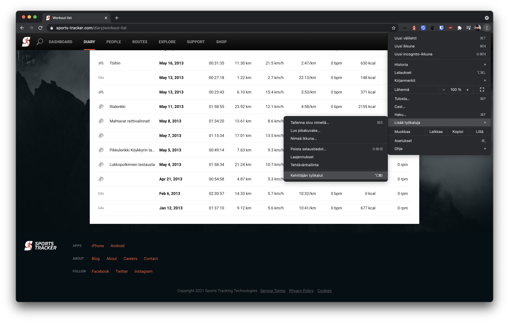
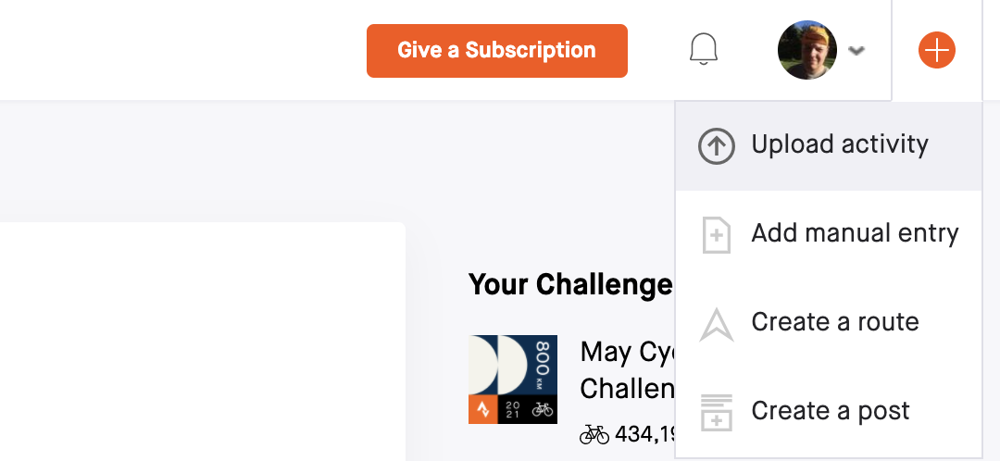
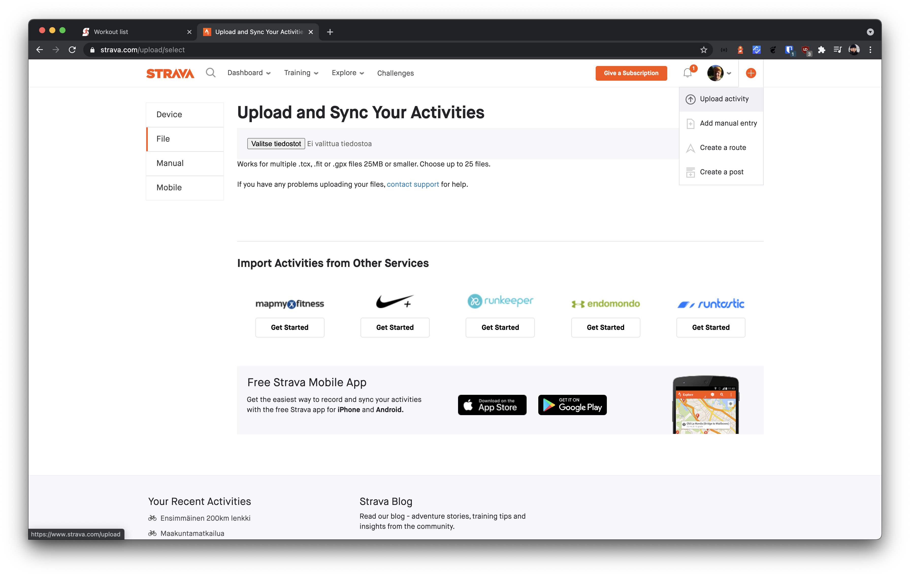

Kevään myötä pyöräilymotivaatiota on tullut haettua suunnittelemalla reittejä sellaisiin paikkoihin, missä ei ole vielä tullut ajeltua. Aiemmin olen käyttänyt tähän [Veloviewer](https://veloviewer.com/)-nimistä palvelua, joka hakee Stravasta tiedot ja tekee "heatmapin", mistä näkee aiemmat ajoreitit. Mukaan on mahdollista ottaa myös muutkin kuin niin sanotut Stravan viralliset lajit (pyöräily, juoksu, uinti). Hyvä vaihtoehto Veloviewerille on [StatsHunters](https://www.statshunters.com/), joka taitaa olla vielä ilmainen.

Vasta tänä keväänä tuli mieleen, että olisipa mukava saada aiemmat suoritukset tuotua Stravaan. Suurimman osan aiemmista suorituksista olen tallentanut käyttämällä kotimaista [Sports Tracker](https://www.sports-tracker.com/)-sovellusta. Sports Tracker tukee suoritusten exporttaamista FIT-tiedosto formaatissa mitä myös Strava tukee. Googlella löysin [Selbst & Ständigin artikkelin](https://xn--selbstundstndig-blb.at/data-migration-from-sports-tracker-com-to-strava-com/) miten FIT-tiedostot saa ladattua Sports Trackeristä. Tämän kirjoituksen skripti ei sellaisenaan vielä toiminut, joten jouduin hieman muokkaamaan sitä.

Ideana on se, että tallennetaan sivulta Javascriptillä FIT-tiedostot ja ladataan ne tämänä jälkeen Stravaan. Tämä on kohtalaisen helppoa.

## Vaihe 1: Lataa FIT-tiedostot Sports Trackeristä

Kirjaudu Sports Trackeriin ja mene tämän jälkeen osoitteeseen [`https://www.sports-tracker.com/diary/workout-list`](https://www.sports-tracker.com/diary/workout-list). Avaa Chromen kehittäjän työkalut ja sieltä Console-välilehti. Liitä alla oleva Javascript-koodi consoleen ja paina Enteriä.



```javascript
var type = "gpx";
var type = "fit"; // Remove this line if you want export GPX files

var showMore = null;
while (showMore = document.querySelector("div.show-more")) {
  if (showMore.classList.contains("ng-hide")) {
    break;
  }
  showMore.click();
  await new Promise(r => setTimeout(r, 1000));
}

var workouts = document.querySelectorAll("ul.diary-list__workouts li a");
var token = RegExp("sessionkey" + "=[^;]+")
  .exec(document.cookie)
  .toString()
  .replace(/^[^=]+./, "");
var output = "";

var batch = 0;
for (i = 0; i < workouts.length; i++) {
  if (i % 24 == 0) {
    batch++;
  }

  var href = workouts[i].href;
  var id = href.substr(href.lastIndexOf("/") + 1, 24);

  var url =
    "https://api.sports-tracker.com/apiserver/v1/workout/" +
    (type == "gpx" ? "exportGpx" : "exportFit") +
    "/" +
    id +
    "?token=" +
    token;
  var filename = batch + "-" + "sports-tracker-" + id + "." + type;

  fetch(url)
  .then(resp => resp.blob())
  .then(blob => {
    const url = window.URL.createObjectURL(blob);
    const a = document.createElement("a");
    a.style.display = "none";
    a.href = url;
    a.download = filename;
    document.body.appendChild(a);
    a.click();
    window.URL.revokeObjectURL(url);
  })
  .catch(() => alert("Something went wrong when downloading files"));

  await new Promise(r => setTimeout(r, 1000));
}

console.log("Done.");
```

Selain saattaa pyytää luvan ladata useamman kuin yhden tiedoston kerrallaan sports-tracker.comista. Jos näin käy, salli tiedostojen lataaminen.

Kun consoleen ilmestyy teksti `Done.`, pitäisi tiedostot olla ladattuna tietokoneesi Lataukset / Downloads -hakemistoon ja olet valmis siirtymään seuraavaan vaiheeseen.

## Vaihe 2: Lataa FIT-tiedostot Stravaan

Tämän jälkeen kirjaudu Stravaan ja klikkaa oikealta yläkulmasta 

löytyvän plus-ikonin takaa Upload activity -linkkiä ja tämän jälkeen Valitse tiedostot / Choose files -nappia. Strava antaa ladata 25 FIT-tiedostoa kerrallaan. Valitse Lataukse / Downloads -hakemistostasi löytyvät tiedostot 25 tiedoston erissä Stravaan.



Vaiheessa 1 ladatut tiedostot on nimetty niin, että ensimmäiset 25 tiedostoa on nimetty `1-sports-tracker-123123xyzxyz.fit` tyylisesti ja seuraavat 25 tiedostoa `2-sports-tracker-123123xyzxyz.fit` tyylisesti. Strava ei anna ladata samaa harjoitusta useampaa kertaa, joten pieni huolimattomuus ei ole vaaraksi tässä vaiheessa.
